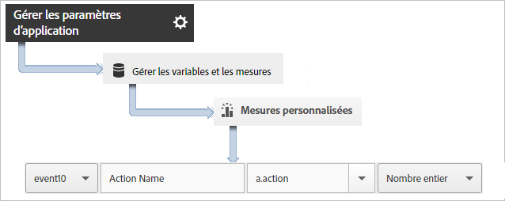
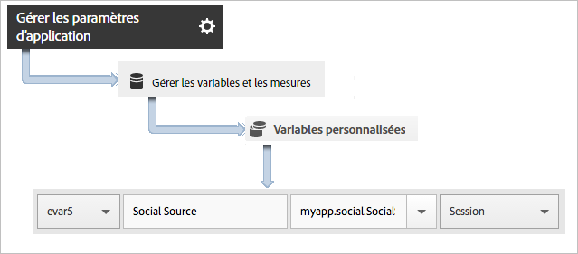

# Suivi des actions d’application {#track-app-actions}

Les actions sont les événements qui se produisent dans votre application Android que vous souhaitez mesurer.

Chaque action est associée à une ou à plusieurs mesures qui sont incrémentées chaque fois que l’événement se produit. Par exemple, vous pourriez envoyer un appel `trackAction` à chaque nouvel abonnement, à chaque consultation d’un article ou à chaque niveau atteint. Le suivi des actions n’est pas automatique. Par conséquent, vous devez appeler `trackAction` lorsqu’un événement dont vous souhaitez effectuer le suivi se produit, puis mettre en correspondance l’action avec un événement personnalisé.

## Suivi des actions{#section_380DF56C4EE4432A823940E4AE4C9E91}

1. Ajoutez la bibliothèque à votre projet et mettez en œuvre le cycle de vie.

   Pour plus d’informations, voir *Ajout du SDK et du fichier de configuration au projet IntelliJ IDEA ou Eclipse* dans [Mise en œuvre principale et cycle de vie](/help/android/getting-started/dev-qs.md).

1. Importez la bibliothèque :

   ```java
   import com.adobe.mobile.*;
   ```

1. Lorsque l’action dont vous souhaitez effectuer le suivi se produit dans votre application, appelez `trackAction` pour envoyer un accès pour cette action :

   ```java
   Analytics.trackAction("myapp.ActionName", null);
   ```

1. Dans l’interface utilisateur Adobe Mobile Services, sélectionnez l’application souhaitée, puis cliquez sur **[!UICONTROL Gérer les paramètres d’application]**.
1. Cliquez sur **[!UICONTROL Gérer les variables et les mesures]**, puis sur l’onglet **[!UICONTROL Mesures personnalisées]**.

1. Mappez le nom des données contextuelles utilisé dans votre code, par exemple `myapp.ActionName`, à un événement personnalisé.

   

Vous pouvez également définir une prop qui contiendra toutes les valeurs d’action en mappant une prop personnalisée dont le nom serait par exemple **[!UICONTROL Actions personnalisées]** et dont la valeur est définie sur `a.action`.


## Envoi de données supplémentaires {#section_3EBE813E54A24F6FB669B2478B5661F9}

En plus du nom de l’action, vous pouvez envoyer des données contextuelles supplémentaires avec chaque appel d’action de suivi :

```java
HashMap<String, Object> exampleContextData = new HashMap<String, Object>(); 
exampleContextData.put("myapp.social.SocialSource", "Twitter"); 
Analytics.trackAction("myapp.SocialShare", exampleContextData);
```

Les valeurs de données contextuelles doivent être mappées à des variables personnalisées dans Adobe Mobile Services :



## Création de rapports sur les actions {#section_0F6A54AB7A3F42C9BB042D86A0FC4630}

| Interface | Rapport |
|--- |--- |
| Adobe Mobile Services | Rapport **[!UICONTROL Chemins d’accès des actions]**.  Affichez l’ordre dans lequel les actions se produisent dans l’application. Vous pouvez également cliquer sur **[!UICONTROL Personnaliser]** dans n’importe quel rapport pour afficher les actions par ordre de classement, de tendances ou dans un rapport ventilé, ou appliquer un filtre afin d’afficher certaines actions pour un segment en particulier. |
| Rapports et analyses marketing | Rapport **[!UICONTROL Événement personnalisé]**.  Une fois qu’une action est mise en correspondance avec un événement personnalisé, vous pouvez afficher les événements mobiles similaires à tous les autres événements Analytics. |
| Analyses ad hoc | Rapport **[!UICONTROL Événement personnalisé]**.  Une fois qu’une action est mise en correspondance avec un événement personnalisé, vous pouvez afficher les événements mobiles similaires à tous les autres événements Analytics. |

