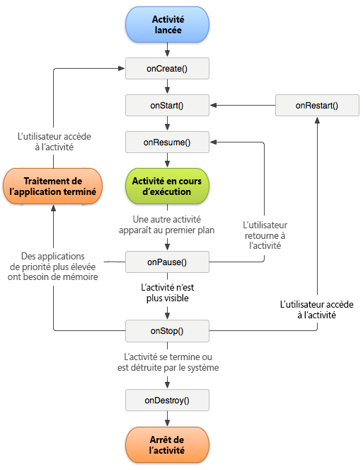

# Track app crashes {#track-app-crashes}

Ces informations vous aident à comprendre le mode de suivi des blocages ainsi que les bonnes pratiques pour traiter les faux blocages.

>[!TIP]
>
>Les blocages d'application font l'objet d'un suivi dans le cadre des mesures de cycle de vie. Avant de pouvoir effectuer le suivi des blocages, ajoutez la bibliothèque à votre projet et mettez en œuvre le cycle de vie. Pour plus d'informations, voir *Ajout du SDK et du fichier Config à votre projet intellij IDEA ou Eclipse* dans [l'implémentation principale et le cycle de vie](/help/android/getting-started/dev-qs.md).

Lors de la mise en œuvre des mesures de cycle de vie, un appel est effectué à `Config.collectLifecycleData` dans la méthode `OnResume` de chaque activité. In the `onPause` method, a call is made to `Config.pauseCollectingLifeCycleData`.

Dans `pauseCollectingLifeCycleData`, un indicateur est défini pour indiquer une fermeture correcte de l’application. Lorsque l’application est à nouveau lancée ou reprise, `collectLifecycleData` coche cet indicateur. Si l’application ne s’est pas fermée correctement comme déterminé par l’état de l’indicateur, des données contextuelles `a.CrashEvent` sont envoyées avec l’appel suivant et un événement de blocage est signalé.

Pour garantir une création de rapports de blocage exacte, vous devez appeler `pauseCollectingLifeCycleData` dans la méthode `onPause` de chaque activité. L’illustration suivante du cycle de vie des activités Android permet de comprendre pourquoi cette étape est indispensable :



Pour plus d’informations sur le cycle de vie des activités Android, voir [Activités](https://developer.android.com/guide/components/activities.html).

*L’illustration ci-dessus du cycle de vie Android a été créée et[partagée par le projet Open Source d’Android](https://source.android.com/)et utilisée selon les conditions générales de la licence[Creative Commons 2.5 Attribution License](https://creativecommons.org/licenses/by/2.5/).*

## Qu’est-ce qui peut provoquer le signalement d’un faux blocage ?

1. Si vous déboguez l’application à l’aide d’un IDE, par exemple Android Studio, un nouveau lancement de l’application depuis l’IDE alors qu’elle est au premier plan provoque un blocage.

   >[!TIP]
   >
   >Vous pouvez éviter ce blocage en arrière-plan de l'application avant de procéder à une nouvelle exécution depuis l'IDE.

1. If the last foreground Activity of your app is backgrounded and does not call `Config.pauseCollectingLifecycleData();` in `onPause`, and your app is manually closed or killed by the OS, the next launch results in a crash.

## Comment les fragments doivent-ils être traités ?

Les fragments disposent d’événements de cycle de vie des applications similaires aux activités. Néanmoins, un fragment ne peut pas être actif sans être rattaché à une activité.

>[!IMPORTANT]
>
>Vous devez vous fier aux événements de cycle de vie auxquels les activités qui contiennent peuvent exécuter votre code. Cet aspect est géré par l’affichage parent du fragment.

## (Facultatif) Implémentation des rappels de cycle de vie d'activité

À compter du niveau 14 de l’API, Android autorise les rappels globaux de cycle de vie pour les activités. For more information, see [Application](https://developer.android.com/reference/android/app/Application).

You can use these callbacks to ensure that all of your Activities correctly call `collectLifecycleData()` and `pauseCollectingLifecycleData()`. Ajoutez le code suivant uniquement dans votre activité principale et dans toute autre activité dans laquelle votre application peut être lancée :

```js
import com.adobe.mobile.Config; 
  
public class MainActivity extends Activity { 
... 
    @Override 
    protected void onCreate(Bundle savedInstanceState) { 
        super.onCreate(savedInstanceState); 
        setContentView(R.layout.activity_main); 
  
        getApplication().registerActivityLifecycleCallbacks(new Application.ActivityLifecycleCallbacks() { 
            @Override 
            public void onActivityResumed(Activity activity) { 
                Config.setContext(activity.getApplicationContext()); 
                Config.collectLifecycleData(activity); 
            } 
  
            @Override 
            public void onActivityPaused(Activity activity) {     
                Config.pauseCollectingLifecycleData(); 
            } 
    
            // the following methods aren't needed for our lifecycle purposes, but are required to be implemented 
            // by the ActivityLifecycleCallbacks object 
            @Override 
            public void onActivityCreated(Activity activity, Bundle savedInstanceState) {} 
            @Override 
            public void onActivityStarted(Activity activity) {} 
            @Override 
            public void onActivityStopped(Activity activity) {} 
            @Override 
            public void onActivitySaveInstanceState(Activity activity, Bundle outState) {} 
            @Override 
            public void onActivityDestroyed(Activity activity) {} 
        }); 
    } 
... 
}
```

To send additional context data with your lifecycle call by using `Config.collectLifecycleData(Activity activity`, `Map<String`, `Object> contextData)`, you must override the `onResume` method for that Activity and ensure that you call `super.onResume()` after manually calling `collectLifecycleData`.

```js
@Override 
protected void onResume() { 
    HashMap<String, Object> cdata = new HashMap<>(); 
    cdata.put("someKey", "someValue"); 
    Config.collectLifecycleData(this, cdata); 
  
    super.onResume(); 
}
```

