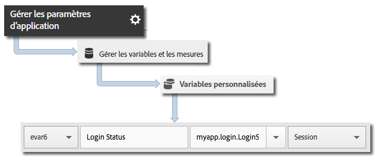

# Suivi des états d’application {#track-app-states}

Les états correspondent aux différents écrans ou affichages de votre application.

Chaque fois qu’un nouvel état s’affiche dans votre application (par exemple, lorsqu’un utilisateur navigue de la page d’accueil vers le fil d’actualité), un appel `trackState` est envoyé. Dans Android, `trackState` est généralement appelé chaque fois qu’une nouvelle activité est chargée.

## Suivi des états {#section_380DF56C4EE4432A823940E4AE4C9E91}

1. Ajoutez la bibliothèque à votre projet et mettez en œuvre le cycle de vie.

   Pour plus d’informations, voir *Ajout du SDK et du fichier de configuration au projet IntelliJ IDEA ou Eclipse* dans [Mise en œuvre principale et cycle de vie](/help/android/getting-started/dev-qs.md).

1. Importez la bibliothèque :

   ```java
   import com.adobe.mobile.*;
   ```

1. Dans la fonction `onCreate`, appelez `trackState` pour envoyer un accès correspondant à l’affichage d’état suivant :

   ```java
   @Override 
   public void onCreate(Bundle savedInstanceState) { 
       super.onCreate(savedInstanceState); 
       setContentView(R.layout.main); 
   
       // Adobe - track when this state loads 
       Analytics.trackState("State Name", null); 
   }
   ```

La variable `"State Name"` est signalée dans la variable `View State` dans Adobe Mobile Services, et un affichage est enregistré pour chaque appel `trackState`. Dans d’autres interfaces Analytics, la variable `View State` est signalée en tant que `Page Name` et `state views` est signalée en tant que `page views`.

## Envoi de données supplémentaires {#section_CFDB4F944496401786A145C209AB387C}

Outre `"State Name"`, vous pouvez envoyer des données contextuelles supplémentaires avec chaque appel d’action de suivi :

```java
@Override 
public void onCreate(Bundle savedInstanceState) { 
    super.onCreate(savedInstanceState); 
    setContentView(R.layout.main); 
  
    // Adobe - track when this state loads 
    HashMap<String, Object> exampleContextData = new HashMap<String, Object>(); 
    exampleContextData.put("myapp.login.LoginStatus", "logged in"); 
    Analytics.trackState("Home Screen", exampleContextData); 
}
```

Les valeurs de données contextuelles doivent être mappées à des variables personnalisées dans Adobe Mobile Services :



## Création de rapports d’états d’application {#section_0F6A54AB7A3F42C9BB042D86A0FC4630}

Les états sont généralement affichés à l’aide d’un rapport de cheminement qui vous permet de déterminer comment les utilisateurs naviguent dans votre application et quels états sont les plus consultés.

|  |  |
|--- |--- |
| Adobe Mobile Services | Rapport **[!UICONTROL Afficher les états]**. Ce rapport est basé sur les chemins que les utilisateurs prennent dans votre application. A sample path is  **[!UICONTROL Home]**  >  **[!UICONTROL Settings]**  > **[!UICONTROL Feed]**. |
| Adobe Analytics | Vous pouvez consulter les états sur les différents affichages des Pages : rapport **[!UICONTROL Pages]**, rapport **[!UICONTROL Pages vues]** et rapport **[!UICONTROL Chemin]**. |
| Analyses ad hoc | Vous pouvez consulter les états sur les différents affichages des Pages au moyen de la dimension **[!UICONTROL Page]**, de la mesure **[!UICONTROL Pages vues]** et des rapports **[!UICONTROL Chemin]**. |


