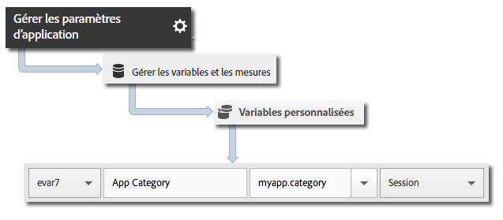

# Mise en œuvre principale et cycle de vie{#core-implementation-and-lifecycle}

Ces informations vous aideront à mettre en œuvre la bibliothèque Android et à collecter les mesures de cycle de vie, par exemple les lancements, les mises à niveau, les sessions, les utilisateurs actifs, etc.

## Téléchargement du kit SDK {#section_99FE1A17A36D4A2C943939023CF6265C}

>[!IMPORTANT]
>
>Pour télécharger le SDK, vous devez utiliser Android 2.2 ou une version supérieure.

1. Suivez les procédures décrites dans les sections ci-après pour configurer une suite de rapports de développement et télécharger une version prérenseignée du fichier de configuration :

   * [Création d’une suite de rapports](/help/android/getting-started/requirements.md)
   * [Téléchargement du kit SDK](/help/android/getting-started/requirements.md)

1. Téléchargez et décompressez le fichier `[Your_App_Name_]AdobeMobileLibrary-4.*-Android.zip` et vérifiez que les composants logiciels suivants existent :

   * `adobeMobileLibrary.jar`, qui est la bibliothèque qui sera utilisée avec les appareils et simulateurs Android.

   * `ADBMobileConfig.json` : fichier de configuration du SDK personnalisé pour votre application.
   >[!IMPORTANT]
   >
   >Si vous téléchargez le SDK en dehors de l’interface utilisateur Adobe Mobile Services, le fichier `ADBMobileConfig.json` doit être configuré manuellement. Si vous découvrez Analytics et le SDK Mobile et que vous souhaitez configurer une suite de rapports de développement et télécharger une version prérenseignée du fichier de configuration, consultez la rubrique [Avant de démarrer.](/help/android/getting-started/requirements.md)

## Ajout du SDK et du fichier de configuration au projet IntelliJ IDEA ou Eclipse {#section_B89510FBB4C646AEA73A185B966E54D3}

**Projet IntelliJ IDEA**

Pour ajouter le SDK et le fichier de configuration au projet, procédez comme suit :

1. Ajoutez le fichier `ADBMobileConfig.json` au dossier `assets` du projet.

1. Cliquez avec le bouton droit sur le projet dans le volet de navigation du projet.
1. Sélectionnez **[!UICONTROL Ouvrir les paramètres du module]**.
1. Sous **[!UICONTROL Paramètres du projet]**, sélectionnez **[!UICONTROL Bibliothèques]**.
1. Cliquez sur l’icône **[!UICONTROL +]** pour ajouter une nouvelle bibliothèque.
1. Sélectionnez **[!UICONTROL Java]** et accédez au fichier `adobeMobileLibrary.jar`.
1. Sélectionnez les modules dans lesquels vous prévoyez d’utiliser la bibliothèque mobile.
1. Cliquez sur **[!UICONTROL Appliquer]**, puis sur **[!UICONTROL OK]** pour fermer la fenêtre Paramètres du module.

**Projet Eclipse**

Pour ajouter le SDK et le fichier de configuration au projet, procédez comme suit :

1. Ajoutez le fichier `ADBMobileConfig.json` au dossier `assets` du projet.
1. Dans **[!UICONTROL Eclipse IDE]**, cliquez avec le bouton droit sur le nom du projet.
1. Cliquez sur **[!UICONTROL Créer chemin]** &gt; **[!UICONTROL Ajouter archives externes]**.
1. Sélectionner `adobeMobileLibrary.jar`.
1. Cliquez sur **[!UICONTROL Ouvrir]**.
1. Cliquez de nouveau avec le bouton droit sur le projet, puis sélectionnez **[!UICONTROL Créer chemin]** &gt; **[!UICONTROL Configurer création chemin]**.
1. Dans l’onglet **[!UICONTROL Ordonner et exporter]**, assurez-vous que le fichier **`adobeMobileLibrary.jar`** est sélectionné.

## Ajout des autorisations des applications {#section_2EAF73ABF6424647B219A63B33B02CD5}

La bibliothèque AppMeasurement nécessite les autorisations suivantes pour envoyer des données et enregistrer les appels de suivi hors ligne :

* `INTERNET`
* `ACCESS_NETWORK_STATE`

Pour ajouter ces autorisations, ajoutez les lignes suivantes au fichier `AndroidManifest.xml` situé dans le répertoire du projet d’application :

```java
<uses-permission android:name="android.permission.INTERNET" /> 
<uses-permission android:name="android.permission.ACCESS_NETWORK_STATE" />
```

## Définition du contexte de l’application {#set-application-context}

Le code suivant doit être ajouté à la méthode `onCreate` de votre activité principale :

```java
   @Override
   public void onCreate(BundlesavedInstanceState){
     super.onCreate(savedInstanceState)
     setContentView(R.layout.main);
     Config.setContext(this.getApplicationContext());
   }
````

## Mise en œuvre des mesures de cycle de vie {#section_BA686C09021F474AADDE8690BBB910F7}

Une fois que vous avez activé le cycle de vie, chaque fois que l’application est lancée, un accès est envoyé permettant de mesurer les lancements, les mises à niveau, les sessions, les utilisateurs actifs, etc. Pour en savoir plus, voir la section [Mesures de cycle de vie](/help/android/metrics.md).

**Procédez comme suit pour chaque activité de votre application :**

1. Importez la bibliothèque :

   ```java
   import com.adobe.mobile.*;
   ```

1. Pour la fonction `onResume`, démarrez la collecte des données du cycle de vie :

   ```java
   @Override 
   public void onResume() { 
       Config.collectLifecycleData(this); 
       // -or- Config.collectLifecycleData(this, contextData); 
   }
   ```

1. Pour la fonction `onPause`, arrêtez la collecte des données du cycle de vie :

   ```java
   @Override 
   public void onPause() { 
       Config.pauseCollectingLifecycleData(); 
   }
   ```

>[!IMPORTANT]
>
>Vous devez ajouter ces appels à chaque activité afin de garantir une création de rapports de blocage exacte. Pour plus d’informations, voir [Suivi des blocages d’application](/help/android/analytics-main/crashes.md).

## Inclusion des données supplémentaires aux appels du cycle de vie

Pour inclure des données supplémentaires aux appels de mesures de cycle de vie, transmettez un paramètre supplémentaire à `collectLifecycleData` qui contient les données contextuelles :

```java
@Override 
public void onResume() {
    HashMap<String, Object> contextData = new HashMap<String, Object>(); 
    contextData.put("myapp.category", "Game"); 
    Config.collectLifecycleData(this, contextData); 
}
```

Les valeurs des données contextuelles supplémentaires envoyées avec `collectLifecycleData` doivent être mises en correspondance avec les variables personnalisées dans Adobe Mobile Services :



Les autres mesures de cycle de vie sont collectées automatiquement. Pour en savoir plus, voir la section [Mesures de cycle de vie](/help/android/metrics.md).

## Étapes suivantes {#section_BF709684E1DD40EA9169BC1D0D4B37C2}

Exécutez les tâches ci-après :

* [Suivi des états de l’application](/help/android/analytics-main/states.md)
* [Suivi des actions de l’application](/help/android/analytics-main/actions.md)

