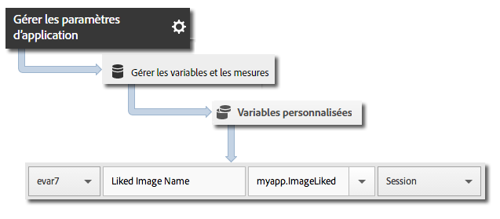

# Suivi des balises {#beacon-tracking}

Le suivi des balises permet de mesurer et de cibler des micro-emplacements à l’aide d’iBeacon et du Bluetooth basse énergie.

Les données de balises suivantes sont envoyées à Analytics et à Target lorsque `trackBeacon` est appelé :

* `a.beacon.uuid` : ProximityUUID de la balise
* `a.beacon.major` : numéro majeur de la balise (par exemple, le numéro de la boutique)
* `a.beacon.minor` : numéro mineur de la balise (par exemple, un numéro unique dans une boutique)
* `a.beacon.prox` : valeurs 0 à 3 représentant la distance de l’utilisateur par rapport à la balise.

Voici ce que ces valeurs signifient :

* 0 = inconnu
* 1 = immédiat
* 2 = proche
* 3 = loin

Ces données de balise sont capturées dans les variables des solutions mobiles.

## Balises de suivi {#section_FC3F213545944A468B1E6D5D5C8E2F1F}

1. Ajoutez la bibliothèque à votre projet et mettez en œuvre le cycle de vie.

   Pour plus d’informations, voir *Ajout du SDK et du fichier de configuration au projet IntelliJ IDEA ou Eclipse* dans [Mise en œuvre principale et cycle de vie](/help/android/getting-started/dev-qs.md).

1. Importez la bibliothèque :

   ```java
   import com.adobe.mobile.*;
   ```

1. Trouvez l’emplacement de la balise.

   Plusieurs bibliothèques tierces sont disponibles pour analyser les balises Bluetooth LE, selon le fabricant de la balise.
1. Après avoir obtenu les informations de la balise, utilisez l’appel suivant pour effectuer le suivi de l’emplacement :

   ```java
   // assumed that the following variables will have been retrieved by the 3rd party beacon library 
   String beaconUUID; 
   String major; 
   String minor; 
   Analytics.BEACON_PROXIMITY proximity;  
   // BEACON_PROXIMITY is an enum available in the SDK. Number 0-3 representing how close the 
   // user is to the beacon. 0 unknown, 1 immediate, 2 near, 3 far.  
   Analytics.trackBeacon(beaconUUID, major, minor, proximity, null);
   ```

1. Lorsque l’utilisateur quitte la proximité de la balise, effacez la balise actuelle :

   ```java
   Analytics.clearBeacon();
   ```

## Envoi de données supplémentaires {#section_3EBE813E54A24F6FB669B2478B5661F9}

Outre les données de balises, vous pouvez envoyer des données contextuelles supplémentaires avec chaque appel `trackBeacon` :

```java
HashMap cdata = new HashMap<String, Object>(); 
cdata.put("myapp.ImageLiked", imageName); 
Analytics.trackBeacon(beaconUUID, major, minor, proximity, cdata);
```

Les valeurs des données contextuelles doivent être mises en correspondance avec des variables personnalisées dans Adobe Mobile Services :



