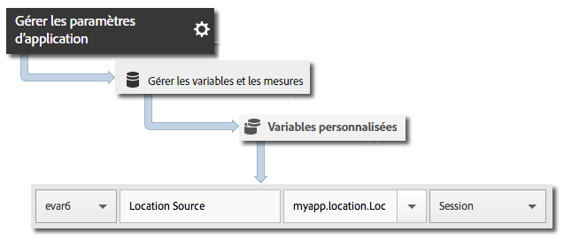

# Geo-location and points of interest {#geo-location-and-points-of-interest}

La géolocalisation vous aide à mesurer les données de position à l’aide de la latitude et de la longitude ainsi que de points ciblés prédéfinis dans vos applications Android.

Chaque appel `trackLocation` envoie les informations suivantes :

* Latitude, longitude et position d’un point ciblé défini dans l’interface utilisateur Adobe Mobile Services.

   Ces informations sont transmises aux variables des solutions mobiles pour une création de rapports automatique.

* Distance depuis le centre et exactitude transmises sous la forme de données contextuelles.

   Ces variables ne sont pas capturées automatiquement. You must map these context data variables by using the instructions in the *Sending Additional Data* section below.

## Mises à jour dynamiques des points ciblés {#section_3747B310DD5147E2AAE915E762997712}

À compter de la version 4.2, les points ciblés sont définis dans l’interface utilisateur Adobe Mobile et synchronisés dynamiquement dans le fichier de configuration de l’application. Cette synchronisation requiert un `analytics.poi` paramètre dans la configuration [JSON](/help/android/configuration/json-config/json-config.md)ADBMobile :

```js
“analytics.poi”: “https://assets.adobedtm.com/…/yourfile.json”,
```

S’il n’est pas configuré, vous devez télécharger une version mise à jour du fichier `ADBMobile.json` et l’ajouter à l’application. Pour plus d’informations, voir [Téléchargement du SDK et des outils](/help/android/getting-started/requirements.md)de test.

## Tracking geo-location and POIs {#section_B1616E400A7548F9A672F97FEC75AE27}

1. Ajoutez la bibliothèque à votre projet et mettez en œuvre le cycle de vie.

   Pour plus d’informations, voir *Ajout du SDK et du fichier de configuration à votre projet* IntelliJ IDEA ou Eclipse dans l’implémentation et le cycle de vie [](/help/android/getting-started/dev-qs.md)principaux.

1. Importez la bibliothèque :

   ```java
   import com.adobe.mobile.*;
   ```

1. Appelez `trackLocation` pour effectuer le suivi de la position actuelle :

   ```java
   Location currentLocation = new Location("my location here"); 
   Analytics.trackLocation(currentLocation, null);
   ```

   >[!TIP]
   >
   >Vous pouvez appeler `trackLocation` à tout moment.

   You can use location strategies to determine the location that is passed to the `trackLocation` call. Pour plus d’informations, voir Stratégies [d’emplacement](https://developer.android.com/guide/topics/location/strategies.html)Android.

En outre, si la position est déterminée comme se trouvant dans un rayon de point ciblé défini, une variable de données contextuelles `a.loc.poi` est envoyée avec l’accès `trackLocation` et est signalée comme point ciblé dans les rapports **Ventilation géographique**. Une variable contextuelle `a.loc.dist` est également envoyée avec la distance en mètres depuis les coordonnées définies.

## Sending additional data {#section_3EBE813E54A24F6FB669B2478B5661F9}

Outre les données de position, vous pouvez envoyer des données contextuelles supplémentaires avec chaque appel de localisation :

```java
HashMap<String, Object> locationContextData = new HashMap<String, Object>(); 
locationContextData.put("myapp.location.LocationSource", "GPS"); 
 
Location currentLocation = new Location("my location here"); 
Analytics.trackLocation(currentLocation, locationContextData);
```

Les valeurs des données contextuelles doivent être mises en correspondance avec des variables personnalisées dans l’interface utilisateur Adobe Mobile Services :



## Location context data {#section_FFB71E6653F9410A89CC6ACC0C9164A9}

La latitude et la longitude sont envoyées en utilisant trois différents paramètres de données contextuelles, chaque paramètre représentant un niveau différent de précision, pour un total de six paramètres de données contextuelles.

Par exemple, les coordonnées lat = 40.93231, long = -111.93152 représentent une position avec 1 mètre de précision. Cette position est fractionnée en fonction du niveau de précision dans les variables suivantes :

`a.loc.lat.a`= 040.9

`a.loc.lat.b` = 32

`a.loc.lat.c` = 31

`a.loc.lon.a` = -111.9

`a.loc.lon.b` = 31

`a.loc.lon.c` = 52

Pour certains niveaux de précision, il se peut que la valeur `00` apparaisse. Cela dépend du degré de précision de la position actuelle. Si, par exemple, la précision de la position est actuellement de 100 mètres, les variables `a.loc.lat.c` et `a.loc.lon.c` sont renseignées par `00`.

À noter :

* A `trackLocation` request sends in the equivalent of a `trackAction` call.

* Les points ciblés n’étant pas transmis par les appels types `trackAction` et `trackState`, vous devez donc utiliser un appel `trackLocation` pour effectuer le suivi des points ciblés.

* `trackLocation` doit être appelé aussi souvent que nécessaire pour effectuer le suivi de la position et des points ciblés.

   Nous vous recommandons d’appeler `trackLocation` lors du démarrage de l’application, puis selon les besoins de cette dernière.

* Les points ciblés sont renseignés uniquement une fois qu’ils sont définis dans le fichier de configuration de l’application.

   Les points ciblés ne sont pas appliqués aux appels `trackLocation` historiques qui ont été envoyés auparavant.
* Les appels `trackLocation` prennent en charge l’envoi de données contextuelles supplémentaires, tout comme les appels `trackAction`.

* Lorsque les diamètres de deux points ciblés se chevauchent, le premier point ciblé contenant la position actuelle est utilisé.

   Si les points ciblés se chevauchent, vous devez les répertorier du plus granulaire au moins granulaire pour garantir que le point ciblé le plus granulaire est signalé.

