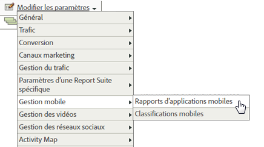
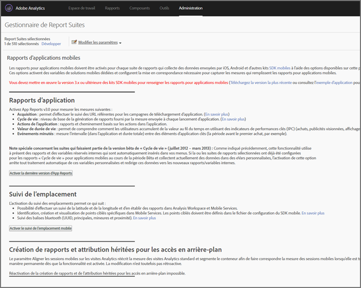

# Analytics {#analytics}

Après avoir ajouté la bibliothèque au projet, vous pouvez effectuer n’importe quel appel de méthode Analytics, n’importe où dans l’application (assurez-vous d’importer ADBMobile.h dans votre classe).

## Enable mobile application reports in Analytics {#task_3DA1354942CF4BF4B11B9CC97588A9ED}

Avant d’ajouter du code, demandez à votre administrateur Analytics de procéder comme suit pour activer le suivi du cycle de vie des applications mobiles. Cela garantit que la suite de rapports est prête à capturer des mesures lors du démarrage du développement.


1. Open **[!UICONTROL Admin Tools]** &gt; **[!UICONTROL Report Suites]** and select your mobile report suite(s).
1. Click **[!UICONTROL Edit Settings]** &gt; **[!UICONTROL Mobile Management]** &gt; **[!UICONTROL Mobile Application Reporting]**.

   

1. Cliquez sur **[!UICONTROL Activer la dernière version d’App Reports]**.

   Vous pouvez éventuellement cliquer aussi sur **[!UICONTROL Activer le suivi de l’emplacement mobile]** et **[!UICONTROL Activer la création de rapports et l’attribution héritées pour les accès en arrière-plan]**.

   

Lifecycle metrics are now ready to be captured, and Mobile Application Reports] appear in the **[!UICONTROL Reports]** menu in the marketing reports interface.

## Collecte de mesures de cycle de vie {#task_25D469C62DF84573AEB5E8E950B96205}

1. To collect lifecycle metrics in your app, call `collectLifecycleData()` in the `ApplicationUI` constructor.

   Par exemple :

   ```java
   ApplicationUI::ApplicationUI(bb::cascades::Application *app): QObject(app) { 
   //... 
   ADBMobile::collectLifecycleData(); 
   } 
   ```

   If `collectLifecycleData()` is called twice in the same session, then your application will report a crash on every call after the first. Le SDK définit un indicateur lorsque l’application est arrêtée afin de signaler une sortie réussie. If this flag is not set, `collectLifecyleData()` reports a crash.

## Events, props, and eVars {#concept_B885D5A71A5D45129CE7C1C3426A7D28}


Si vous avez consulté la [référence de classe et de référence adbmobile](/help/blackberry/methods.md), vous vous demandez probablement où définir les événements, evars, props, heirs et listes. Dans la version 4, vous ne pouvez plus affecter ces types de variables directement dans l’application. À la place, le SDK utilise des données contextuelles et des règles de traitement afin de faire correspondre les données de l’application aux variables Analytics à des fins de création de rapports.

Les règles de traitement présentent plusieurs avantages :

* Vous pouvez modifier la correspondance des données sans soumettre de mise à jour dans la boutique d’applications.
* Vous pouvez utiliser des noms significatifs pour les données au lieu de définir des variables spécifiques à une suite de rapports.
* L’envoi de données supplémentaires a très peu d’impact. Ces valeurs n’apparaîtront pas dans les rapports tant qu’elles ne sont pas mappées à l’aide des règles de traitement.

Les valeurs que vous affectiez directement aux variables doivent être ajoutées à la table de hachage HashMap `data`.

## Règles de traitement {#concept_3EA4CD602AF4488A896B0EDD3BA2D969}

Les règles de traitement sont utilisées pour copier les données que vous envoyez dans les variables de données contextuelles vers des eVars, props et autres variables pour la création de rapports.

[Formation aux règles de traitement](https://tv.adobe.com/embed/1181/16506/) – Summit 2013

[Règles de traitement](https://docs.adobe.com/content/help/en/analytics/admin/admin-tools/processing-rules/processing-rules.html)

[Obtenir l'autorisation d'utiliser des règles de traitement](https://helpx.adobe.com/analytics/kb/processing-rules-authorization.html)

Il est recommandé de regrouper les variables de données contextuelles à l’aide d’espaces de noms, car cela vous aide à conserver un ordre logique. Si, par exemple, vous souhaitez collecter des informations sur un produit, vous pouvez définir les variables suivantes :

```js
"product.type":"hat" 
"product.team":"mariners" 
"product.color":"blue"
```

Les variables de données contextuelles sont triées par ordre alphabétique dans l’interface des règles de traitement, afin que les espaces de noms permettent de voir rapidement les variables qui se trouvent dans le même espace de noms.

En outre, nous avons entendu dire que certains d’entre vous nomment des clés de données de contexte en utilisant le numéro d’eVar ou de prop :

```js
"eVar1":"jimbo"
```

Ceci pourrait *quelque peu* vous faciliter la tâche lorsque vous exécutez le mappage unique dans les règles de traitement, mais la lisibilité sera réduite au cours du débogage et des futures mises à jour de code, qui pourront alors s’avérer plus complexes. Nous vous recommandons vivement de nommer les clés et les valeurs de manière explicite :

```js
"username":"jimbo"
```

Les variables contextuelles qui définissent les événements de compteur peuvent avoir les mêmes clé et valeur :

```js
"logon":"logon"
```

Les variables de données contextuelles qui définissent des événements d’incrémentation peuvent avoir l’événement comme clé et la valeur à incrémenter comme valeur :

```js
"levels completed":"6"
```

>[!TIP]
>
>Adobe réserve l'espace de noms `a.`. En dehors de cette restriction, les variables de données contextuelles doivent être uniques dans votre société de connexion afin éviter les collisions.

## Activation du suivi hors ligne {#concept_402F4ECE240B4CA1B779322A7BFCB8DE}

To store hits when the device is offline, you can optionally enable offline tracking in the `ADBMobileConfig.json` file.

Faites très attention aux exigences d’horodatage décrites dans la référence du fichier de configuration avant d’activer le suivi hors ligne.

## Méthodes Analytics

Pour obtenir la liste des méthodes Analytics disponibles pour blackberry, reportez-vous *aux méthodes* Analytics dans [Adobe Mobile Class and Method Reference](/help/blackberry/methods.md).