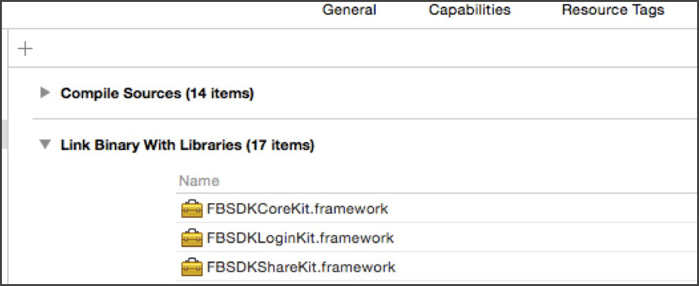

# Suivi de liens profonds différés tiers {#tracking-third-party-deferred-deep-links}

Utilisez le SDK iOS pour mettre en œuvre le suivi de liens profonds différés tiers.

## Création de liens profonds classiques pour le SDK Adobe Mobile {#section_D114FA1EB9664EAA82E036A990694B26}

Le SDK Adobe Mobile prend actuellement en charge la création de liens profonds lorsque le développeur d’applications doit invoquer l’API `trackAdobeDeepLink` et transmettre l’URL de lien profond, qui est l’URL du lecteur d’empreinte digitale générée dans Adobe Mobile Services pendant la configuration. Le SDK envoie une commande ping au lecteur d’empreinte digitale pour obtenir les données d’acquisition et l’ajoute aux données contextuelles des appels d’analyse d’installation/de lancement en tant qu’élément du cycle de vie. Le SDK ajoute également les données de lien profond à partir des paramètres d’URL de lien profond. Pour obtenir plus d’informations sur la création de liens profonds, voir [Suivi des liens profonds](/help/ios/acquisition-main/tracking-deep-links/tracking-deep-links.md).

## Création de liens profonds Facebook {#section_6A9DACB54A2F4CDEBE9C744DEFADFDED}

Un créateur de publicités peut créer une publicité sur Facebook sous la forme d’un lien profond. Lorsque les utilisateurs cliquent sur la publicité dans Facebook, ils accèdent directement aux informations qui les intéressent dans l’application. Le lien profond **n’est pas** une URL d’empreinte digitale. Néanmoins, lors de la configuration de la publicité, il existe une option permettant de fournir une URL de lien profond tiers. Un développeur d’applications qui utilise les SDK et services mobiles Experience Cloud doit saisir l’URL d’empreinte digitale configurée pour Mobile Services dans ce champ. Si tout est correctement configuré, le SDK Facebook transmet cette URL à l’application lorsque cette dernière est installée ou lancée.

## Configuration des SDK {#section_834CD3109175432B8173ECB6EA7DE315}

1. Configurez le SDK Facebook :

   Pour plus d’informations, voir :

   * [Prise en main du SDK Facebook pour iOS](https://developers.facebook.com/docs/ios/getting-started)
   * [Configuration de la création de liens profonds](https://developers.facebook.com/docs/app-ads/deep-linking#os)

1. Pour configurer le SDK, appelez `trackAdobeDeepLink` et transférez l’URL aux SDK :

   ```objective-c
   - (BOOL)application:(UIApplication *)application openURL:(NSURL *)url sourceApplication:(NSString *)sourceApplication annotation:(id)annotation 
   { 
     [ADBMobile trackAdobeDeepLink:url]; 
     return YES; 
   }
   ```

   >[!TIP]
   >
   >Assurez-vous que l’URL de lien profond comporte une clé dénommée `a.deeplink.id`. Aucun paramètre d’URL ne sera annexé aux données contextuelles lorsque le paramètre `a.deeplink.id` n’est pas indiqué dans l’URL.

Si l’application est configurée selon la procédure indiquée ci-dessus, la version AMSDK actuelle fonctionnera normalement et annexera les données de lien profond pour installer/lancer correctement les appels d’analyse.

## Activation de la fonctionnalité dans un exemple d’application {#section_64C15E269E89424B8E3D029F88094620}

1. Enregistrez un schéma d’URL.

   Vérifiez que vous avez enregistré un schéma d’URL, lequel est identique à l’URL de lien profond.

   ```objective-c
   <key>CFBundleURLTypes</key> 
       <array> 
           <dict> 
               <key>CFBundleURLSchemes</key> 
               <array> 
                   <string>sampleapptest</string> 
               </array> 
           </dict> 
       </array>
   ```

1. Reliez les SDK Facebook.

   

1. Modifier `AppDelegate`.

   1. Importez les en-têtes.

      ```objective-c
      /************************************************************************* 
      ADOBE SYSTEMS INCORPORATED 
      Copyright 2015 Adobe Systems Incorporated 
      All Rights Reserved. 
      NOTICE:  Adobe permits you to use, modify, and distribute this file in accordance with the 
      terms of the Adobe license agreement accompanying it.  If you have received this file from a 
      source other than Adobe, then your use, modification, or distribution of it requires the prior 
      written permission of Adobe. 
      
      **************************************************************************/ 
      
      #import "AppDelegate.h" 
      #import "GalleryViewController.h" 
      #import "SimpleTrackingController.h" 
      #import "PostbackController.h" 
      #import "InAppMessageViewController.h" 
      #import "LifetimeValueController.h" 
      #import "LocationTargetingController.h" 
      #import "MediaViewController.h" 
      #import "TimedActionController.h"
      
      // Uncomment after including the facebook sdks. 
      @import FBSDKCoreKit; 
      @import Bolts;
      ```

   1. Indiquez la gestion des liens profonds différés.

      ```objective-c
      - (BOOL) application:(UIApplication *)application didFinishLaunchingWithOptions:(NSDictionary *)launchOptions { 
          /* 
           * Adobe Tracking - Analytics 
           * 
           * turn on debug logging for the ADBMobile SDK 
           * enable the collection of lifecycle data 
           */ 
              if (launchOptions[UIApplicationLaunchOptionsURLKey] == nil) { 
                  if (NSClassFromString(@"FBSDKAppLinkUtility") != nil) 
                  { 
                      [NSClassFromString(@"FBSDKAppLinkUtility") performSelector:@selector(fetchDeferredAppLink:) withObject:^(NSURL *url, NSError *error) { 
                          if (error) { 
                              NSLog(@"Received error while fetching deferred app link %@", error); 
                          } 
                          if (url) { 
                              [[UIApplication sharedApplication] openURL:url]; 
                          } 
                      }]; 
                  } 
          } 
          ..... 
          ..... 
          return YES; 
      }
      ```

   1. Appelez l’API `trackAdobeDeepLink` et transmettez l’URL du lien profond au SDK.

      ```objective-c
      - (BOOL)application:(UIApplication *)app openURL:(NSURL *)url options:(NSDictionary<NSString *, id> *)options { 
          [self handleDeepLink:url]; 
      
          return YES; 
      }
      ```
