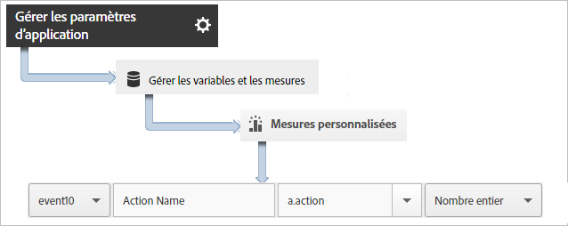
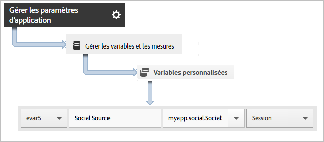

# Suivi des actions de l’application {#track-app-actions}

Les actions sont des événements qui se produisent votre application que vous souhaitez mesurer. Chaque action est associée à une ou à plusieurs mesures qui sont incrémentées chaque fois que l’événement se produit. Par exemple, vous pourriez suivre un nouvel abonnement, à chaque consultation d’un article ou à chaque niveau atteint. Les mesures correspondantes pour ces événements sont configurées en tant qu’abonnements, articles lus et niveaux atteints.

Le suivi des actions n’est pas automatique. Pour effectuer le suivi d’un événement, vous devez appeler `trackAction`.

## Suivi des actions {#section_380DF56C4EE4432A823940E4AE4C9E91}

1. Ajoutez la bibliothèque à votre projet et mettez en œuvre le cycle de vie.

   Pour plus d’informations, voir *Ajout du SDK et du fichier de configuration à votre projet* dans [Mise en œuvre principale et cycle de vie](/help/ios/getting-started/dev-qs.md).
1. Importez la bibliothèque.

   ```objective-c
   #import "ADBMobile.h"
   ```

1. Lorsque l’action dont vous souhaitez effectuer le suivi se produit dans votre application, appelez `trackAction` pour envoyer un accès pour cette action.

   ```objective-c
   [ADBMobile trackAction:@"myapp.ActionName"  
                     data:nil];
   ```

   >[!TIP]
   >
   >Si le code dans lequel vous ajoutez cet appel s’exécute pendant que l’application est en arrière-plan, utilisez `trackActionFromBackground` plutôt que `trackAction`.

1. Dans l’interface utilisateur des Adobe Mobile Services, sélectionnez l’application souhaitée, puis cliquez sur **[!UICONTROL Gérer les paramètres d’application]**.

1. Cliquez sur **[!UICONTROL Gérer les variables et les mesures]**, puis sur l’onglet **[!UICONTROL Mesures personnalisées]**.

1. Mappez le nom des données contextuelles utilisé dans votre code, par exemple `a.action=myapp.ActionName`, à un événement personnalisé.

   

Vous pouvez également définir une prop qui contiendra toutes les valeurs d’action en mappant une prop personnalisée dont le nom serait par exemple **[!UICONTROL Actions personnalisées]** et dont la valeur est définie sur `a.action`.


## Envoi de données supplémentaires {#section_3EBE813E54A24F6FB669B2478B5661F9}

En plus du nom de l’action, vous pouvez envoyer des données contextuelles supplémentaires avec chaque appel d’action de suivi :

```objective-c
NSMutableDictionary *contextData = [NSMutableDictionary dictionary]; 
[contextData setObject:@"Twitter" forKey:@"myapp.social.SocialSource"]; 
[ADBMobile trackAction:@"myapp.SocialShare" data:contextData];
```

Les valeurs des données contextuelles doivent être mises en correspondance avec des variables personnalisées :



## Suivi des actions en arrière-plan {#section_AC13013F207D4FBAAF27E4412034251E}

Si vous suivez une action dans un code qui pourrait être en cours d’exécution alors que l’application est en arrière-plan, appelez `trackActionFromBackground` plutôt que `trackAction`. Leurs paramètres sont identiques, mais `trackActionFromBackground` contient une logique supplémentaire pour éviter que les appels de cycle de vie ne se déclenchent alors qu’ils ne le devraient pas.

## Création de rapports sur les actions {#section_0F6A54AB7A3F42C9BB042D86A0FC4630}

| Interface | Rapport |
|--- |--- |
| Adobe Mobile Services | Rapport **[!UICONTROL Chemins d’accès des actions.]** Affichez l’ordre dans lequel les actions se produisent dans l’application. Vous pouvez également cliquer sur **[!UICONTROL Personnaliser]** dans n’importe quel rapport pour afficher les actions par ordre de classement, de tendances ou dans un rapport ventilé, ou appliquer un filtre afin d’afficher certaines actions pour un segment en particulier. |
| Rapports et analyses marketing | Rapport **[!UICONTROL Événement personnalisé]**.  Une fois qu’une action est mise en correspondance avec un événement personnalisé, vous pouvez afficher les événements mobiles similaires à tous les autres événements Analytics. |
| Analyses ad hoc | Rapport **[!UICONTROL Événement personnalisé.]** Une fois qu’une action est mise en correspondance avec un événement personnalisé, vous pouvez afficher les événements mobiles similaires à tous les autres événements Analytics. |
