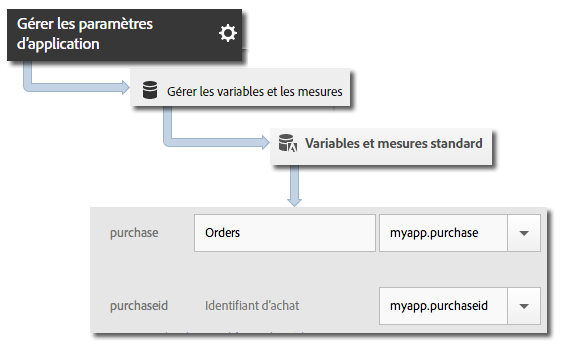

# Variable products {#products-variable}

La variable products ne peut pas être définie à l’aide de règles de traitement. Dans le SDK iOS 4.x, vous devez utiliser une syntaxe spéciale dans le paramètre de données contextuelles pour définir les produits sur l’appel au serveur.

Pour définir la variable *`products`*, définissez une clé de données contextuelles sur `"&&products"`, puis définissez la valeur en utilisant la syntaxe définie pour la variable *`products`* :

```objective-c
[contextData setObject:@"Category;Product;Quantity;Price[,Category;Product;Quantity;Price]" forKey:@"&&products"];
```

Par exemple :

```objective-c
//create a context data dictionary 
NSMutableDictionary *contextData = [NSMutableDictionary dictionary]; 
 
// add products, a purchase id, a purchase context data key, and any other data you want to collect. 
// Note the special syntax for products 
[contextData setObject:@";Running Shoes;1;69.95,;Running Socks;10;29.99" forKey:@"&&products"]; 
[contextData setObject:@"1234567890" forKey:@"m.purchaseid"]; 
[contextData setObject:@"1" forKey:@"m.purchase"]; 
 
// send the tracking call - use either a trackAction or TrackState call. 
// trackAction example: 
[ADBMobile trackAction:@"purchase" data:contextData]; 
// trackState example: 
[ADBMobile trackState:@"Order Confirmation" data:contextData]; 
```

*`products`* est définie directement sur la demande d’image, tandis que les autres variables sont définies en tant que données contextuelles. Toutes les variables de données contextuelles doivent être mises en correspondance à l’aide des règles de traitement :



Il n’est pas nécessaire de mettre en correspondance la variable  *`products`* à l’aide des règles de traitement, car elle est définie directement sur la demande d’image par le SDK.
