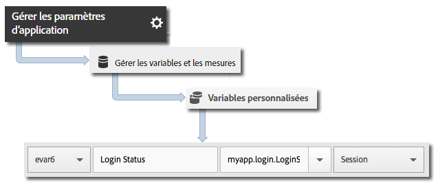

# Suivi des états d’application {#track-app-states}

Les états correspondent aux différents écrans ou affichages de votre application. Chaque fois qu’un nouvel état s’affiche dans votre application (par exemple, lorsqu’un utilisateur navigue de la page d’accueil vers le fil d’actualité), un appel de suivi de l’état devrait être envoyé. Sous iOS, un état est généralement suivi dans la méthode viewDidLoad de chaque vue.

>[!TIP]
>
>Pour suivre des états, effectuez un appel vers `trackState`. Les états ne sont pas automatiquement suivis.

## Suivi des états {#section_380DF56C4EE4432A823940E4AE4C9E91}

1. Ajoutez la bibliothèque à votre projet et mettez en œuvre le cycle de vie.

   Pour plus d’informations, voir *Ajout du SDK et du fichier de configuration à votre projet* dans [Mise en œuvre principale et cycle de vie](/help/ios/getting-started/dev-qs.md).
1. Importez la bibliothèque.

   ```objective-c
   #import "ADBMobile.h"
   ```

1. Invoquez `trackState` afin d’envoyer un accès pour cet affichage d’état.

   ```objective-c
   [ADBMobile trackState:@"Login Screen"  
                    data:nil];
   ```

Dans Adobe Mobile Services, le **[!UICONTROL State Name]** est reporté dans la variable *`View State`* et un affichage est enregistré pour chaque appel `trackState`. Dans d’autres interfaces Analytics, la variable **[!UICONTROL View State]** est signalée en tant que **[!UICONTROL Page Name]** et state views est signalée en tant que page views.

## Envoi de données supplémentaires {#section_CFDB4F944496401786A145C209AB387C}

Outre le **[!UICONTROL Nom de l’état]**, vous pouvez envoyer des données contextuelles supplémentaires avec chaque appel d’action de suivi :

```objective-c
NSMutableDictionary *contextData = [NSMutableDictionary dictionary]; 
[contextData setObject:@"logged in" forKey:@"myapp.login.LoginStatus"]; 
[ADBMobile trackState:@"Home Screen" data:contextData];
```

Les valeurs des données contextuelles doivent être mises en correspondance avec des variables personnalisées :



## Création de rapports d’états d’application {#section_0F6A54AB7A3F42C9BB042D86A0FC4630}

Les états sont généralement consultés au moyen d’un rapport de cheminement afin de découvrir comment les utilisateurs naviguent dans votre application et les états les plus vus.

|  |  |
|--- |--- |
| Adobe Mobile Services | Rapport **[!UICONTROL Afficher les états]**. Ce rapport est basé sur les chemins que les utilisateurs prennent dans votre application. Un exemple de chemin est **[!UICONTROL Accueil]** > **[!UICONTROL Paramètres]** > **[!UICONTROL Flux]**. |
| Adobe Analytics | Vous pouvez consulter les états sur les différents affichages des Pages : rapport **[!UICONTROL Pages]**, rapport **[!UICONTROL Pages vues]** et rapport **[!UICONTROL Chemin]**. |
| Analyses ad hoc | Vous pouvez consulter les états sur les différents affichages des Pages au moyen de la dimension **[!UICONTROL Page]**, de la mesure **[!UICONTROL Pages vues]** et des rapports **[!UICONTROL Chemin]**. |
