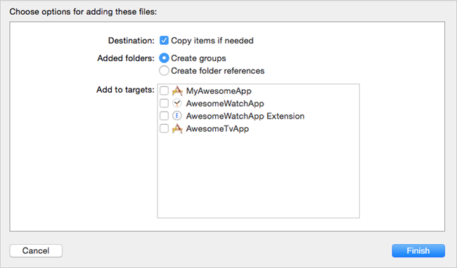
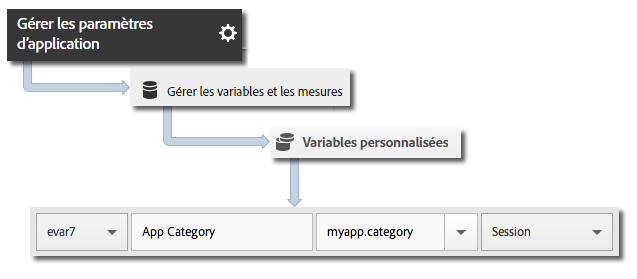

# Mise en œuvre principale et cycle de vie {#core-implementation-and-lifecycle}

Ces informations vous aideront à mettre en œuvre la bibliothèque iOS et à collecter les mesures de cycle de vie, telles que les lancements, les mises à niveau, les sessions, les utilisateurs actifs, etc.

## Téléchargement du kit SDK {#section_99FE1A17A36D4A2C943939023CF6265C}

>[!IMPORTANT]
>
>Pour télécharger les SDK, vous **devez** utiliser la version iOS 6 ou ultérieure.

**Condition requise**

Avant de télécharger le SDK, suivez les étapes de la section *Création d’une suite de rapports* dans [Mise en œuvre principale et cycle de vie](/help/ios/getting-started/requirements.md) pour configurer une suite de rapports de développement et télécharger une version préremplie du fichier de configuration.

Pour télécharger le kit SDK :

1. Téléchargez, décompressez le fichier `[Your_App_Name_]AdobeMobileLibrary-4.*-iOS.zip` et vérifiez que vous disposez des composants logiciels suivants :

   * `ADBMobile.h` : fichier d’en-tête Objective-C utilisé par AppMeasurement pour iOS.
   * `ADBMobileConfig.json` : fichier de configuration du SDK personnalisé pour votre application.
   * `AdobeMobileLibrary.a` : binaire gras en bytecode contenant les versions de bibliothèque pour les appareils (armv7, armv7s et arm64) et les simulateurs (i386 et x86_64) iOS.

      Ce binaire gras doit être lié lorsque la cible est destinée à une application iOS.

   * `AdobeMobileLibrary_Extension.a` : binaire gras en bytecode contenant les versions de bibliothèque pour les appareils (armv7, armv7s et arm64) et les simulateurs (i386 et x86_64) iOS.

      Ce binaire gras doit être lié lorsque la cible est destinée à une extension iOS.

   * `AdobeMobileLibrary_Watch.a` : binaire gras en bytecode contenant les versions de bibliothèque pour les appareils (armv7k) et les simulateurs (i386, x86_64) Apple Watch.

      Ce binaire gras doit être lié lorsque la cible est destinée à une application d’extension Apple Watch (watchOS 2).

   * `AdobeMobileLibrary_TV.a` : binaire gras en bytecode contenant les versions de bibliothèque pour les nouveaux appareils (arm64) et le nouveau simulateur (x86_64) Apple TV.

      Ce binaire gras doit être lié lorsque la cible est destinée à une application Apple TV (tvOS).

>[!IMPORTANT]
>
>Si vous téléchargez le SDK en dehors de l’interface utilisateur Adobe Mobile Services, le fichier `ADBMobileConfig.json` doit être configuré manuellement. Si vous découvrez Analytics et le SDK Mobile et que vous souhaitez configurer une suite de rapports de développement et télécharger une version préremplie du fichier de configuration, consultez la rubrique [Avant de démarrer](/help/ios/getting-started/requirements.md).

## Ajout du SDK et du fichier de configuration au projet {#section_93C25D893B4A4CD3B996CF3C5590C8DC}

1. Lancez Xcode IDE et ouvrez votre application.
1. Dans Navigateur de projets, faites glisser le répertoire `AdobeMobileLibrary` sous votre projet.
1. Vérifiez les éléments suivants :

   * La case à cocher **[!UICONTROL Copier les éléments si nécessaire]** est sélectionnée.
   * **[!UICONTROL L’option Créer des groupes]** est sélectionnée.
   * Aucune des cases à cocher de la section **[!UICONTROL Ajouter aux cibles]** n’est sélectionnée.

   

1. Cliquez sur **[!UICONTROL Terminer]**.
1. Dans le **[!UICONTROL Navigateur de projets]**, sélectionnez **`ADBMobileConfig.json`**.
1. Dans **[!UICONTROL Inspecteur de fichiers]**, ajoutez le fichier JSON à toute cible de votre projet qui utilisera le SDK Adobe.

   

1. Dans **[!UICONTROL Navigateur de projets]**, accomplissez les étapes suivantes :

   1. Cliquez sur votre application.
   1. Sous l’onglet **[!UICONTROL Général]**, sélectionnez vos cibles et liez les structures et bibliothèques requises dans les sections **[!UICONTROL Structures liées]** et **[!UICONTROL Bibliothèques]**.
   * **Cibles d’une application iOS**
      * `SystemConfiguration.framework`
      * `WebKit.framework`
      * `libsqlite3.0.tbd`
      * `AdobeMobileLibrary.a`
      * `CoreLocation.framework` (facultatif, mais requis pour les fonctionnalités de géolocalisation)
   * **Cibles d’une extension iOS**

      * `SystemConfiguration.framework`
      * `libsqlite3.0.tbd`
      * `AdobeMobileLibrary\_Extension.a`
   * **Cible d’une application Apple Watch (watchOS 2)**

      * `libsqlite3.0.tbd`
      * `AdobeMobileLibrary\_Watch.a`
   * **Cible d’une application Apple TV (tvOS)**

      * `SystemConfiguration.framework`
      * `libsqlite3.0.tbd`
      * `AdobeMobileLibrary\_TV.a`

   >[!CAUTION]
   >
   > Le fait de lier plusieurs fichiers `AdobeMobileLibrary*.a` à la même cible risque d’entraîner un comportement inattendu ou d’empêcher la création de votre application.

1. Vérifiez qu’aucune erreur n’est générée lors de la création de votre application.

## Mise en œuvre des mesures de cycle de vie {#section_532702562A7A43809407C9A2CBA80E1E}

>[!IMPORTANT]
>
>iOS enverra des informations relatives au cycle de vie que la fonction `collectlifecycledata` soit invoquée ou non, et `collectlifecycledata` permet uniquement d’initier le cycle de vie plus tôt dans la séquence de lancement de l’application.

Une fois que vous avez activé le cycle de vie, chaque fois que l’application est lancée, un accès est envoyé permettant de mesurer les lancements, les mises à niveau, les sessions, les utilisateurs actifs et d’autres [mesures de cycle de vie](/help/ios/metrics.md).

Ajoutez un appel `collectLifecycleData`/ `collectLifecycleDataWithAdditionalData` dans `application:didFinishLaunchingWithOptions` :

```objective-c
- (BOOL)application:(UIApplication *)application didFinishLaunchingWithOptions:(NSDictionary *)launchOptions { 
 [ADBMobile collectLifecycleData]; 
    return YES; 
}
```

### Inclusion des données supplémentaires aux appels du cycle de vie

Pour ajouter des données aux appels de mesures de cycle de vie, utilisez `collectLifecycleDataWithAdditionalData` :

>[!IMPORTANT]
>
>Toute donnée transférée au SDK par l’intermédiaire de `collectLifecycleDataWithAdditionalData:` est conservée dans `NSUserDefaults` par le SDK. Le SDK retire du paramètre `NSDictionary` les valeurs qui ne sont pas de type `NSString` ou `NSNumber`.

```objective-c
- (BOOL)application:(UIApplication *)application didFinishLaunchingWithOptions:(NSDictionary *)launchOptions { 
    NSMutableDictionary *contextData = [NSMutableDictionary dictionary]; 
    [contextData setObject:@"Game" forKey:@"myapp.category"]; 
    [ADBMobile collectLifecycleDataWithAdditionalData:contextData]; 
    return YES; 
}
```

Les valeurs des données contextuelles supplémentaires envoyées avec `collectLifecycleDataWithAdditionalData` doivent être mises en correspondance avec les variables personnalisées dans Adobe Mobile Services :



Les autres mesures de cycle de vie sont collectées automatiquement. Pour en savoir plus, voir la section [Mesures de cycle de vie](/help/ios/metrics.md).

## Étapes suivantes {#section_A24DC703359D4B5C8F493D6421306FD3}

Exécutez les tâches ci-après :

* [Suivi des états de l’application](/help/ios/analytics-main/states.md)
* [Suivi des actions de l’application](/help/ios/analytics-main/actions.md)
