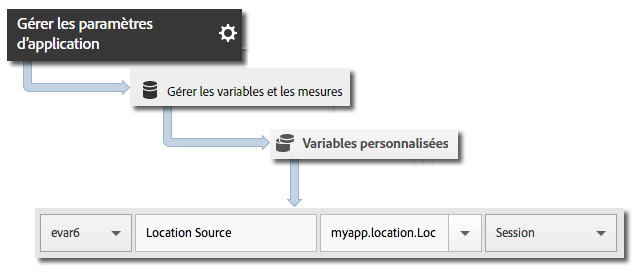

# Géolocalisation et points ciblés {#geo-location-and-points-of-interest}

La géolocalisation vous permet de déterminer des données de position au moyen de la latitude et de la longitude, et de points ciblés prédéfinis dans vos applications iOS.

Chaque appel `trackLocation` envoie les informations suivantes :

* Latitude, longitude et position sous forme de point ciblé (POI) défini dans Adobe Mobile Services.

   Ces informations sont transmises aux variables de solution mobile pour le reporting automatique.

* Distance par rapport au centre et précision transmises en tant que données contextuelles.

   Ces variables ne sont pas capturées automatiquement. Vous devez les mettre en correspondance en suivant les instructions de la section *Envoi de données supplémentaires* ci-dessous.

## Mises à jour dynamiques des points ciblés {#section_3747B310DD5147E2AAE915E762997712}

À partir de la version 4.2, les points ciblés sont définis dans l’interface Adobe Mobile et synchronisés dynamiquement avec les fichiers de configuration de l’application. Cette synchronisation requiert un paramètre `analytics.poi` dans le fichier `ADBMobile.json` :

```js
“analytics.poi”: “https://assets.adobedtm.com/…/yourfile.json”,
```

Pour plus d’informations, voir [Configuration JSON ADBMobile](/help/ios/configuration/json-config/json-config.md).

Si ce paramètre n’est pas configuré, une version actualisée du fichier `ADBMobile.json` doit être téléchargée et ajoutée à votre application. Pour plus d’informations et d’instructions, voir *Téléchargement du SDK et des outils de test* dans [Avant de démarrer](/help/ios/getting-started/requirements.md).

## Suivi de la géolocalisation et des points ciblés {#section_B1616E400A7548F9A672F97FEC75AE27}

1. Ajoutez la bibliothèque à votre projet et mettez en œuvre le cycle de vie.

   Pour plus d’informations, voir *Ajout du SDK et du fichier de configuration à votre projet* dans [Mise en œuvre principale et cycle de vie](/help/ios/getting-started/dev-qs.md).
1. Importez la bibliothèque :

   ```objective-c
   #import "ADBMobile.h"
   ```

1. Appelez `trackLocation` pour effectuer le suivi de la position actuelle :

   ```objective-c
   CLLocation *currentLocation = location; 
   [ADBMobile trackLocation: currentLocation data: nil]; 
   ```

   >[!TIP]
   >
   >Vous pouvez appeler `trackLocation` à tout moment.

   Pour déterminer l’emplacement qui est transmis à l’appel `trackLocation`, utilisez [Obtention de la position de l’utilisateur](https://developer.apple.com/Library/ios/documentation/UserExperience/Conceptual/LocationAwarenessPG/CoreLocation/CoreLocation.html).

Par ailleurs, si l’emplacement se trouve dans le périmètre d’un point ciblé donné, une variable de données contextuelles `a.loc.poi` est envoyée avec l’accès `trackLocation` et consignée comme point ciblé dans les rapports d’emplacement. Une variable contextuelle `a.loc.dist` est également envoyée avec la distance en mètres depuis les coordonnées définies.

## Envoi de données supplémentaires {#section_3EBE813E54A24F6FB669B2478B5661F9}

Outre les données de position, vous pouvez envoyer des données contextuelles supplémentaires avec chaque appel de localisation :

```objective-c
NSMutableDictionary *contextData = [NSMutableDictionary dictionary]; 
[contextData setObject:@"GPS" forKey:@"myapp.location.LocationSource"]; 
[ADBMobile trackLocation: currentLocation data:contextData];
```

Les valeurs des données contextuelles doivent être mises en correspondance avec des variables personnalisées :



## Données contextuelles de position {#section_FFB71E6653F9410A89CC6ACC0C9164A9}

La latitude et la longitude sont chacune envoyées en utilisant trois paramètres de données contextuelles différents, chacun représentant un niveau de précision différent, pour un total de six paramètres de données contextuelles.

Par exemple, les coordonnées lat = 40.93231, lon = -111.93152 représentent un emplacement avec une précision de 1 m. Cet emplacement est fractionné en fonction du niveau de précision des variables suivantes :

* `a.loc.lat.a`= 040.9
* `a.loc.lat.b` = 32
* `a.loc.lat.c` = 31
* `a.loc.lon.a` = -111,9
* `a.loc.lon.b` = 31
* `a.loc.lon.c` = 52

Pour certains niveaux de précision, il se peut que la valeur « 00 » apparaisse. Cela dépend du degré de précision de l’emplacement actuel. Par exemple, si l’emplacement actuel est précis à 100 m, la valeur « 00 » s’affiche pour les variables `a.loc.lat.c` et `a.loc.lon.c`.

## Informations supplémentaires {#section_931AC1E0D88147E29FE1B6E3CC1E9550}

À noter :

* Une demande `trackLocation` envoie l’équivalent d’un appel `trackAction`.

* Les points ciblés ne sont pas transmis dans les appels `trackAction` et `trackState` standard ; vous devez donc utiliser un appel `trackLocation` pour les localiser.

* `trackLocation` doit être appelé aussi souvent que nécessaire pour effectuer le suivi de la position et des points ciblés.

   Nous vous recommandons d’utiliser l’appel `trackLocation` lorsque l’application démarre, puis selon les besoins.

* Les points ciblés sont indiqués uniquement lorsqu’ils ont été définis dans le fichier de configuration de l’application.

   Ils ne sont pas appliqués aux anciens appels `trackLocation`.
* Les appels `trackLocation` prennent en charge l’envoi de données contextuelles supplémentaires, tout comme les appels `trackAction`.

* Lorsque les diamètres de deux points ciblés se chevauchent, le premier point ciblé contenant la position actuelle est utilisé.

   Si vos points ciblés se chevauchent, vous devez les répertorier du plus granulaire au moins granulaire afin de vous assurer que les points ciblés les plus granulaires sont signalés.

