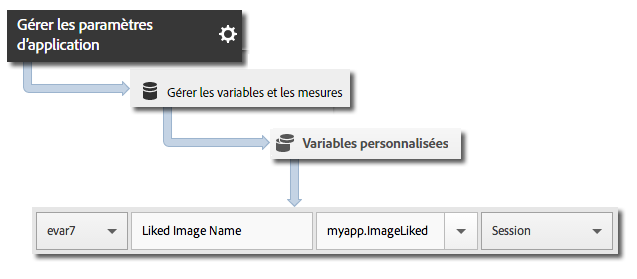

# Suivi iBeacon {#ibeacon-tracking}

Le suivi iBeacon permet de mesurer et de cibler des micro-emplacements à l’aide d’iBeacon et du Bluetooth à basse consommation.

Les données de balises suivantes sont envoyées à Analytics et à Target lorsque `trackBeacon` est appelé :

* `a.beacon.uuid` : ProximityUUID de la balise
* `a.beacon.major` : nombre majeur de la balise, tel que le numéro d’un magasin
* `a.beacon.minor` : nombre mineur de la balise, tel que le numéro unique dans un magasin
* `a.beacon.prox` : les valeurs suivantes représentent la proximité de l’utilisateur avec la balise :

   * `0` = inconnue
   * `1` = immédiate
   * `2` = proche
   * `3` = loin

## Suivi des iBeacons {#section_FC3F213545944A468B1E6D5D5C8E2F1F}

1. Ajoutez la bibliothèque à votre projet et mettez en œuvre le cycle de vie.

   Pour plus d’informations, voir *Ajout du SDK et du fichier de configuration à votre projet* dans [Mise en œuvre principale et cycle de vie](/help/ios/getting-started/dev-qs.md).
1. Importez la bibliothèque :

   ```objective-c
   #import "ADBMobile.h"
   ```

1. Lorsqu’un appareil se trouve à proximité d’une balise, appelez `trackBeacon` :

   ```objective-c
   [ADBMobile trackBeacon:beacon data:nil];
   ```

1. Lorsque l’utilisateur s’éloigne de la balise, effacez la balise actuelle :

   ```objective-c
   [ADBMobile trackingClearCurrentBeacon];
   ```

## Envoi de données supplémentaires {#section_3EBE813E54A24F6FB669B2478B5661F9}

Outre le nom de l’action minutée, vous pouvez joindre des données contextuelles supplémentaires à chaque appel d’action de suivi :

```objective-c
[ADBMobile trackBeacon:beacon data:@{@"myapp.ImageLiked" : imageName}];
```

Les valeurs des données contextuelles doivent être mises en correspondance avec des variables personnalisées :



## Exemples {#section_9749238BCBC148998CB18E97D7670D19}

```objective-c
- (void)locationManager:(CLLocationManager *)manager didRangeBeacons:(NSArray *)beacons inRegion:(CLBeaconRegion *)region { 
    if (beacons.count > 0) { 
        CLBeacon *beacon = beacons[0]; 
        // Adobe - track when in range of a beacon 
        [ADBMobile trackBeacon:beacon data:@{@"sampleContextData" : @"sampleContextDataVal"}]; 
    } 
} 
 
// When the user leaves the proximity of the beacon, clear the current beacon 
[ADBMobile trackingClearCurrentBeacon];
```

