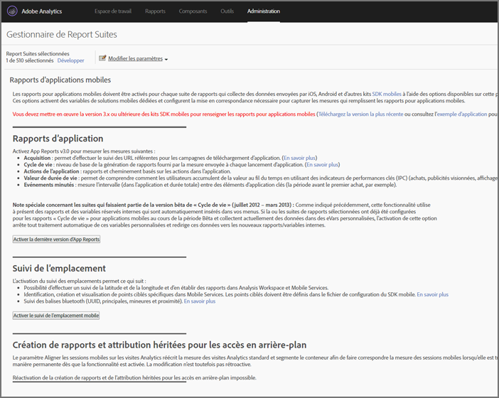

# Analytics {#analytics}

Après avoir ajouté la bibliothèque à votre projet, vous pouvez effectuer n’importe quel appel de méthode Analytics n’importe où dans votre application.

>[!TIP]
>
>Assurez-vous que vous importez `ADBMobile.h` dans votre classe.

## Activation des rapports d’applications mobiles dans Analytics {#section_F2F9234009184F20BA36B5CDE872B424}

Avant d’ajouter du code, demandez à votre administrateur Analytics d’effectuer les opérations suivantes pour activer le suivi du cycle de vie des applications mobiles. Ainsi, votre suite de rapports est prête à capturer les mesures au début du développement.

1. Ouvrez Outils **** d’administration > Suites **[!UICONTROL de]** rapports et sélectionnez votre ou vos suites de rapports mobiles.

1. Cliquez sur **[!UICONTROL Modifier les paramètres]** > Gestion **** mobile > Rapports **[!UICONTROL d’application]** mobile.

   

1. Cliquez sur **[!UICONTROL Activer les derniers rapports]** d’application.

   Vous pouvez également cliquer sur **[!UICONTROL Activer le suivi]** des emplacements mobiles ou **[!UICONTROL Activer le Rapports et l’attribution hérités pour les accès]** en arrière-plan.

   

Les mesures de cycle de vie sont maintenant prêtes à être capturées et les rapports d’applications mobiles apparaissent dans le menu **[!UICONTROL Rapports]** de l’interface des rapports marketing.

### Nouvelles versions

Régulièrement, de nouvelles versions du rapports d’applications mobiles sont publiées. Les nouvelles versions ne sont pas appliquées automatiquement à votre suite de rapports. Vous devez répéter ces étapes pour effectuer la mise à niveau. Chaque fois que vous ajoutez une nouvelle fonctionnalité Experience Cloud à votre application, nous vous recommandons de répéter ces étapes pour vous assurer que vous disposez de la dernière configuration.

## Mesures de cycle de vie{#section_532702562A7A43809407C9A2CBA80E1E}

Pour collecter les mesures de cycle de vie dans votre application, ajoutez des appels lorsque l&#39;application est activée, comme le montrent les exemples suivants.

### WinJS dans default.js

```js
app.onactivated = function (args) { 
  if (args.detail.kind === activation.ActivationKind.launch) { 
   ... 
   // launched and resumed stuff  
   ADBMobile.Config.collectLifecycleData(); 
  } 
}; 
app.oncheckpoint = function (args) { 
  ADBMobile.Config.pauseCollectingLifecycleData(); 
}
```

### C# dans App.xaml.cs

```js
public App() 
{ 
    this.InitializeComponent(); 
    this.Resuming += OnResuming; 
    this.Suspending += OnSuspending; 
} 
protected override void OnLaunched(LaunchActivatedEventArgs e) 
{   ... 
    ADBMobile.Config.CollectLifecycleData(); 
    ... 
} 
private void OnResuming(object sender, object e) 
{ 
    ... 
    ADBMobile.Config.CollectLifecycleData(); 
    ... 
} 
private void OnSuspending(object sender, SuspendingEventArgs e) 
{ 
    ... 
    ADBMobile.Config.PauseCollectingLifecycleData(); 
    ... 
}
```

### C ++/CX dans App.xaml.cpp

```js
App::App() 
{ 
 InitializeComponent(); 
 Resuming += ref new EventHandler<Object ^>(this, &App::OnResuming); 
 Suspending += ref new SuspendingEventHandler(this, &App::OnSuspending); 
} 
void App::OnResuming(Object ^sender, Object ^args) 
{ 
 ... 
 ADBMobile::Config::CollectLifecycleData(); 
 ... 
} 
void App::OnSuspending(Object^ sender, SuspendingEventArgs^ e) 
{ 
 ... 
 ADBMobile::Config::PauseCollectingLifecycleData(); 
 ... 
} 
void App::OnLaunched(Windows::ApplicationModel::Activation::LaunchActivatedEventArgs^ e) 
{ 
 ... 
 ADBMobile::Config::CollectLifecycleData(); 
 ... 
}
```

Si `CollectLifecycleData()` est appelé deux fois au cours de la même session, votre application signale un blocage à chaque appel après le premier. Le SDK définit un indicateur lorsque l’application est fermée, qui indique une sortie réussie. Si cet indicateur n&#39;est pas défini, `CollectLifecyleData()` signale un blocage.

## Événements, props et eVars {#section_76EA6F5611184C5CAE6E62956D84D7B6}

Si vous avez examiné les méthodes [](/help/universal-windows/c-configuration/methods.md)SDK, vous vous demandez probablement où définir des événements, des eVars, des props, des héritiers et des listes. Dans la version 4, vous ne pouvez plus affecter ces types de variables directement dans votre application. Au lieu de cela, le SDK utilise des données contextuelles et des règles de traitement pour mapper les données de votre application aux variables Analytics pour le rapports.

Les règles de traitement offrent plusieurs avantages :

* Vous pouvez modifier le mappage de vos données sans envoyer de mise à jour à l’App Store.
* Vous pouvez utiliser des noms significatifs pour les données au lieu de définir des variables spécifiques à une suite de rapports.
* L’envoi de données supplémentaires n’a que peu d’impact. Ces valeurs n’apparaîtront pas dans les rapports tant qu’elles ne seront pas mises en correspondance à l’aide de règles de traitement.

Toutes les valeurs que vous affectiez directement aux variables doivent être ajoutées aux données contextuelles.

## Règles de traitement {#section_66EE762EEA5E4728864166201617DEBF}

Les règles de traitement permettent de copier les données envoyées dans des variables de données contextuelles vers des variables evar, prop et d’autres variables pour le rapports.

[Formation](https://tv.adobe.com/embed/1181/16506/) sur les règles de traitement au sommet 2013

[Aide des règles de traitement](https://docs.adobe.com/content/help/fr-FR/analytics/admin/admin-tools/processing-rules/processing-rules.html)

[Devenir autorisé à utiliser des règles de traitement](https://helpx.adobe.com/analytics/kb/processing-rules-authorization.html)

Nous vous recommandons de regrouper vos variables de données contextuelles à l’aide d’&quot;espaces de nommage&quot;, car cela vous permet de conserver un ordre logique. Par exemple, si vous souhaitez collecter des informations sur un produit, vous pouvez définir les variables suivantes :

```javascript
"product.type":"hat" 
"product.team":"mariners" 
"product.color":"blue"
```

Les variables de données contextuelles sont triées par ordre alphabétique dans l’interface des règles de traitement. Les espaces de nommage vous permettent donc d’afficher rapidement les variables qui se trouvent dans le même espace de nommage.

En outre, nous avons entendu dire que certains d’entre vous nomment des clés de données contextuelles à l’aide de l’evar ou du numéro prop :

```js
"eVar1":"jimbo"
```

Cela peut rendre la tâche *légèrement* plus facile lorsque vous effectuez le mappage unique dans les règles de traitement, mais vous perdez la lisibilité pendant le débogage et les futures mises à jour du code peuvent s’avérer plus difficiles. Nous vous recommandons plutôt d’utiliser des noms descriptifs pour les clés et les valeurs :

```js
"username":"jimbo"
```

Définissez les variables contextuelles qui définissent les événements de compteur sur la valeur &quot;1&quot; :

```js
"logon":"1"
```

Les variables de données contextuelles qui définissent les événements incrémenteurs peuvent avoir la valeur d’incrémentation :

```js
"levels completed":"6"
```

>[!TIP]
>
>Adobe réserve l’espace de noms « `a.` ». Outre cette restriction, les variables de données contextuelles doivent simplement être uniques dans votre société de connexion pour éviter les collisions.

## Variable products {#section_AFBA36F3718C44D29AF81B9E1056A1B4}

Pour être défini *`products`* dans le SDK mobile, vous devez utiliser une syntaxe spéciale. Pour plus d’informations, voir Variable [](/help/universal-windows/analytics/products.md)Produits.

## (Facultatif) Activation du suivi hors ligne {#section_955B2A03EB854742BDFC4A0A3C287009}

Pour stocker les accès lorsque le périphérique est hors ligne, vous pouvez activer le suivi hors ligne dans le fichier de méthodes [](/help/universal-windows/c-configuration/methods.md) SDK. Soyez attentif aux exigences d’horodatage décrites dans la référence de fichier de configuration avant d’activer le suivi hors ligne.

## Géolocalisation et points ciblés{#section_BAD34A8DD013454DB355121316BD7FD4}

La géolocalisation vous permet de mesurer les données d’emplacement (latitude/longitude) et les points d’intérêt prédéfinis. Chaque `TrackLocation` appel envoie :

* Latitude/Longitude et point d’accès (s’il s’agit d’un point d’accès défini dans le fichier de `ADBMobileConfig.json` configuration).

   Elles sont transmises aux variables de solution mobile pour le rapports automatique.

* Distance par rapport au centre et précision transmise en tant que données contextuelles.

   Capturer à l’aide d’une règle de traitement.

Pour effectuer le suivi d&#39;un emplacement :

```js
var ADB = ADBMobile; 
ADB.Analytics.trackLocation(37.75345, -122.33207, null);
```

Si le point d’accès suivant est défini dans le fichier de `ADBMobileConfig.json` configuration :

```js
"poi" : [ 
            ["San Francisco",37.757144,-122.44812,7000], 
        ]
```

Lorsque l’emplacement du périphérique est déterminé comme se trouvant dans un rayon de 7 000 mètres du point défini, une variable de données `a.loc.poi` contextuelles avec la valeur `San Francisco` est envoyée avec l’ `TrackLocation` accès. An `a.loc.dist` context variable is sent with the distance in meters from the defined coordinates.

## Lifetime value {#section_D2C6971545BA4D639FBE07F13EF08895}

La valeur de durée de vie vous permet de mesurer et de cibler une valeur de durée de vie pour chaque utilisateur. À chaque fois que vous envoyez une valeur avec `TrackLifetimeValueIncrease`, la valeur est ajoutée à la valeur existante. La valeur de durée de vie est stockée sur l’appareil et peut être récupérée à tout moment en appelant `GetLifetimeValue`. Cette procédure peut être utilisée pour stocker des valeurs de durée de vie (achats, vues des publicités, affichages complets de vidéos, partages sur les médias sociaux, chargement de photos, etc.).

```js
// Lifetime Value Example 
var ADB = ADBMobile; 
var purchasePrice = 39.95; 
var cdata = new Windows.Foundation.Collections.PropertySet(); 
cdata["ItemPurchaseEvent"] = "ItemPurchaseEvent"; 
cdata["PurchaseItem"] = "Item453"; 
cdata["PurchasePrice"] = purchasePrice; 
ADB.Analytics.trackLifetimeValueIncrease(purchasePrice, cdata);
```

## Actions minutées{#section_7FF8B6A913A0460EAA4CAE835E32D8C1}

Les actions minutées vous permettent de mesurer la durée in-app et la durée totale entre le début et la fin d’une action. Le SDK calcule la durée de la session et la durée totale (intersessions) nécessaire à l’exécution de l’action. Vous pouvez l’utiliser pour définir des segments à comparer à l’heure d’achat, au niveau de passage, au flux de passage en caisse, etc.

* Nombre total de secondes dans l&#39;application entre le début et la fin - intersessions
* Nombre total de secondes entre le début et la fin (heure de l’horloge)

```js
// Timed Action Start Example 
var ADB = ADBMobile; 
var cdata = new Windows.Foundation.Collections.PropertySet(); 
cdata["ExperienceName"] = experience; 
ADB.Analytics.trackTimedActionStart("TimeUntilPurchase", cdata);
```

```js
// Timed Action Update Example 
var ADB = ADBMobile; 
var cdataUpdate = new Windows.Foundation.Collections.PropertySet(); 
cdataUpdate["ImageLiked"] = imageName; 
ADB.Analytics.trackTimedActionStart("TimeUntilPurchase", cdata); 
```

```js
// Timed Action End Example 
var ADB = ADBMobile; 
ADB.Analytics.trackTimedActionEnd("TimeUntilPurchase");
```
