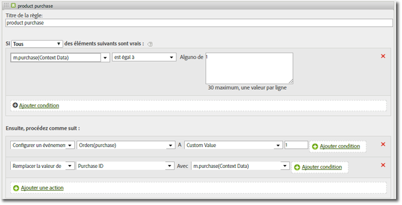

# Variable products {#products-variable}

La variable products ne peut pas être définie à l’aide de règles de traitement. Dans le SDK mobile, vous devez utiliser une syntaxe spéciale dans le paramètre de données contextuelles pour définir les produits directement sur l’appel au serveur.

Pour définir la variable *`products`*, définissez une clé de données contextuelles sur `"&&products"`, puis définissez la valeur à l’aide de la syntaxe définie pour la variable *`products` :

```js
cdata["&&products"] = "Category;Product;Quantity;Price[,Category;Product;Quantity;Price]";
```

Par exemple :

```js
//create a context data dictionary 
var cdata = new Windows.Foundation.Collections.PropertySet(); 
 
// add products, a purchase id, a purchase context data key, and any other data you want to collect. 
// Note the special syntax for products 
cdata["&&products"] = ";Running Shoes;1;69.95,;Running Socks;10;29.99"; 
cdata["m.purchaseid"] = "1234567890"; 
cdata["m.purchase"] = "1"; 
 
var ADB = ADBMobile; 
// send the tracking call - use either a trackAction or TrackState call. 
// trackAction example: 
ADB.Analytics.trackAction("purchase", cdata); 
// trackState example: 
ADB.Analytics.trackState("Order Confirmation", cdata);
```

*`products`* est défini directement sur la demande d’image, et les autres variables sont définies en tant que données contextuelles. Toutes les variables de données contextuelles doivent être mappées à l’aide de règles de traitement :



Il n’est pas nécessaire de mapper la variable *`products`* à l’aide des règles de traitement, car elle est définie directement sur la demande d’image par le SDK.

## Variable products avec des eVars de marchandisage et des événements spécifiques à un produit {#section_685D53AD3D064F9A8E225F995A9BA545}

Exemple de variable *`products`* avec des eVars de marchandisage et des événements spécifiques à un produit.

```
//create a context data dictionary 
var cdata = new Windows.Foundation.Collections.PropertySet(); 
  
// add products, a purchase id, a purchase context data key, and any other data you want to collect. 
// Note the special syntax for products 
cdata["&&events"] = "event1 "; 
cdata["&&products"] = ";Running Shoes;1;69.95;event1=5.5;eVar1=Merchandising,;Running Socks;10;29.99"; 
cdata["m.purchaseid"] = "1234567890"; 
cdata["m.purchase"] = "1"; 
  
var ADB = ADBMobile; 
// send the tracking call - use either a trackAction or TrackState call. 
// trackAction example: 
ADB.Analytics.trackAction("purchase", cdata); 
// trackState example: 
ADB.Analytics.trackState("Order Confirmation", cdata);
```

>[!TIP]
>
>Si vous déclenchez un événement spécifique à un produit à l’aide de la variable *`&&products`* , vous devez également définir cet événement dans la variable *`&&events`*, sinon l’événement est filtré pendant le traitement.
