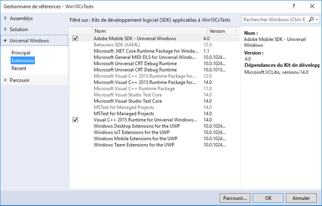

# Extensions de Windows Visual Studio pour le SDK 4.x des solutions Experience Cloud {#windows-visual-studio-extensions-for-experience-cloud-solutions-x-sdk}

Cette extension permet d&#39;ajouter plus facilement la référence du SDK Windows des solutions Experience Cloud 4.x dans votre projet.

## Installation de la bibliothèque à partir de GitHub {#section_F55DB6241EF1475286C05FEAEBF996A3}

1. Téléchargez le SDK Windows Universal depuis [GitHub](https://github.com/Adobe-Marketing-Cloud/mobile-services/releases).
1. Décompressez le fichier téléchargé localement.
1. Doublon-cliquez sur le fichier **[!UICONTROL ADBMobileUniversalWindowsVSIX.vsix]** pour ouvrir le programme d’installation.
1. Sélectionnez Emplacement **** global et installez la bibliothèque.

## Ajouter des références à votre projet {#section_00C14FE9243D4330BE1F4BB56FCF08B1}

1. Ouvrez votre projet Windows 10.
1. Ouvrez la boîte de dialogue Gestionnaire de références.

   

1. Dans l’onglet **[!UICONTROL Extensions]** , recherchez et sélectionnez **[!UICONTROL Adobe Mobile SDK]**.
1. Cliquez sur **[!UICONTROL OK]** pour l’enregistrer.

   Le Adobe Mobile SDK sera ajouté à votre projet. Si le package **[!UICONTROL Microsoft Visual C++ Runtime]** n&#39;a pas encore été ajouté, ce package sera également ajouté à votre projet.

1. Dans Configuration Manager, sélectionnez un type de plate-forme et commencez à tester votre application.

