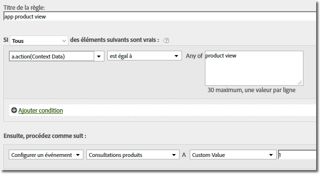

# Migration vers les SDK 4.x{#migrate-to-x}

Cette section décrit comment migrer de la version 3.x du SDK mobile Windows vers le SDK de plateforme Windows universelle 4.x pour les solutions Experience Cloud.

Avec le passage à la version 4.x, toutes les fonctionnalités sont désormais accessibles par le biais de méthodes statiques. Vous n’avez plus besoin de suivre vos propres objets.

Les sections suivantes décrivent la migration de la version 3.x à la version 4.x.

## Suppression des propriétés non utilisées {#section_145222EAA20F4CC2977DD883FDDBBFC5}

Vous avez probablement remarqué un nouveau `ADBMobileConfig.json` fichier inclus dans votre téléchargement. Ce fichier contient des paramètres globaux spécifiques à l’application et remplace la plupart des variables de configuration utilisées dans les versions précédentes.

Voici un exemple de fichier `ADBMobileConfig.json` :

```js
{ 
    "version" : "1.0", 
    "analytics" : { 
        "rsids" : "coolApp", 
        "server" : "my.CoolApp.com", 
        "charset" : "UTF-8", 
        "ssl" : true, 
        "offlineEnabled" : true, 
        "lifecycleTimeout" : 300, 
        "privacyDefault" : "optedin", 
        "poi" : [ 
                    ["san francisco",37.757144,-122.44812,7000], 
                    ["santa cruz",36.972935,-122.01725,600] 
                ] 
    }, 
 "target" : { 
  "clientCode" : "myTargetClientCode", 
  "timeout" : 5 
 }, 
 "audienceManager" : { 
  "server" : "myServer.demdex.com" 
 } 
}
```

Les tableaux suivants répertorient les variables de configuration que vous devez déplacer vers le fichier de configuration. Déplacez la valeur définie pour la variable dans la première colonne vers la variable dans la seconde colonne, puis supprimez l’ancienne variable de configuration de votre code.

### Migration à partir de la version 3.x

Le tableau suivant fournit une liste de variables dans les SDK 3.x et le nouveau nom dans les SDK 4.x :

| Variable/méthode de configuration | Variable in the `ADBMobileConfig.json` file. |
|--- |--- |
| offlineTrackingEnabled | &quot;offlineEnabled&quot; |
| reportSuiteIDs | &quot;rsids&quot; |
| trackingServer | &quot;server&quot; |
| charSet | &quot;charset&quot; |
| currencyCode | &quot;devise&quot; |
| ssl | &quot;ssl&quot; |
| setOfflineHitLimit | Supprimer, n&#39;est plus utilisé. |
| linkTrackVars | Supprimer, n&#39;est plus utilisé. |
| linkTrackEvents | Supprimer, n&#39;est plus utilisé. |

## Mise à jour des appels et des variables de suivi {#section_96E7D9B3CDAC444789503B7E7F139AB9}

Au lieu d’utiliser les appels et les appels Web `Track` et `TrackLink` , le SDK version 4 utilise deux méthodes qui ont un peu plus de sens dans le monde mobile :

* `TrackState` Les états sont les vues disponibles dans votre application, telles que &quot;tableau de bord d’accueil&quot;, &quot;paramètres de l’application&quot;, &quot;panier&quot;, etc. Ces états sont semblables aux pages d’un site web ; les appels `trackState` incrémentent les pages vues.

* `TrackAction` Les actions sont les actions qui se produisent dans votre application et que vous souhaitez mesurer, telles que les &quot;connexions&quot;, les &quot;clics sur la bannière&quot;, les &quot;abonnements de flux&quot; et d’autres mesures. Ces appels n’incrémentent pas les vues de page.

The `contextData` parameter for both of these methods contains name-value pairs that are sent as context data.

### Événements, props et eVars

Si vous avez examiné les méthodes [](/help/universal-windows/c-configuration/methods.md)SDK, vous vous demandez probablement où définir des événements, des eVars, des props, des héritiers et des listes. Dans la version 4, vous ne pouvez plus affecter ces types de variables directement dans votre application. Au lieu de cela, le SDK utilise des données contextuelles et des règles de traitement pour mapper les données de votre application aux variables Analytics pour le rapports.

Les règles de traitement offrent les avantages suivants :

* Vous pouvez modifier le mappage de vos données sans envoyer de mise à jour à l’App Store.
* Vous pouvez utiliser des noms significatifs pour les données au lieu de définir des variables spécifiques à une suite de rapports.
* L’envoi de données supplémentaires n’a que peu d’impact. Ces valeurs n’apparaîtront pas dans les rapports tant qu’elles ne seront pas mises en correspondance à l’aide de règles de traitement.

Pour plus d’informations, voir la section Règles *de* traitement dans la présentation [d’](/help/universal-windows/analytics/analytics.md)Analytics.

Toutes les valeurs que vous affectiez directement aux variables doivent être ajoutées aux données contextuelles. This means that calls to `SetProp`, `SetEvar`, and assignments to persistent context data should all be removed and the values added to context data.

### AppSection/Server, GeoZip, transaction ID, Campaign et autres variables standard

Toute autre donnée que vous définissez sur l’objet de mesure, y compris les variables répertoriées ci-dessus, doit être ajoutée aux données contextuelles. En d’autres termes, les seules données envoyées avec un `TrackState` appel ou `TrackAction` sont la charge utile dans le `data` paramètre.

**Remplacement des appels de suivi**

Throughout your code, replace the following methods with a call to `trackState` or `trackAction`:

**Migration à partir de la version 3.x :**

* TrackAppState (TrackState)
* TrackEvents (TrackAction)
* Track (TrackAction)
* TrackLinkURL (TrackAction)

## Service d’ID personnalisé {#section_2CF930C13BA64F04959846E578B608F3}

Remplacez la variable `visitorID` par un appel à `setUserIdentifier`.

## Suivi hors ligne {#section_5D4CD8CD1BE041A79A8657E31C0D24C6}

Offline tracking is enabled in the `ADBMobileConfig.json` file. All other offline configuration is done automatically.

Dans tout votre code, supprimez les appels aux méthodes suivantes :

**Migration à partir de la version 3.x :**

* SetOnline
* SetOffline

## Variable products{#section_AFBA36F3718C44D29AF81B9E1056A1B4}

Puisque la variable `products` n’est plus disponible dans les règles de traitement, vous pouvez utiliser la syntaxe suivante pour la définir :

```js
// create a processing rule to set the corresponding product event. 
// for example, set the Product Views event when context data a.action = "product view" 
var cdata = new Windows.Foundation.Collections.PropertySet(); 
cdata["&&products"] = ";Cool Shoe"; 
ADB.Analytics.trackAction("product view", cdata);
```



La valeur de `"&&products"` (dans cet exemple, la valeur est `";Cool Shoe`&quot;) doit respecter la syntaxe de la chaîne products pour le type de événement suivi.
