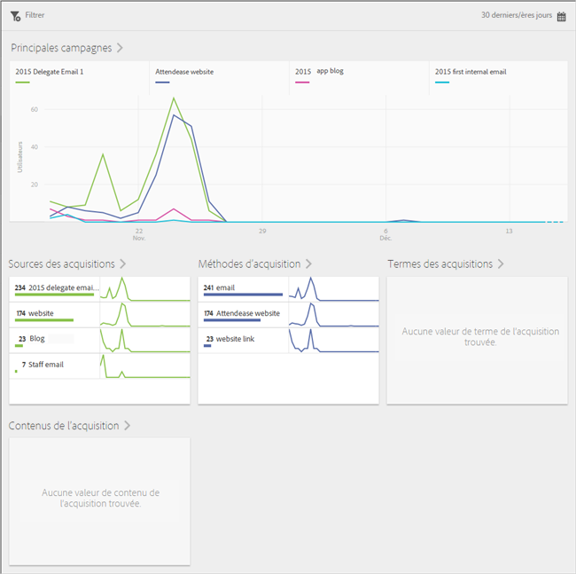
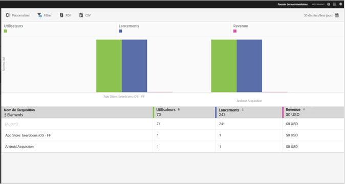

# Acquisition {#acquisition}

Les marketeurs peuvent créer des liens de suivi afin de convertir et d’orienter le trafic vers leurs applications. Ces liens de suivi peuvent orienter les utilisateurs vers les boutiques d’applications, des liens profonds d’applications et des spots, qui peuvent ensuite être mis en corrélation avec le comportement intégré à l’application. Un marketeur peut créer un lien permettant d’orienter les utilisateurs vers iOS, Android ou d’autres plateformes, selon le cas.

## Nouvelle version du SDK Adobe Experience Cloud

Vous recherchez des informations et de la documentation concernant le SDK d’Adobe Experience Platform Mobile ? Cliquez [ici](https://aep-sdks.gitbook.io/docs/) pour consulter la documentation la plus récente.

Nous avons lancé, en septembre 2018, une version majeure du SDK. Ces nouveaux SDK Adobe Experience Platform Mobile peuvent être configurés via [Experience Platform Launch](https://www.adobe.com/fr/experience-platform/launch.html).

* Pour commencer, accédez à [Launch](https://launch.adobe.com/).
* Pour consulter le contenu des dépôts du SDK Experience Platform, accédez à [Github : Adobe Experience Platform SDK](https://github.com/Adobe-Marketing-Cloud/acp-sdks).

>[!IMPORTANT]
>
> Si vous utilisez les SDK Adobe Experience Platform Mobile avec Adobe Launch, vous **devez** également installer l’extension Adobe Analytics Mobile Services pour utiliser les fonctionnalités Adobe Mobile Services comme les liens Acquisition. Pour en savoir plus, reportez-vous à la section [Adobe Analytics - Mobile Services](https://aep-sdks.gitbook.io/docs/using-mobile-extensions/adobe-analytics-mobile-services). Pour plus d’informations sur l’utilisation des liens d’acquisition et de marketing avec les SDK Experience Cloud, voir [Liens d’acquisition et de marketing](https://aep-sdks.gitbook.io/docs/using-mobile-extensions/adobe-analytics-mobile-services#acquisition-and-marketing-links).

>[!IMPORTANT]
>
>Bien que vous puissiez configurer des fonctionnalités dans l’interface utilisateur, elles ne fonctionneront pas tant que vous n’aurez pas téléchargé le fichier de configuration généré et ajouté ce fichier au SDK. Pour plus d’informations sur le téléchargement et la configuration des SDK, voir la section *documentation du SDK* sur cette page.

Vous pouvez créer, modifier, gérer et afficher des rapports sur les liens marketing d’application mobile pouvant faire l’objet d’un suivi.

>[!TIP]
>
>Cette fonctionnalité nécessite le SKU Adobe Analytics - Applications mobiles ou Adobe Analytics Premium.

Les rapports d’acquisition suivants exposent les informations concernant les performances de vos liens marketing :

* **Aperçu**{#section_5B2BA47F22694919A472AB591101237E}

   Ce rapport expose les meilleures campagnes qui ont attiré des utilisateurs vers votre application, avec des informations concernant les performances de la campagne sur différentes métadonnées de suivi, telles que la source, le moyen, le terme et le contenu de l’acquisition.

   

* **Rapports sur les liens** {#section_A23A640C363B43569D9D484CF49EA277}

   Le rapport offre une vue organisant les performances de vos liens marketing dans un classement. En plus de répertorier les noms des liens avec les mesures de performances clés, ce rapport peut aussi être personnalisé. Pour en savoir plus, voir [Personnalisation des rapports](/help/using/usage/reports-customize/t-reports-customize.md).

   À noter :

   * Vous pouvez cliquer sur les icônes de flèche dans les en-têtes de colonne pour trier les données par ordre croissant ou décroissant.
   * Pour exporter les données vers un document PDF, vous pouvez cliquer sur **[!UICONTROL Télécharger]**.
   
