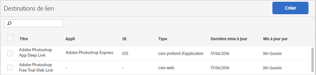

# Create and manage link destinations{#create-and-manage-link-destinations}

Utilisez la page Gérer les destinations de lien afin de créer, de modifier, d’archiver/ne plus archiver et de supprimer des destinations de lien. Ces destinations peuvent être appelées en ligne lors de la création de liens marketing, de notifications Push ou de messages in-app.

Pour afficher la page Gérer les destinations de lien, procédez comme suit :

1. Dans le menu de navigation de gauche, cliquez sur **[!UICONTROL Gérer les applications]**.
1. Cliquez sur le nom de l’application dont vous souhaitez afficher la page Informations sur l’application.
1. Sur la partie supérieure droite, cliquez sur **[!UICONTROL Gérer les destinations de lien]**.

La page Destinations de lien affiche vos destinations de lien et fournit des options pour créer, archiver, déarchiver, modifier et supprimer des destinations de lien.

Par exemple :

