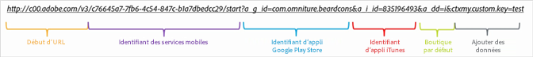
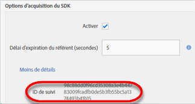

# Création manuelle de liens Acquisition {#create-acquisition-link-manually}

{#eol}

En configurant manuellement les paramètres d’URL, vous pouvez créer des liens marketing permettant de gagner instantanément de nouveaux utilisateurs d’applications mobiles.

>[!IMPORTANT]
>
>Le SDK version 4.6 ou ultérieure est requis pour cette fonctionnalité. Pour plus d’informations, voir [Conditions préalables requises pour Acquisition](/help/using/acquisition-main/c-acquisition-prerequisites.md).

Le schéma suivant illustre les composants d’un lien de suivi créé manuellement et présente les différents paramètres d’URL que vous devez configurer correctement lors de la création manuelle de liens d’acquisition.

Ce lien est configuré pour effectuer une redirection spécifique à la plateforme vers la boutique Google Play ou l’Apple App Store pour une application mobile. Si la destination ne peut pas être déterminée, la boutique par défaut est définie sur l’Apple App Store. Une fois l’application installée, la clé contextuelle personnalisée `my.custom.key:test` est jointe à l’accès à l’installation d’Analytics.

Pour créer des liens manuellement, utilisez le format d’URL suivant :

`http(s)://c00.adobe.com/v3/ {mobile-services-app-hash}/start? {parameters}`

>[!TIP]
>
>La version du SDK Android que vous utilisez n’a aucune incidence sur ce paramètre.

Assurez-vous d’utiliser le bon protocole pour les appareils iOS :

* Appliquez le protocole **HTTP** si vous utilisez un SDK iOS antérieur à la version 4.7.0 ou si vous utilisez un SDK iOS version 4.7.0 ou ultérieure et que l’option **[!UICONTROL Utiliser HTTPS]** n’est **pas** sélectionnée sur la page Gérer les paramètres de l’application.
* Appliquez le protocole **HTTPS** si vous utilisez un SDK iOS version 4.7.0 ou ultérieure et que l’option **[!UICONTROL Utiliser HTTPS]****est** sélectionnée sur la page Gérer les paramètres de l’application.

Les conditions suivantes ont été respectées :

* `{mobile-services-app-hash}` correspond à l’identificateur d’application dans le fichier `acquisition:appid ` de configuration.

   `{mobile-services-app-hash}` se trouve dans la page Gérer les paramètres de l’application sous les options du SDK d’acquisition, dans le champ ID de suivi.

   

* `{parameters}` est une liste de paramètres de requête URL standard spécifiquement nommés.

Voici la liste des paramètres :

* **`a_g_id`**

   Identifiant d’application dans le Google Play Store.

   * Exemple de valeur : `com.adobe.beardcons`

* **`a_g_lo`**

   Remplacement de l’environnement local du Google Play Store.

   * Exemple de valeur : `ko`

* **`a_i_id`**

   Identifiant d’application iTunes.

   * Exemple de valeur : `835196493`

* **`a_i_lo`**

   Remplacement de l’environnement local iTunes.

   * Exemple de valeur : `jp`

* **`a_dd`**

   Boutique par défaut pour la redirection automatique.

   * Exemple de valeur : `i | g`

* **`a_cid`**

   Remplacement d’identifiant personnalisé (généralement IDFA pour iOS ou ADID pour Android).

   * Exemple de valeur : `Any String < 255 characters (UTF-8 encoded)`

* **`ctx*`**

   Les clés affectées du préfixe `ctx` sont incluses dans les données contextuelles de l’accès au lancement résultant.

   * Exemple de valeur : `ctxmy.custom.key=myValue`

* **`ctxa.referrer.campaign.name`**

   Nom de la campagne d’acquisition.

   Ce paramètre est indispensable à la génération de rapports lorsque vous souhaitez comparer les performances de différents liens d’acquisition.

   * Exemple de valeur : Conférence au sommet 2015

* **`ctxa.referrer.campaign.trackingcode`**

   Code de suivi

   Ce paramètre est indispensable à la génération de rapports lorsque vous souhaitez comparer les performances de différents liens d’acquisition.

   * Exemple de valeur : `lexsxouj`

* **`ctxa.referrer.campaign.source`**

   La source.

   * Exemple de valeur : Réseau publicitaire

* **`ctxa.referrer.campaign.medium`**

   Méthode

   * Exemple de valeur : Email

* **`ctxa.referrer.campaign.content`**

   Contenu

   * Exemple de valeur : Image # 325689

* **`ctxa.referrer.campaign.term`**

   Terme

   * Exemple de valeur : randonnée+bottes

Lorsque vous créez manuellement des liens d’acquisition, tenez compte des informations suivantes :

* Tous les paramètres qui ne correspondent pas à ceux du tableau sont transmis lors de la redirection vers la boutique d’applications.
* D’un point de vue technique, tous les paramètres sont facultatifs, bien que le lien soit inopérant si au moins un identifiant de boutique n’a pas été spécifié.

   Exemple d’identifiant de boutique : `a_g_id`/ `a_i_id`.

* Si la boutique de destination ne peut être déterminée de façon automatique, et qu’aucune boutique n’est définie par défaut, le lien renvoie une erreur 404.
