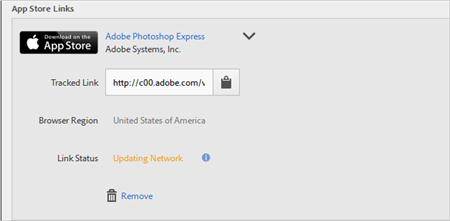

# Création d’un lien d’acquisition{#create-an-acquisition-link}

Vous pouvez créer des liens de boutique d’applications permettant de télécharger des applications directement à partir de l’Apple App Store et de Google Play. Les liens que vous créez permettent d’attribuer les événements de succès aux téléchargements.

1. Click **[!UICONTROL Acquisition]** &gt; **[!UICONTROL Manage Acquisition Links]** &gt; **[!UICONTROL Create New]**.
1. Type the following information in the **[!UICONTROL Link Information]** section:

   * (**Required**) **[!UICONTROL Name]**
Specify a descriptive name for the App Link.
   * **[!UICONTROL Code
de suivi]** Indiquez le code de suivi souhaité ou cliquez **[!UICONTROL sur Générer]** pour créer un nouveau code de suivi.
   * (**Required**) **[!UICONTROL Source]**
Specify the original referrer, such as "newsletter" or "homepage."
   * **[!UICONTROL Medium]**Indiquez le
support marketing, tel que « bannière » ou « courriel ».  » »
   * **[!UICONTROL Contenu]**
Indiquez le nom ou l'identifiant de la publicité avec le lien.
   * **[!UICONTROL Terme]**
Indiquez les termes payants ou d'autres termes de recherche pour la publicité.
   >[!IMPORTANT]
   >
   >Les valeurs des champs ci-dessus ne peuvent pas être modifiées une fois le lien d'acquisition créé.

1. Type information in the fields in the **[!UICONTROL Add App Store Link]** section.

   * **[!UICONTROL Boutique d’applications]**

      Sélectionnez une boutique d’applications :
      * Apple App Store
      * Google Play
      Les options de chaque boutique d’applications varient comme décrit ci-dessous.

   * **[!UICONTROL Région du navigateur (Apple App Store uniquement)]**

      Spécifiez une boutique d’applications régionale spécifique pour les navigateurs de bureau.

      Grâce à ce paramètre, vous pouvez sélectionner la boutique d’applications spécifique à une région vers laquelle doit renvoyer le lien d’acquisition lorsqu’un utilisateur clique sur ce lien dans un navigateur de bureau. Les périphériques mobiles sont automatiquement redirigés en fonction des paramètres correspondants.

   * **[!UICONTROL Langue du navigateur (Google Language uniquement))]**

      Sélectionnez une langue dans la liste déroulante.

      Ce paramètre vous permet de définir une langue spécifique à afficher dans la boutique Google Play Store pour les navigateurs de bureau. Les périphériques mobiles affichent la langue en fonction des paramètres correspondants.

   * **[!UICONTROL Rechercher par nom]**

      * Pour l'Apple App Store, si vous ne connaissez pas l'ID de l'application, vous pouvez rechercher l'application par son nom.

         Vous pouvez restreindre votre recherche en sélectionnant une région facultative dans la liste déroulante **[!UICONTROL Dans la région].**

      * Pour Google Play, si vous ne connaissez pas le nom du pack, vous pouvez rechercher le nom de l'application par son nom.
   * **[!UICONTROL ID d’application (Apple App Store uniquement)]**

      Si vous avez recherché l’application, ce champ est rempli automatiquement. Vous pouvez saisir la valeur ID application directement, plutôt que de rechercher l’application.

   * **[!UICONTROL Nom de module (Google Play uniquement)]**

      Si vous avez recherché l’application, ce champ est rempli automatiquement. Au lieu de rechercher. vous pouvez également saisir directement la valeur Nom du package.

1. To save your configuration and to generate the link, click **[!UICONTROL Add]** &gt; **[!UICONTROL Save]**.

   Le lien nouvellement créé s’affiche dans la section **[!UICONTROL Liens de boutique d’applications].**

   

1. Click  to copy the tracked link to your clipboard.

1. Collez le lien dans vos messages sur les réseaux sociaux, annonces publicitaires, messages électroniques, etc.