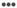

# Create or edit marketing links{#create-or-edit-marketing-links}

Vous pouvez créer ou modifier des liens marketing pour fournir des liens profonds vers votre application mobile ou votre site Web. Pour plus d'informations, voir [les liens Apple Universal Links et Android App Links](/help/using/c-manage-app-settings/c-mob-confg-app/c-universal-app-links.md).

1. In your app, in the left navigation pane, expand **[!UICONTROL Acquisition]** and click **[!UICONTROL Marketing Link Builder]**.
1. Procédez de l’une des manières suivantes :

   * To create a Marketing Link, click **[!UICONTROL Create New]**.
   * Pour modifier un lien, cliquez sur son nom dans la colonne **[!UICONTROL Titre].**

1. Renseignez les champs suivants :

   * **[!UICONTROL Nom du lien marketing]**:

      (**Required**) Specify a descriptive name for your Marketing Link. Le nom s’affiche seulement sur la page Liens marketing dans l’interface utilisateur de Adobe Mobile Services. En spécifiant un nom explicite, vous et d’autres personnes de votre organisation pouvez trouver rapidement un lien spécifique et des informations à son sujet.

   * **[!UICONTROL Code de suivi unique]**:

      (**Required**) Specify the desired tracking code or click ( to create a new tracking code. Vous pouvez afficher les rapports qui détaillent l’utilisation du code de suivi.

   * **[!UICONTROL Ajouter les données contextuelles de suivi]**:

      (**Optional**) Click the **[!UICONTROL +]** icon and type the relevant information to track your campaign using context data. Dans la liste déroulante **[!UICONTROL Données contextuelles personnalisées], sélectionnez une balise prédéfinie ou l’une de vos propres balises.** Les données contextuelles sont utilisées pour la création de rapports lorsque le lien marketing est déployé.

      Les balises prédéfinies suivantes sont disponibles :

      * **Données
contextuelles personnalisées** Indiquez la clé et la valeur. Si vous ajoutez des données contextuelles personnalisées, vous devez créer une règle de traitement. Pour plus d'informations, voir [Présentation des règles de traitement](https://docs.adobe.com/content/help/en/analytics/admin/admin-tools/processing-rules/processing-rules.html).

      * **Source**
Indiquez le référent initial, tel que « newsletter » ou « homepage ».  » »

      * **Medium**Indiquez le
support marketing, tel que « bannière » ou « courriel ».  » »

      * **Contenu**
Indiquez le nom ou l'identifiant de la publicité avec le lien.

      * **Terme**
Indiquez les termes payants ou d'autres termes de recherche pour la publicité.
1. Cliquez sur **[!UICONTROL Enregistrer]**.
1. Renseignez les champs suivants :

   * **(Obligatoire)** Dans **[!UICONTROL l'URL de secours]**, spécifiez l'URL vers laquelle les utilisateurs sont dirigés lorsqu'une destination ne peut pas être établie (par exemple, si l'utilisateur se trouve sur un bureau ou une autre plate-forme qui ne correspond pas à une règle de destination).
   * In **[!UICONTROL Marketing Link Options]**, select **[!UICONTROL Interstitials]** or **[!UICONTROL Universal and App Links]**.

      Pour plus d'informations, voir [Spots](/help/using/acquisition-main/c-marketing-links-builder/t-create-edit-adobe-links/t-interstitials.md) ou [Apple Universal Links et Liens d'application Android](/help/using/c-manage-app-settings/c-mob-confg-app/c-universal-app-links.md).

   * **(Conditionnel)** Si **[!UICONTROL les liens universels ou d'application]** sont sélectionnés, dans **[!UICONTROL le chemin personnalisé]**, les utilisateurs peuvent définir le chemin d'URL après le domaine avec un paramètre de requête. Pour plus d'informations, voir [les liens Apple Universal Links et Android App Links](/help/using/c-manage-app-settings/c-mob-confg-app/c-universal-app-links.md).

1. Click **[!UICONTROL Edit Deep Link Interstitial]** and configure the link.

   (**Optional**) When there are multiple destinations, users can be routed depending on whether they have a mobile app installed. Si l’application est installée, une page d’entrée de spots s’affiche.

   Pour plus d’informations, voir [Spots](/help/using/acquisition-main/c-marketing-links-builder/t-create-edit-adobe-links/t-interstitials.md).

1. Click **[!UICONTROL Save]** and click **[!UICONTROL Next]**.
1. Sur la page Destination, configurez le lien.

   1. Click the **[!UICONTROL Decision]** icon () and select one of the following decision locations:

      * **[!UICONTROL Ajouter une décision]**
      * **[!UICONTROL Ajouter un chemin d’accès]**
   1. If you selected **[!UICONTROL Add Decision]**, select one of the following decision types:

      * **[!UICONTROL Système d’exploitation]**

         Les systèmes d’exploitation pris en charge comprennent iOS, Android, AMX, etc.

      * **[!UICONTROL Type de périphérique]**

         Les types d’appareils incluent les ordinateurs de bureau, les liseuses électroniques, les consoles de jeux, les téléphones mobiles, les décodeurs, etc.
   1. Click the **[!UICONTROL Destination]** icon (  ) and select one of the following destination types:

      * **[!UICONTROL Boutique d’applications]**
      * **[!UICONTROL Lien Web]**
      * **[!UICONTROL Lien profond d’application]**
      * **[!UICONTROL Lien hybride]**
      >[!TIP]
      >
      >When you use the **[!UICONTROL Web Link]** destination type with a link to the app store, acquisition is not tracked. Pour suivre les acquisitions, utilisez le type de destination **[!UICONTROL Boutique d’applications].**

      Pour plus d'informations, voir [Création d'une destination de lien](/help/using/acquisition-main/c-manage-link-destinations/t-create-new-app-deep-link-destination.md).

1. Pour enregistrer le lien marketing, cliquez  puis **[!UICONTROL sur Enregistrer]**.
