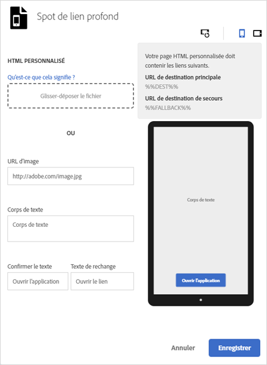

# Spots{#interstitials}

Vous pouvez orienter les utilisateurs vers une destination donnée selon que l’application est installée sur leur appareil (lien profond d’application) ou non (orientation vers un site Web ou une boutique d’applications). Il est préférable de laisser aux utilisateurs le choix de leur destination. Les marketeurs peuvent configurer une page de spots qui présente aux utilisateurs les destinations possibles.

Pour configurer un spot en création d’un lien marketing :

1. Click **[!UICONTROL Edit Deep Link Interstitial]**.

   

1. Renseignez les champs suivants :

   * **[!UICONTROL HTML personnalisé]**

      Sélectionnez votre page HTML de spots personnalisés.

      En utilisant des spots personnalisés, les spécialistes du marketing peuvent personnaliser les pages d’entrée interstitielles à l’aide de code HTML/CSS/JS personnalisé, ce qui vous permet de personnaliser vos pages.

      Voici les exigences relatives à la page HTML :

      * Doit être un fichier HTML.
      * Must contain the `%%DEST%%` and `%%FALLBACK%%` placeholders.
      * Le code HTML chargé sera affiché dans un `<iframe>`.

         Vous devez vous assurer que les cibles de vos liens pointent vers une fenêtre parente. You can include `<base target="_parent" />` in `<head>` or specify a target property for each `<a/>` individually.

         >[!TIP]
         >
         >Si vous transférez du code HTML personnalisé, les quatre autres options du tableau ne seront pas utilisées, sauf si vous supprimez le fichier téléchargé.
   * **[!UICONTROL URL d’image]**

      Spécifiez l’URL vers un fichier image.

   * **[!UICONTROL Corps de texte]**

      Spécifiez le corps du texte du spot.

   * **[!UICONTROL Confirmer le texte]**

      Spécifiez le texte du bouton.

   * **[!UICONTROL Texte de rechange]**

      Spécifiez le texte de substitution à afficher.

      Ce champ met à jour le texte du bouton en cas d’échec d’un lien profond. Les utilisateurs sont invités à cliquer sur le lien profond avant d’être dirigés vers une option de substitution. Par exemple, il peut s’agir d’une boutique d’applications d’où télécharger et installer l’application ou du site Web de l’entreprise. Le texte de rechange indique aux utilisateurs qu’il existe une autre option en cas d’échec du lien profond.

1. (**Optional**) Click the icons above the image to see how the interstitial looks rotated and on different devices.

   Vous pouvez modifier l’image en dehors de Mobile Services afin d’être sûr qu’elle s’affiche correctement dans différentes situations.
1. Cliquez sur **[!UICONTROL Enregistrer]**.
