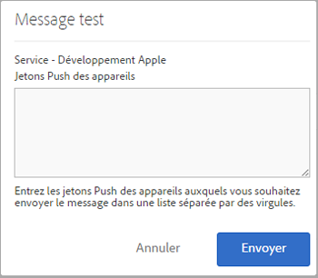

# Conditions préalables requises pour activer la messagerie push {#prerequisites-to-enable-push-messaging}

Avant de pouvoir configurer la messagerie push dans vos applications, vous devez effectuer certaines tâches.

## Activez Experience Cloud pour votre entreprise

Experience Cloud doit être activé pour votre entreprise Adobe Analytics. Vous pouvez vérifier le statut auprès de votre gestionnaire de compte Adobe.

## Installation et configuration du SDK Mobile

* **Installation du SDK Mobile**

   Pour configurer la messagerie push, vous devez télécharger et installer la version 4.6 ou ultérieure du SDK Mobile. Pour obtenir plus d’informations, voir [Téléchargement des SDK](/help/using/c-manage-app-settings/c-mob-confg-app/t-config-analytics/download-sdk.md).

* **Configuration des services push**

   Vous devez configurer les services push dans le SDK Mobile.
Pour plus d’informations, voir la vidéo et les rubriques suivants :

   * [Messagerie push dans Android](/help/android/messaging-main/push-messaging/push-messaging.md)
   * [Messagerie push dans iOS](/help/ios/messaging-main/push-messaging/push-messaging.md)

## Connectez-vous au service principal Mobile à l’aide de votre Adobe ID

>[!IMPORTANT]
>
>Pour pouvoir exploiter la fonctionnalité de services push, les utilisateurs doivent se connecter au service principal Mobile en utilisant leur Adobe ID, et leur compte Analytics doit être associé à leur Adobe ID. La fonctionnalité de services push n’est pas disponible si les utilisateurs se connectent à l’aide de leurs comptes Adobe Analytics existants.

Si les utilisateurs n’ont pas d’Adobe ID, procédez comme suit :

1. (**L’administrateur Experience Cloud**) invite les utilisateurs à s’inscrire à Experience Cloud.

1. (**L’utilisateur**) crée un Adobe ID individuel en suivant les instructions que vous avez reçues de l’administrateur Experience Cloud.

   Un message électronique est automatiquement envoyé à chaque utilisateur une fois que l’administrateur a accompli l’étape précédente.

1. (**Utilisateurs**) Connexion à Mobile à l’aide de leur Adobe ID.

## Liaison des comptes d’utilisateur dans Experience Cloud

Chaque utilisateur doit lier le compte de la solution Analytics depuis l’organisation Experience Cloud.

1. Pour vous connecter à Experience Cloud à l’aide d’un Adobe ID, saisissez [https://marketing.adobe.com](https://marketing.adobe.com) dans un navigateur.

1. Dans le coin supérieur droit, sélectionnez le nom de la société Analytics.

1. Cliquez sur **[!UICONTROL Ajouter l’organisation]**, puis sélectionnez **[!UICONTROL Adobe SiteCatalyst/Adobe Social]** dans la liste déroulante.

1. Saisissez le nom de la société et vos anciennes informations d’identification pour la société en question, puis cliquez sur **[!UICONTROL Lier le compte]**.

   L’Adobe ID est maintenant associé à votre compte, votre société et vos informations de connexion Analytics.

Pour plus d’informations, voir [Dépannage de la liaison de compte](https://docs.adobe.com/content/help/fr-FR/core-services/interface/manage-users-and-products/organizations.html).

## Configuration des services push et du service d’identification du SDK dans l’interface utilisateur de Mobile

La section **[!UICONTROL Services push]** est désactivée tant que vous n’avez pas activé le service d’identification pour votre application. Mais une fois le service d’identification activé, la section des services push est activée. Pour plus d’informations sur l’activation des services push, voir [Configuration des options du service d’identification du SDK](/help/using/c-manage-app-settings/c-mob-confg-app/t-config-visitor.md).

>[!IMPORTANT]
>
>Vous devez cliquer sur **[!UICONTROL Enregistrer]** pour enregistrer vos modifications et actualiser les services push.
>
>Vous pouvez configurer une application de boutique d’applications pour Apple et une application pour Google dans chaque suite de rapports. Si vous avez besoin d’applications supplémentaires, par exemple, une pour un environnement de production et une pour un environnement de développement, configurez une nouvelle application de boutique d’applications et une nouvelle suite de rapports pour chaque environnement.

* Pour **Apple**, faites glisser votre clé privée et/ou votre certificat. Si votre clé privée est chiffrée par mot de passe, entrez son mot de passe.

   * Pour la **clé privée**, effectuez un glisser-déposer de votre clé privée dans la case.

      Vous pouvez également cliquer sur **[!UICONTROL Parcourir]** pour sélectionner le fichier. Ce fichier contient la clé privée. Le certificat peut également être inclus dans ce fichier (`.p12`, `pkcs12`, `.pfx`, `.key`, `.pem`).

   * Pour le **mot de passe de la clé privée**, si votre fichier de clé privée est chiffré, saisissez le mot de passe.

      (Conditionnel) Pour le **certificat**, faites glisser et déposez votre fichier de certificat dans la zone. Vous pouvez également cliquer sur **[!UICONTROL Parcourir]** pour sélectionner le fichier. Ce champ n’est pas obligatoire si le fichier de clé privée contient également le certificat ( `.cert`, `.cer`, `.crt`, `.pem`).

* Pour **Google**, spécifiez la clé d’API de l’application.

   Cliquez sur **[!UICONTROL Tester]** pour vérifier que l’application et Mobile Services sont configurés correctement. Cette option est utile pour le débogage et le dépannage.

   Tapez les jetons push du périphérique auquel vous souhaitez envoyer le message. Vous pouvez envoyer le message vers plusieurs périphériques en spécifiant les jetons dans une liste séparée par des virgules.

   
