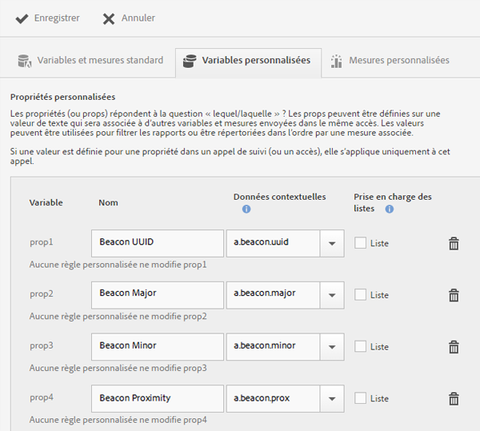
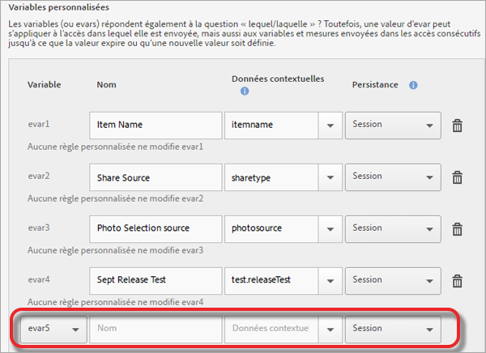

# Gestion de votre application {#managing-your-app}

Vous pouvez suivre et gérer les données que vous recevez de l’application en configurant un ensemble de variables et de mesures.

## Gestion des variables et des mesures {#section_EC2D58AC334F4ED49E764B81C2423A62}

* **Variables et mesures standard**

   Toute application comporte des variables et des mesures pour suivre les activités du panier et des achats. Some purchase information cannot be handled with processing rules, so the SDK exposes the special `"&&products"` context data. Par exemple, vous pouvez avoir des variables telles que les ajouts au panier, les suppressions du panier, les enregistrements, les commandes, etc. Les données contextuelles doivent être mappées aux données dans Adobe Analytics. Si cette variable est renseignée par un mappage simple des données contextuelles, il s’agit de la clé qui mappe sur celui-ci. Laissez ce champ vide si la variable est renseignée par des règles plus complexes dans les outils d’administration Analytics.

   Pour de plus amples informations sur les variables et mesures, veuillez consulter :

   * [Variables de produit sous Android](/help/android/analytics-main/products/products.md)
   * [Variables de produit dans iOS](/help/ios/analytics-main/products/products.md)

* **Variables personnalisées**

   La page Variables personnalisées présente toutes les variables Analytics personnalisées configurées pour la suite de rapports contenant les données de votre application. Dans cette page, vous pouvez activer des variables supplémentaires et mapper des données contextuelles sur des variables Analytics.

### Mappage des données contextuelles aux variables Analytics

Click **[!UICONTROL Manage App Settings]** &gt; **[!UICONTROL Manage Variables &amp; Metrics]** &gt; **[!UICONTROL Custom Variables]**.

These mappings call the same API that is used in [Processing Rules](https://docs.adobe.com/content/help/en/analytics/admin/admin-tools/processing-rules/processing-rules.html).

Voici une liste des variables personnalisées que vous pouvez configurer :

* The **[!UICONTROL Custom Properties]** (or props) answer the question "which one?" props peuvent être définies sur une valeur textuelle qui sera associée à d’autres variables et mesures envoyées dans le même accès. Ces valeurs peuvent servir à filtrer les rapports ou peuvent être classées par mesure associée.

   Lorsqu’une valeur est définie pour une propriété dans un appel de suivi (ou accès), elle s’applique uniquement à cet appel.

* The **[!UICONTROL Custom Variables]** (or evars) also answer the question "which one?" Toutefois, une valeur d’eVar peut s’appliquer non seulement à l’accès dans lequel elle est envoyée, mais aussi aux variables et mesures envoyées dans les accès consécutifs jusqu’à ce que la valeur expire ou qu’une nouvelle valeur soit définie.
* The **[!UICONTROL Custom List Variables (or Multi-Value Variables)]** behave the same as variables except they allow you to capture multiple values on one hit. Pour plus d’informations, voir Variables [de](https://docs.adobe.com/content/help/en/analytics/implementation/javascript-implementation/variables-analytics-reporting/page-variables.html)liste.

The following mappings display in Analytics as being created in Mobile Services.

* **[!UICONTROL Nom]**

   Nom convivial de la variable de collecte des données.

* **[!UICONTROL Données contextuelles]**

   Si cette variable est renseignée par un mappage simple des données contextuelles, il s’agit de la clé qui mappe sur celui-ci. Laissez ce champ vide si la variable est renseignée par des règles plus complexes dans les Outils d’administration Analytics.

   Cliquez dans la colonne des données contextuelles, puis sélectionnez la variable de données contextuelles à mapper. Cette liste déroulante contient les variables reçues au cours des 30 derniers jours. Si les données contextuelles à mapper ne figurent pas dans la liste, vous pouvez les saisir.

* **[!UICONTROL Persistance (variables personnalisées et variables de liste personnalisées)]**

   La persistance détermine le point à partir duquel la valeur de la variable personnalisée (eVar) expire ou n’est plus associée à des accès supplémentaires. Si une eVar expire au déclenchement d’un accès, la valeur Aucun sera associée à cet accès pour cette eVar. En d’autres termes, aucune valeur eVar n’était active au moment de l’accès.

   Vous pouvez sélectionner l’une des options suivantes :

   * **[!UICONTROL Session]**

      La valeur eVar persiste pendant la durée de la visite Analytics.

   * **[!UICONTROL Appel de suivi]**

      The eVar value persists only for the tracking call or hit it in which it was included.

   * **[!UICONTROL Ne jamais expirer]**

      La valeur eVar persiste pour tous les appels de suivi suivants.
   * **[!UICONTROL Advanced]**

      Adobe Analytics dispose d’une interface utilisateur avancée pour configurer la persistance des eVar. Si une valeur de persistance est définie pour l’eVar qui n’est pas prise en charge dans Mobile Services, cette valeur s’affiche dans l’interface utilisateur de Mobile Services.

      To manage eVars, click **[!UICONTROL Adobe Analytics Report Suite Manager]** &gt; **[!UICONTROL Conversion Variables UI]**.

   * **[!UICONTROL Prise en charge des listes]**

      Permet de transmettre plusieurs valeurs à associer à la propriété dans un appel de suivi. Le délimiteur doit être un caractère et ne peut pas être un zéro ou un espace.

   * **[!UICONTROL Délimiteur]**

      The delimiter must be one character and cannot be a zero or a space.

### Variable Analytics supplémentaires

Vous pouvez activer des variables supplémentaires à l’aide de la liste déroulante située en bas de chaque section de variable.

Sélectionnez un numéro de variable inutilisé et saisissez un nom. Vous pouvez éventuellement spécifier la variable de données contextuelles que vous aimeriez voir stockée, ainsi que toute information supplémentaire.

* **Mesures personnalisées**

   *Metrics (or events) answer the questions how much? or how many?***. Les événements peuvent incrémenter à chaque action de l’utilisateur ou conserver des valeurs numériques telles que le prix. Les mesures personnalisées peuvent comprendre la date de création d’une application, le téléchargement ou l’export d’un fichier PDF ou CSV, le téléchargement du SDK, la réalisation d’un rapport, l’ajout d’un lien vers la boutique d’applications, l’activation d’un message in-app, etc.

   Select one of the following custom metric types:

   * **[!UICONTROL Nombre entier]**
   * **[!UICONTROL Nombre décimal]**
   * **[!UICONTROL Devise]**

## Gestion des points ciblés {#section_990EF15E4E3B42CC807FCD9BEC8DB4C6}

Les points ciblés vous permettent de définir des emplacements géographiques que vous pouvez utiliser à des fins de corrélation, de ciblage avec des messages in-app, etc. Lorsqu’un accès est envoyé dans un point ciblé, celui-ci est rattaché à l’accès en question. Pour plus d’informations sur les points ciblés, voir [Gestion des points ciblés](/help/using/location/t-manage-points.md).

## Gestion des destinations de lien {#section_F722A387E22A430187B063D358A87711}

Vous pouvez créer, modifier, archiver/ne plus archiver et supprimer des destinations de lien. Ces destinations peuvent ensuite être appelées en ligne lors de la création de liens marketing, de notifications Push ou de messages in-app. For more information about link destinations, see Manage Link Destinations.

## Gestion des postbacks {#section_78B0A8D7AE6940E78D85AE3AB829E860}

Les postbacks permettent d’envoyer les données collectées par Adobe Mobile à un serveur tiers distinct. En mettant à profit les mêmes déclencheurs et caractéristiques que ceux que vous utilisez pour afficher un message in-app, vous pouvez configurer Mobile pour envoyer des données personnalisées vers une destination tierce. Pour plus d’informations sur les postbacks, voir [Configuration des postbacks](/help/using/c-manage-app-settings/c-mob-confg-app/signals.md).
