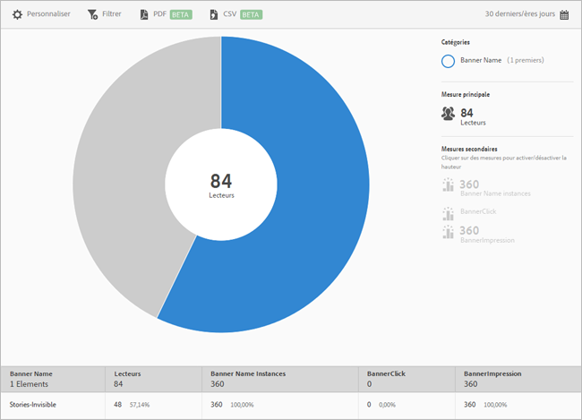

# Mesures de bannière {#banner-metrics}

Le rapport sur les **[!UICONTROL mesures de bannière]** offre une visualisation de vos données existantes sous forme de cadran. Ce rapport est accessible exclusivement aux clients de DPS (Digital Publishing Suite).

Par défaut, ce rapport affiche les mesures suivantes :

* **[!UICONTROL Nom de bannière]** : intitulé de la bannière.
* **[!UICONTROL Lecteurs]** : nombre d’utilisateurs de l’application.
* **[!UICONTROL Instances du nom de la bannière]**, qui est le nombre de fois où la bannière a été référencée par des clics et des impressions.
* **[!UICONTROL Clics sur la bannière]** : nombre de fois où des utilisateurs ont cliqué sur la bannière.
* **[!UICONTROL Impressions de la bannière]** : nombre de fois où une bannière a été vue (ou a été visible) sur une page de navigateur.

Ce rapport est similaire au rapport **[!UICONTROL Technologie]**. Pour plus d’informations sur la navigation et l’utilisation des rapports radiaux, l’ajout de ventilations et de mesures, la création d’activités Target et de filtres bascules, ainsi que le partage de rapports, voir [Technologie](/help/using/usage/reports-technology.md). Les informations contenues dans cette rubrique peuvent être utilisées pour personnaliser le rapport **[!UICONTROL Mesures de bannière]**.
