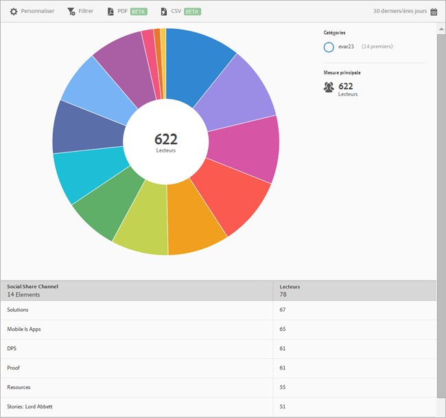

# Partage social{#social-sharing}

Le rapport sur le **[!UICONTROL partage social]offre une visualisation de vos données existantes sous forme de cadran.** Ce rapport est disponible uniquement pour les clients DPS.

Par défaut, ce rapport indique le nombre de lecteurs qui ont partagé des articles sur différents canaux, par courrier électronique, messagerie, etc.

Ce rapport est similaire au rapport **[!UICONTROL Technologie].** For information about how to navigate and use sunburst reports; add breakdowns and metrics; create target activities; create sticky filters, and share reports, see [Technology](//help/using/usage/reports-technology.md). Les informations contenues dans la rubrique Technologie peuvent être utilisées pour personnaliser le rapport **[!UICONTROL Partage social].**
