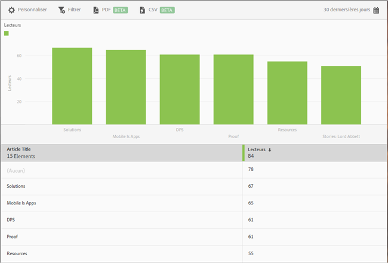

# Rapport sur les 50 premiers articles {#top-articles}

Le rapport sur les **[!UICONTROL 50 premiers articles]** contient un histogramme et un rapport de classement affichant les articles les plus consultés à l’aide de l’application. Ce rapport est accessible exclusivement aux clients de DPS.

Bien que le rapport par défaut affiche les données relatives aux 30 jours qui précèdent par nombre de lecteurs, vous pouvez le personnaliser.

Par défaut, ce rapport affiche le titre de l’article et le nombre de lecteurs.

Vous pouvez configurer les options suivantes pour ce rapport :

* **[!UICONTROL Période]**
Cliquez sur l’icône **[!UICONTROL Calendrier]** pour sélectionner une période personnalisée ou prédéfinie dans la liste déroulante

* **[!UICONTROL Personnaliser]**

   Personnalisez vos rapports en modifiant les options **[!UICONTROL Afficher par]**, en ajoutant des mesures et des filtres, en ajoutant des séries (mesures) supplémentaires, etc. Pour en savoir plus, voir [Personnalisation des rapports](/help/using/usage/reports-customize/reports-customize.md).

* **[!UICONTROL Filtrer]**

   Cliquez sur **[!UICONTROL Filtrer]** pour créer un filtre couvrant différents rapports, afin de visualiser le comportement d’un segment par rapport à l’ensemble des rapports mobiles. Un filtre d’attractivité vous permet de définir un filtre qui est appliqué à tous les rapports autres que de cheminement. Pour plus d’informations, voir [Ajout d’un filtre bascule](/help/using/usage/reports-customize/t-sticky-filter.md).

* **[!UICONTROL Télécharger]**

   Cliquez sur **[!UICONTROL PDF]** ou **[!UICONTROL CSV]** pour télécharger ou ouvrir les documents et les partager avec des utilisateurs qui n’ont pas accès à Mobile Services, ou pour utiliser le fichier dans des présentations.
