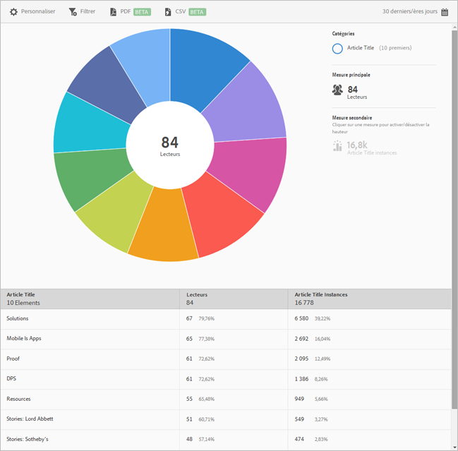

# 10 premiers articles rapport{#top-articles}

{#eol}

Le rapport sur les **[!UICONTROL 10 premiers articles]** offre une visualisation de vos données sous forme de cadran. Ce rapport est accessible exclusivement aux clients de DPS.

Par défaut, ce rapport indique le titre de l’article, le nombre de lecteurs et le pourcentage total de lecteurs, ainsi que les instances et le pourcentage du titre de l’article.

Ce rapport est similaire au rapport **[!UICONTROL Technologie]**. Pour plus d’informations sur la navigation et l’utilisation des rapports sous forme de cadran, l’ajout de répartitions et de mesures, la création d’activités Target et de filtres bascules, ainsi que le partage de rapports, voir [Technologie](/help/using/usage/reports-technology.md). Ces informations peuvent être utilisées pour personnaliser le rapport sur les **[!UICONTROL 10 premiers articles]**.
