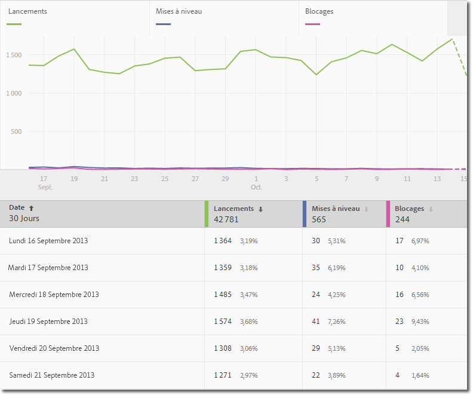
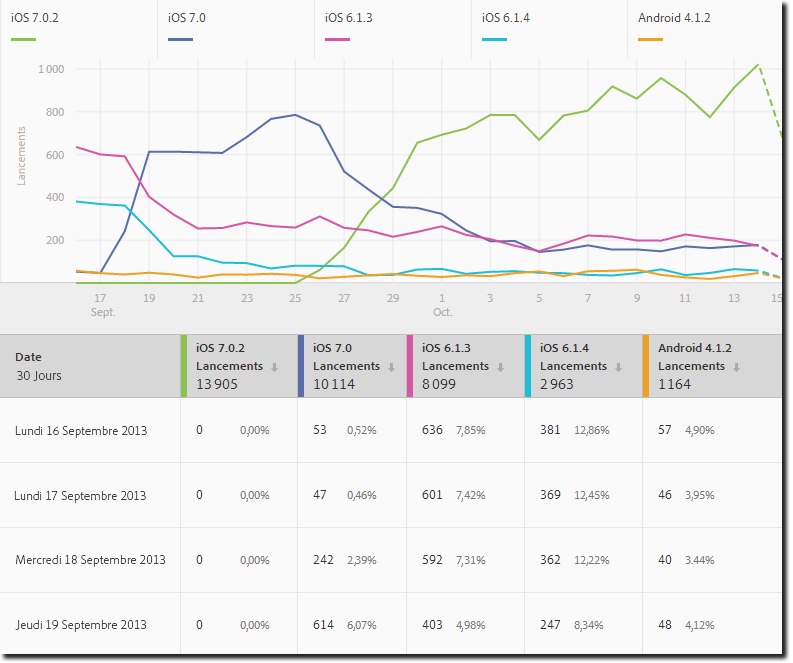
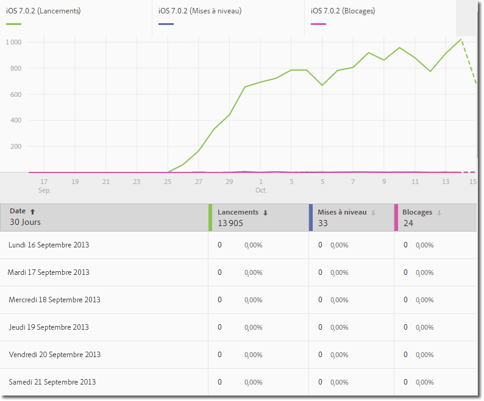
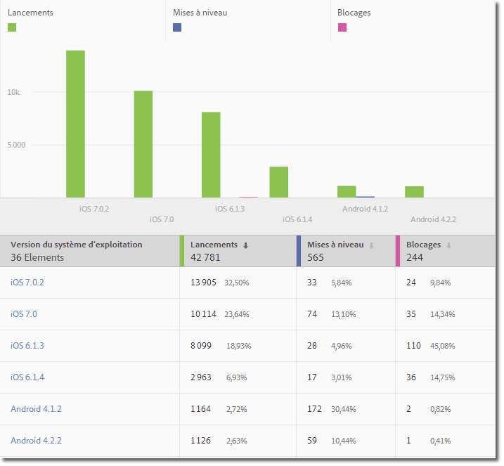
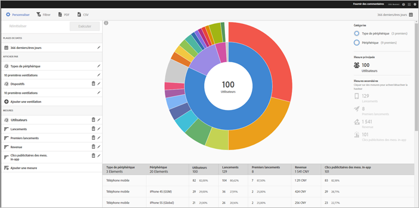
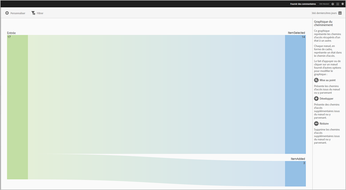
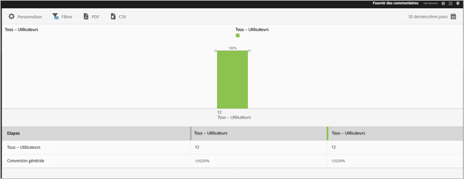

# Types de rapports {#report-types}

Lorsque vous personnalisez des rapports, la grande flexibilité qui s’offre à vous peut rendre plus complexe le choix du type de rapport adapté à la collecte des données dont vous avez besoin.

Avant de personnaliser les rapports, vous devez comprendre la différence entre une mesure et une dimension.

* Mesure

   Une mesure sert à mesurer vos données. Les mesures sont des valeurs qui peuvent être comptabilisées et ajoutées et qui sont utilisées pour déterminer la fréquence des actions spécifiques dans votre application. Les mesures courantes comprennent les installations, les lancements, le chiffre d’affaires, la valeur de durée de vie et les connexions. Par exemple, à chaque lancement de votre application,  la valeur  _launches_value augmente d’un.

* Dimension

   Une dimension sert à décrire vos données. Les dimensions sont représentées à l’aide d’une chaîne ou d’un nombre qui joue le rôle d’une chaîne (comme un code postal). Elles servent à organiser et à segmenter vos données. Parmi les exemples de dimensions courantes, citons la version du système d’exploitation, le nom de la campagne, le nom du produit et l’opérateur de téléphonie mobile. Chaque dimension comporte un certain nombre de valeurs spécifiques qui sont associées à cette dimension. Par exemple, la dimension de version du système d’exploitation contient des valeurs telles que _iOS 7_ et _Android 4.1.2_.

Voici les types de rapports que vous pouvez générer dans l’interface utilisateur d’Adobe Mobile :

## Rapport sur toute la durée {#section_2741DA54C90C49AFB17C7B9BC7AD627D}

Les rapports sur toute la durée montrent les performances des mesures sur une période afin que vous puissiez rapidement identifier les pics et les tendances. L’analyse débute souvent dans un rapport sur toute la durée et passe aux rapports de tendance et de classement au fur et à mesure que vous analysez les facteurs susceptibles de contribuer à un pic de mesure ou à une tendance.

Par exemple, si vous constatez un pic de lancements, vous pouvez exécuter un rapport de tendance qui affiche les lancements des 5 principaux systèmes d’exploitation pour identifier ceux qui contribuent le plus au pic de lancements :

Pour afficher des valeurs de dimension avec d’autres mesures sur un rapport sur toute la durée, vous pouvez utiliser la mesure d’instances et définir un filtre de dimension.

## Rapport de tendances  {#section_C9BE9A2EDBFF4D938B9AF14C8AA67883}

Les rapports de tendances vous aident à déterminer les performances des dimensions les plus populaires par rapport à une mesure. Vous pouvez utiliser ce rapport pour déterminer les valeurs qui contribuent le plus à la modification d’une mesure.

Pour voir un rapport de tendances pour une dimension, ajoutez un filtre bascule (par exemple, Système d’exploitation = iOS 6.0.1) à un rapport sur toute la durée afin d’afficher les mêmes données. En outre, vous pouvez ajouter cinq mesures supplémentaires au rapport sur toute la durée filtré.

## Rapport sur toute la durée filtré {#section_F8FAF2A4496F449CA99EF1E052C71A2D}

Si vous souhaitez afficher une valeur de dimension spécifique, vous pouvez ajouter un filtre bascule à un rapport sur toute la durée. Le rapport suivant montre les lancements, les mises à niveau et les blocages sur une durée de 30 jours pour une version spécifique du système d’exploitation.

## Rapport de classement {#section_C073D744A95843AF99EE74FB5B013735}

Les rapports de classement indiquent la fréquence à laquelle les 50 premières dimensions contribuent à une mesure. Ce rapport est utile pour afficher la contribution totale pour une période sur un grand nombre de valeurs.

## Rapport radial  {#section_17A9842039174DE094A6B1E9837E35BB}

Les rapports radiaux fournissent, par exemple, le rapport de base avec les ventilations. La visualisation utilise la hauteur pour afficher la mesure et les différences de performances entre les mesures. Chaque cercle concentrique représente un segment ciblé dans la catégorie de ce cercle. Vous pouvez agir sur une audience, par exemple appliquer un filtre bascule, masquer une mesure et afficher des mesures.

Vous pouvez afficher le rapport dans un tutoriel produit qui décrit comment interagir avec un graphique sous forme de cadran.

Pour commencer le tutoriel :

1. Dans Gérer les paramètres de l’application, cliquez sur **[!UICONTROL Utilisation]**.

1. Cliquez sur **[!UICONTROL Technologie]** > **[!UICONTROL Ventilation technologique]**.
1. Dans la barre de titre du rapport, cliquez sur **[!UICONTROL Personnaliser]**, puis sur l’icône d’information.

### Rapport de cheminement {#section_AD400106BC684B50B27CCCD3F4497114}

Un rapport de cheminement est basé sur l’analyse des chemins d’accès et affiche un graphique des chemins représentant les voies empruntées par un état de l’application vers un autre état.

Chaque nœud a la forme d’une boîte et représente un état dans les chemins d’accès des utilisateurs par le biais d’une application. Par exemple, dans l’illustration ci-dessus, le nœud supérieur représente le nombre d’utilisateurs qui ont lancé l’application et sélectionné une photo dans la galerie.

### Rapport Entonnoir  {#section_AF3B0C899D844FC3AD1F91A2C452C92F}

Les rapports Entonnoir vous permettent d’identifier où les clients abandonnent une campagne marketing ou se détournent d’un chemin de conversion défini lors de l’interaction avec votre application mobile. Vous pouvez également utiliser le rapport Entonnoir pour comparer les actions de différents segments.

La visualisation de l’entonnoir vous permet de voir où les clients abandonnent le processus. L’obtention d’une bonne visibilité sur les décisions des clients à chaque étape vous permet de comprendre à quel moment ils ont été dissuadés, quel chemin ils ont tendance à emprunter, ainsi que le moment où ils quittent votre application.

