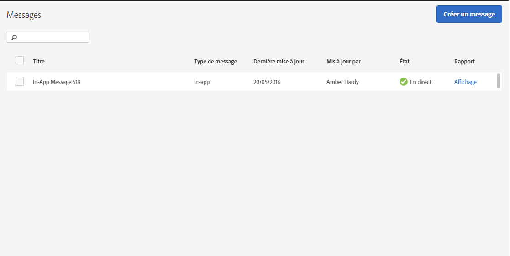

# Gestion des messages{#manage-messages}

Affichez la liste de vos messages in-app et push avec des détails sur la date de la dernière mise à jour de chaque message et sur la façon dont les messages sont en direct ou ont été désactivés.

Vous pouvez dupliquer, activer/désactiver et archiver/ne plus archiver des messages. Vous pouvez également afficher un rapport indiquant le nombre d’utilisateurs ayant visualisé le message et le nombre de ceux qui ont cliqué dessus.

Pour gérer les messages, cliquez sur ***your_app_name*** &gt; **[!UICONTROL Messagerie]** &gt; **[!UICONTROL Gérer les messages]**.

Voici des informations supplémentaires sur les tâches pouvant être exécutées sur les messages :

* **Recherche et filtrage des messages**

   Utilisez la zone de recherche en haut de la liste pour rechercher et filtrer les messages. Au fur et à mesure que vous saisissez du texte dans le champ de recherche, les messages correspondants de la liste s’affichent. La recherche fonctionne à l’échelle de toutes les colonnes du tableau. Par exemple, vous pouvez saisir `Draft` pour afficher uniquement les messages associés à cet état. Pour afficher seulement les messages mis à jour par un utilisateur, saisissez le nom de ce dernier.

   Outre la zone de recherche, vous pouvez également cliquer sur un en-tête de colonne pour trier la liste par ordre croissant ou décroissant en fonction du contenu de cette colonne.

   Par exemple, si vous triez la colonne **[!UICONTROL Type de message]dans un ordre croissant, tous les messages in-app s’affichent avant les messages push.** Si vous triez la colonne **[!UICONTROL Dernière mise à jour]par ordre décroissant, les derniers messages mis à jour apparaissent en haut de la liste.**

* **Duplication de messages**

   1. Cochez la case en regard d’un ou plusieurs messages et cliquez sur **[!UICONTROL Dupliquer la sélection]**.
   1. Sélectionnez l’application pour laquelle vous voulez faire un message dupliqué.
   1. Saisissez un nom pour le message.

      Pour dupliquer un message pour la même application, saisissez un nouveau nom pour le message. Utilisez le même nom pour remplacer le message d’origine. Si vous dupliquez un message pour une application différente, vous pouvez conserver le même nom sans remplacer le message d’origine.

   1. Click **[!UICONTROL Duplicate]** or **[!UICONTROL Overwrite]**, as necessary.

* **Désactivation ou activation de messages**

   Pour désactiver un message, cochez la case en regard d’un ou plusieurs messages actifs et cliquez sur **[!UICONTROL Désactiver la sélection]**.

   Pour activer un message désactivé, cochez la case en regard d’un ou plusieurs messages désactivés et cliquez sur **[!UICONTROL Activer la sélection]**.

* **Archivage de messages**

   Pour archiver des messages et nettoyer votre liste de messages :

   >[!TIP]
   >
   >Avant de pouvoir archiver un message, vous devez le désactiver.

   1. Cochez la case en regard d’un ou plusieurs messages désactivés et cliquez sur **[!UICONTROL Archiver la sélection]**.

* **Affichage des messages archivés**

   1. Cliquez sur **[!UICONTROL Afficher l’archive]**.
   1. Cochez la case en regard d’un ou plusieurs messages archivés et cliquez sur **[!UICONTROL Désarchiver la sélection]**.

