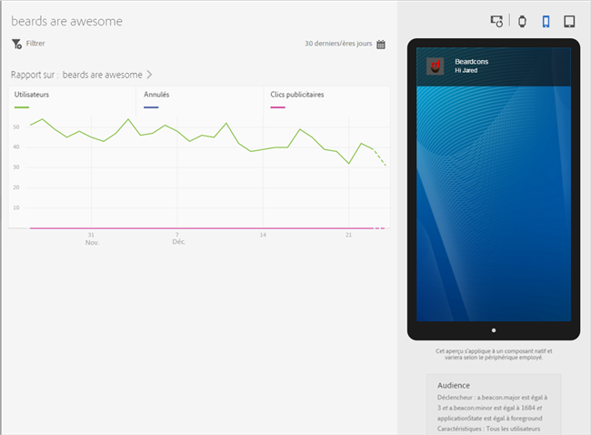
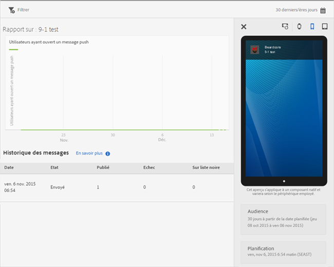

# Affichage des rapports sur les messages{#view-message-reports}

Vous pouvez afficher des rapports sur les messages in-app et push.

1. Cliquez sur  dans la colonne **[!UICONTROL Rapport]** de n’importe quel message.
1. (**Facultatif**) Créez un filtre d’attractivité pour le rapport ou changez la période en cliquant sur l’icône **[!UICONTROL Calendrier]**.

   Pour plus d’informations sur la création d’un filtre bascule, voir [Ajout d’un filtre bascule.](/help/using/usage/reports-customize/t-sticky-filter.md)

>[!TIP]
>
>Le rapport peut varier selon le type de message que vous consultez.

## Les messages in-app {#section_90B79BA58E8141F78538C187EB1BF8C7}

Si vous affichez des rapports pour un message in-app, le rapport ressemble à l’illustration suivante :

### Mesures des messages in-app

Voici la liste des mesures disponibles pour les messages in-app :

* **[!UICONTROL Impression]**, lorsqu’un message est déclenché

* **[!UICONTROL Clic publicitaire]** Lorsqu’un utilisateur appuie sur le bouton **[!UICONTROL Clic publicitaire]** dans une alerte ou un message plein écran, et lorsqu’un utilisateur ouvre l’application à partir d’une notification locale.

* **[!UICONTROL Annuler]** Lorsqu’un utilisateur appuie sur le bouton **[!UICONTROL Annuler]** dans une alerte ou un message plein écran.

* **[!UICONTROL Taux d’engagement]**. Il s’agit d’une mesure calculée d’Adobe Analytics. Le résultat est obtenu en divisant le nombre de clics publicitaires par le nombre d’impressions.

## Messages push {#section_BEAFD858CA194185B6F88903446058E9}

Si vous affichez des rapports pour un message push, le rapport ressemble à l’illustration suivante :

Le graphique de la partie supérieure affiche le nombre d’utilisateurs qui ont ouvert le message.

### Mesures des messages push

Voici la liste des mesures disponibles pour les messages push :

* **[!UICONTROL Heure]**

   Heure à laquelle le message a été transmis aux appareils à partir de Mobile Services.

* **[!UICONTROL État]**

   Le statut du message, et les statuts disponibles sont les suivants :

   * **[!UICONTROL Annulés]**
   * **[!UICONTROL Planifiés]**
   * **[!UICONTROL En cours d’exécution]**
   * **[!UICONTROL Exécuté]**

* **[!UICONTROL Publié]**

   Le nombre de jetons d’appareil qui ont bien été envoyés à APNS/FCM (Apple Push Notification Service/Firebase Cloud Messaging) pour envoyer le message aux appareils des utilisateurs.

* **[!UICONTROL Échec]**

   Nombre de jetons d’appareil non envoyés à APNS/FCM. Quelques raisons possibles d’échec :

   * pushID non valide

   * La plateforme push (APNS, FCM, etc.) spécifiée n’existe pas pour l’application de la tâche. Par exemple, la plate-forme peut collecter des jetons Push iOS, mais le service APNS n’est pas configuré.

   * Le message a peut-être échoué car le service Push n&#39;a pas été configuré correctement ou que le système Mobile Services est hors service.
   >[!IMPORTANT]
   >
   >Si vous constatez un nombre d’échecs inhabituellement élevé, vérifiez la configuration des services Push. Si les services Push semblent être correctement configurés, contactez le service d’assistance clientèle Adobe.

* **[!UICONTROL Liste bloquée]**

   Nombre de jetons d’appareil qui ne peuvent plus être envoyés vers APNS ou FCM. Cela signifie habituellement que l’application a été désinstallée du périphérique ou que l’utilisateur a modifié ses paramètres de réception des messages. Android et iOS diffèrent quant au moment où les jetons sont comptés comme Placés sur l&#39;liste bloquée. Les jetons Android sont immédiatement affichés dans le nombre de listes bloquées (liste bloquée). Les jetons iOS s’affichent au départ comme étant publiés, mais en fonction des commentaires d’APNS, ils s’affichent comme placés sur l&#39;liste bloquée sur les messages suivants.
