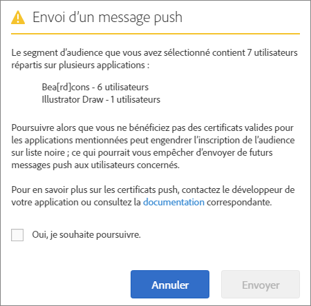

# Audience : messages push {#audience-define-and-configure-audience-segments-for-push-messages}

Vous pouvez définir et configurer les options d’audience se rapportant aux messages push, y compris la période, les segments Analytics et les segments personnalisés.

## Définition des segments d’audience {#section_7C4D2393CF7441959FE2381A02867CAC}

Lorsqu’un segment d’audience est créé pour les messages push, le segment peut inclure des utilisateurs d’une ou plusieurs applications, car les suites de rapport ou suites de rapports virtuelles peuvent contenir des données concernant une ou plusieurs applications. Pour de plus amples informations concernant les suites de rapports virtuelles, voir   [Suites de rapports virtuelles](/help/using/manage-apps/c-mob-vrs.md)

Dans Adobe Mobile Services, il est possible que les professionnels du marketing ne puissent émettre des notifications push que vers une application par plate-forme. S’ils tentent de cibler des segments qui contiennent des utilisateurs provenant de plusieurs applications, un avertissement s’affiche indiquant que le traitement peut entraîner de graves problèmes et que les utilisateurs peuvent être mis sur liste de blocage. Si vous êtes confronté à un dysfonctionnement des messages push, consultez *Résoudre les dysfonctionnements des messages push* dans   [Dépannage de la messagerie push](/help/using/in-app-messaging/t-create-push-message/c-schedule-push-message.md)

Afin d’utiliser les données Audience Manager dans votre définition de segment, consultez [Audience Analytics](https://docs.adobe.com/content/help/fr-FR/analytics/integration/audience-analytics/mc-audiences-aam.html).

>[!IMPORTANT]
>
>Si les utilisateurs de l’application sont sur liste de blocage, les marketeurs ne peuvent plus **jamais** leur envoyer de messages push.

Si vous sélectionnez un segment d’audience qui contient des utilisateurs de plusieurs applications, vous pouvez lire le message suivant :

Le nom de l’application est basé sur une version réduite de l’appid, qui est automatiquement envoyée à Adobe Analytics par le SDK Mobile Services au format `<app name> <version number> (<bundle id>)`.

>[!TIP]
>
>Le numéro de version est facultatif.

Jusqu’à 6 jeux de numéros pour la version et 5 jeux de numéros pour l’ID de lot sont supprimés.

Par exemple :

* `Bea[rd]cons 1.0 (123)` apparaît comme `Bea[rd]cons`
* `Bea[rd]cons 1.2 (1.2)` apparaît comme `Bea[rd]cons`
* `Bea[rd]cons 1.2.3.4.5.6.7 (1111)` apparaît comme `Bea[rd]cons .7`
* `Bea[rd]cons 1.2.3. (1.2.3.4.5.6)` apparaît comme `Bea[rd]cons (.6)`

Pour continuer à envoyer des messages push aux applications énumérées, cochez la case **[!UICONTROL Oui, je souhaite poursuivre.]** puis cliquez sur **[!UICONTROL Envoyer]**.

## Bonnes pratiques

Voici quelques bonnes pratiques à retenir :

* Pour diminuer les risques de confusion, **évitez** de définir des suites de rapports virtuelles pour application mobile qui contiennent des données issues de plusieurs applications.
* Utilisez un ID d’application unique intégré à un segment d’audience **à chaque fois** que vous souhaitez envoyer un message push.
Cette méthode garantit que les notifications push sont envoyées à un segment d’audience qui n’appartient qu’à **une seule** application.

### Exemples

Voici quelques exemples pour vous aider à comprendre comment définir correctement des segments :

**À faire** : le professionnel du marketing fournit des certificats push pour les versions iOS et Android d’une application, par exemple pour Adobe Photoshop. Il peut envoyer une notification push à un segment d’utilisateurs qui s’étend sur les deux plateformes.

**À ne pas faire** : le professionnel du marketing fournit des certificats push pour les versions iOS et Android d’une application, par exemple pour Adobe Photoshop. S’il crée et envoie une notification vers un segment de *tous les utilisateurs actifs au cours des 30 derniers jours*, seuls les utilisateurs de l’application Adobe Photoshop sur iOS et Android reçoivent la notification push, et tous les utilisateurs de l’application Adobe Illustrator sur iOS et Android sont bloqués. Pour de plus amples informations et exemples, consultez *Résoudre les dysfonctionnements des messages push* dans   [Résolution des problèmes liés aux messages push](/help/using/in-app-messaging/t-create-push-message/c-troubleshooting-push-messaging.md).

## Configuration des segments d’audience {#section_A92C60885A30421B8150820EC1CCBF13}

1. Accédez à la page Audience pour obtenir un nouveau message push.

   Pour plus d’informations, voir [Création d’un message push](/help/using/in-app-messaging/t-create-push-message/t-create-push-message.md).

   Pendant que vous configurez les options d’audience, prenez note des informations **importantes** :

   * L’**[!UICONTROL Audience estimée ayant souscrit]** est le nombre d’appareils qui correspondent au segment Adobe Analytics **et** le nombre d’appareils ayant accepté les messages.

      Vous pouvez afficher une estimation du nombre d’utilisateurs membres de vos segments sélectionnés qui ont choisi de recevoir des messages et qui recevront le message push. Le nombre total d’utilisateurs de l’application s’affiche en dessous de l’estimation, indépendamment du statut de souscription.

   * Le **[!UICONTROL Total]** est le nombre d’appareils qui correspondent au segment Adobe Analytics.

   * Les messages push sont envoyés aux appareils appartenant au segment Adobe Analytics défini **et** qui ont accepté les messages push.

      En d’autres termes, le SDK a renvoyé une valeur `True` pour l’eVar de souscription des messages push.

   * Même si l’appareil dispose d’un jeton d’appareil valide, le message n’est pas envoyé à l’appareil, sauf si Adobe Analytics a défini le drapeau de souscription.

   * Pour de plus amples informations sur la résolution des problèmes liés aux messages push, consultez ceci :

      * [Messagerie push dans iOS](https://docs.adobe.com/content/help/fr-FR/mobile-services/ios/messaging-ios/push-messaging/push-messaging.html)

      * [Messagerie push dans Android](https://docs.adobe.com/content/help/fr-FR/mobile-services/android/messaging-android/push-messaging/push-messaging.html)

1. Renseignez les champs suivants :

   * **[!UICONTROL Durant]**

      Spécifiez la plage temporelle à utiliser pour l’audience estimée. Sélectionnez une option dans la liste déroulante **[!UICONTROL Durant]** :

   * L’option **[!UICONTROL Dernier(s)]** vous permet de sélectionner une période relative (par exemple, les 7 derniers jours, les 30 derniers jours ou les 60 derniers jours) à partir du moment où l’envoi du message push est programmé.

      À titre d’exemple, si vous sélectionnez les 30 derniers jours et programmez l’envoi du message push le 31 octobre, l’audience estimée correspondra au nombre d’utilisateurs qui ont choisi de recevoir les messages push au cours des 30 jours qui précèdent le 31 octobre.

   * L’option **[!UICONTROL Plage statique]** vous permet de sélectionner une plage statique en sélectionnant les dates de début et de fin pour la gamme d’audience estimée.

      En reprenant l’exemple précédent, si vous sélectionnez une plage de dates commençant le 1er octobre et se terminant le 15 octobre, mais planifiez le message push le 31 octobre, l’audience estimée correspondra au nombre d’utilisateurs qui ont choisi de recevoir les messages push dans la plage de dates statique spécifiée (du 1er au 15 octobre).

   * **[!UICONTROL Segments Analytics]**

      Sélectionnez un segment Adobe Analytics existant dans la liste déroulante. Pour en savoir plus, voir [Création de segments](https://docs.adobe.com/content/help/fr-FR/analytics/components/segmentation/segmentation-workflow/seg-build.html).

   * **[!UICONTROL Segments personnalisés]**

      Sélectionnez une mesure ou une variable dans la liste déroulante (par exemple, **[!UICONTROL Jours depuis la dernière utilisation]** ou **[!UICONTROL Point ciblé]**), et configurez le filtre comme vous le souhaitez. À titre d’exemple, le segment personnalisé suivant cible les utilisateurs possesseurs d’un téléphone mobile exécutant iOS et situés dans la région de la Californie (États-Unis).
   >[!IMPORTANT]
   >
   >Dans la section **[!UICONTROL Créer une audience]**, si vous cliquez sur **[!UICONTROL Et]**, une boîte de dialogue s’affiche pour vous rappeler que chaque application répertoriée **doit** disposer d’un certificat valide. Si vous avez cliqué sur **[!UICONTROL Ou]**, la boîte de dialogue par défaut apparaît. Pour plus d’informations sur les certificats valides et les suites de rapports, voir [Suites de rapports virtuelles](/help/using/manage-apps/c-mob-vrs.md).
