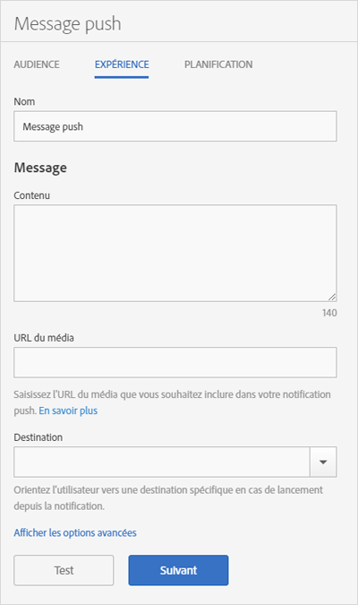

# Experience: push message {#experience-push-message}

Vous pouvez configurer les options d’expérience se rapportant aux messages push et aux messages push enrichis, y compris le nom, le texte du message et la destination. Vous pouvez également configurer des options avancées, notamment les options de données utiles et les options personnalisées pour les appareils iOS.

1. Sur la page Audience pour un nouveau message push, cliquez sur **[!UICONTROL Expérience]**.

   

1. Saisissez le nom du message.
1. Dans la section **[!UICONTROL Message], saisissez les informations dans les champs suivants :**

   * **[!UICONTROL Contenu]**

      Spécifiez le texte de votre message. Vous pouvez utiliser 140 caractères au maximum.

   * **[!UICONTROL URL du média]**

      Saisissez l’URL du fichier média que vous souhaitez utiliser dans le message de notification push. Pour connaître les conditions requises pour utiliser les notifications Push enrichies, voir *Conditions requises pour les notifications* Push enrichies ci-dessous.

      >[!IMPORTANT]
      >
      >Pour afficher une image ou une vidéo dans une notification push, prenez note des éléments suivants :
      > * Les données `attachment-url` sont traitées dans les données utiles push.
      > * L’URL du média doit pouvoir traiter des pics de requêtes.

   * **[!UICONTROL Destination]**

      Sélectionnez une destination spécifique (lien Web, profond ou hybride, par exemple) où orienter les utilisateurs lorsqu’ils cliquent sur le message. For more information, see [Destinations](/help/using/acquisition-main/c-create-destinations.md).

      >[!TIP]
      >
      >When you use the * **[!UICONTROL Web Link]** or **[!UICONTROL Custom Link]** destination types, the destination type is not tracked. Seuls les **[!UICONTROL liens profonds]font l’objet d’un suivi.**

## Conditions requises pour les notifications Push complexes

Voici les conditions requises pour envoyer des notifications Push enrichies :

* **Versions prises en charge**

   Les notifications Push enrichies sont prises en charge sur les versions suivantes :
   * Android 4.1.0 ou version ultérieure
   * iOS 10 ou version ultérieure

      >[!IMPORTANT]
      >
      >À noter :
      >* Les messages Push enrichis envoyés aux versions antérieures seront toujours envoyés, mais seul le texte s’affiche.
      >* La lecture de média n’est pour l’instant pas prise en charge.

* **Formats de fichier**

   Voici la liste des formats de fichier pris en charge :
   * Images : JPG et PNG
   * Animations (iOS uniquement) : GIF
   * Vidéos (iOS uniquement) : MP4

* **Formats d’URL**
   * HTTPS uniquement

* **Taille**
   * Les images doivent être au format 2:1, sinon elles seront rognées.

Pour de plus amples informations concernant la configuration des notifications push enrichies, consultez le contenu suivant :

* [Recevoir des notifications Push dans Android](/help/android/messaging-main/push-messaging/c-set-up-rich-push-notif-android.md)
* [Recevez des notifications Push enrichies dans iOS](/help/ios/messaging-main/push-messaging/c-set-up-rich-push-notif-ios.md)

Pour configurer un message push sur la page Expérience :

1. (**Optional**) Click the **[!UICONTROL Show Advanced Options]** link to configure additional options:

   * **[!UICONTROL Données utiles : données]**

      Fournissez des données utiles push personnalisées dans l’objet JSON qui sera envoyé à l’application au moyen d’une notification push ou locale. La limite pour Android et iOS est fixée à 4 ko.

   * **[!UICONTROL Options Apple : catégorie]**

      Spécifiez une catégorie pour les notifications push et locales. Pour en savoir plus, voir la section [Gestion de l’assistance concernant les notifications de votre application](https://developer.apple.com/library/content/documentation/NetworkingInternet/Conceptual/RemoteNotificationsPG/SupportingNotificationsinYourApp.html#//apple_ref/doc/uid/TP40008194-CH4-SW9) dans la *bibliothèque de développement iOS*.

   * **[!UICONTROL Options Apple : son]**

      Spécifiez le nom du fichier audio à lire dans votre application. S’il n’est pas défini, le son d’alerte par défaut est lu. Pour en savoir plus, voir la section [Gestion de l’assistance concernant les notifications de votre application](https://developer.apple.com/library/content/documentation/NetworkingInternet/Conceptual/RemoteNotificationsPG/SupportingNotificationsinYourApp.html#//apple_ref/doc/uid/TP40008194-CH4-SW10) dans la *bibliothèque de développement iOS*.

   * **[!UICONTROL Options Apple : contenu disponible]**

      Sélectionnez cette option de sorte qu’à la réception du message, iOS réveille votre application en arrière-plan et la laisse exécuter le code en fonction des données utiles du message. For more information, see [Apple Push Notification Service](https://developer.apple.com/library/content/documentation/NetworkingInternet/Conceptual/RemoteNotificationsPG/APNSOverview.html#//apple_ref/doc/uid/TP40008194-CH8-SW1) in the *iOS Developer Library*.

1. (Facultatif) Pour afficher un aperçu de la mise en page de votre message, cliquez sur les icônes ci-après :

   * **[!UICONTROL x Summary}**

      Masque le volet d’aperçu. Cliquez sur  pour afficher à nouveau le volet d’aperçu.

   * **[!UICONTROL Modifier l’orientation]**

      To change the orientation of the preview from portrait to landscape mode, click . Pour les montres, l’orientation passe d’un cadran rond à un cadran carré.

   * **[!UICONTROL Aperçu sur la montre d’un utilisateur]**

      Pour prévisualiser votre message tel qu’il apparaîtra sur les montres d’un utilisateur, cliquez sur l’icône .

   * **[!UICONTROL Aperçu sur le téléphone mobile d’un utilisateur]**

      Pour prévisualiser votre message tel qu’il apparaîtra sur les téléphones mobiles d’un utilisateur, cliquez sur l’icône téléphone.

   * **[!UICONTROL Aperçu sur la tablette d’un utilisateur]**

      Pour prévisualiser votre message dans la tablette d’un utilisateur, cliquez sur l’icône tablette.
   En bas du panneau d’aperçu, vous pouvez afficher une description de l’audience que vous avez sélectionnée à l’étape précédente.

1. (**Optional**) Click **[!UICONTROL Test]** to push your message to specified devices for testing purposes.
1. Sélectionnez le service et saisissez les jetons push pour au moins un appareil vers lequel vous souhaitez envoyer le message.

   Spécifiez les jetons dans une liste séparée par des virgules pour pousser le message vers plusieurs appareils.

1. Configurez les les options de planification du message.

   Pour plus d’informations, voir [Planification : message](/help/using/in-app-messaging/t-create-push-message/c-schedule-push-message.md)push.
