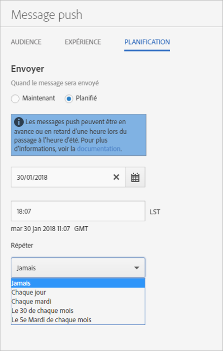

# Planification : messages push{#schedule-push-message}

Dans l’interface utilisateur d’Adobe Mobile Services, vous pouvez planifier la remise immédiate ou ultérieure d’un message push ou sa diffusion selon un schéma récurrent (quotidien, hebdomadaire ou mensuel).

>[!TIP]
>
>Les utilisateurs peuvent, à tout moment, modifier les paramètres de programmation pour une tâche de messages push. Si aucune date applicable n’est définie pour l’envoi d’un message récurrent (par exemple une tâche mensuelle récurrente tous les 31 du mois, le 31 février ou le cinquième jeudi du mois), aucun message n’est envoyé.

À noter :

* Le format de date et d’heure approprié est `hh:mm` et `mm/dd/yyyy`.

* Vous pouvez modifier un message programmé des façons suivantes :

   * Repousser à une date ultérieure.
   * Modifier l’intervalle de répétition

      Par exemple, si vous aviez un message envoyé tous les jours, vous pouvez le basculer en envoi hebdomadaire.

## Avant de planifier des messages push récurrents

Vous **devez** comprendre les informations suivantes avant de programmer l’envoi de messages push récurrents :

* Les options affichées dans la liste déroulante **[!UICONTROL Répétition]** dépendent de la date que vous avez saisie ou sélectionnée.

   Par exemple, si vous avez tapé `Saturday, October 7`, les options suivantes s’affichent :

   * **[!UICONTROL Jamais]**
   * **[!UICONTROL Chaque jour]**
   * **[!UICONTROL Chaque samedi]**
   * **[!UICONTROL Le 7 de chaque mois]**
   * **[!UICONTROL Le 1er samedi de chaque mois]**

* Les messages push sont programmés et envoyés d’après le Temps moyen de Greenwich (GMT).

   Par exemple, si vous avez choisi d’envoyer un message récurrent chaque samedi à 12 h (midi) **PST**, à compter du 7 octobre, le message sera, en fait, envoyé le samedi à 19 h **GMT**.
* Les messages sont envoyés de façon différente si vous vous situez aux États-Unis, en Europe ou en Asie.

   Par exemple, si vous êtes situé à San José, Californie, et que vous programmez un message pour qu’il soit envoyé le ***31 octobre*** à **17 h 30 PST**, le message sera, en fait, envoyé le ***1er novembre*** à 00 h 30 **GMT**. Si vous êtes situé à Tokyo, et que vous programmez un message pour qu’il soit envoyé le ***1er janvier*** à 5 h 30, il sera envoyé le ***31 décembre*** à 20 h 30 **GMT**.
* Les messages sont envoyés une heure à l’avance ou en retard en fonction des heures d’été et d’hiver.
* Si vous regardez vos rapports de messages push, le message est affiché dans l’heure locale de votre système.

   Par exemple, si votre heure de départ est 12 h **PST**, même si le message est envoyé 19 h **GMT**, le rapport de messages affichera 12 h **PST**.

## Planification d’un message push récurrent {#section_675BD754E5A04423A1751193698A978F}

1. Sur la page Planification d’un nouveau message push, sélectionnez **[!UICONTROL Planifié]** ou **[!UICONTROL Maintenant]**.

   Pour plus d’informations, voir [Création d’un message push](/help/using/in-app-messaging/t-create-push-message/t-create-push-message.md).

   Si vous avez sélectionné **[!UICONTROL Maintenant]**, le message est envoyé immédiatement. Afin d’éviter l’envoi immédiat d’un message, cliquez sur **[!UICONTROL Enregistrer en tant que brouillon]**.

   

1. Si vous sélectionnez **[!UICONTROL Planifié]**, cliquez sur l’icône de calendrier, puis sélectionnez ou saisissez une date de début.
1. Saisissez une heure. 
1. Dans **[!UICONTROL Répéter]**, sélectionnez l’une des options suivantes :

   * **[!UICONTROL Jamais]**
   * **[!UICONTROL Chaque jour]**
   * **[!UICONTROL Chaque mardi]**
   * **`<Day x>`du mois**

      Les options affichées changent en fonction du jour sélectionné ou saisi comme jour de début.
   * **`<nth day>`de chaque mois**

      La valeur affichée change en fonction de la date que vous avez sélectionnée ou saisie comme date de début.

1. Dans **[!UICONTROL Fin de répétition]**, saisissez une date et une heure de fin.
1. Cliquez sur l’une des options suivantes :

   * **[!UICONTROL Enregistrer en tant que brouillon]**

      Cette option enregistre le message sous la forme de brouillon. Vous pouvez sélectionner cette option pour enregistrer un message qui est inachevé ou afin qu’une autre personne puisse le modifier et l’approuver avant de l’activer.

      Si vous avez sélectionné **[!UICONTROL Maintenant]** à l’étape précédente, le projet de message est envoyé immédiatement lors de son activation. Si vous avez sélectionné la date et l’heure de diffusion du message, celui-ci est envoyé à l’horaire désigné.

   * **[!UICONTROL Enregistrement et planification]**

      Cette option envoie le message à une date et une heure programmées.

Pour envoyer le brouillon de message ultérieurement, effectuez l’une des tâches suivantes :

* Cliquez sur **[!UICONTROL Gestion des messages]**, sélectionnez la case à cocher à côté du message, puis cliquez sur **[!UICONTROL Activer la sélection]**.
* Cliquez sur **[!UICONTROL Enregistrer et envoyer]** pour enregistrer le message et l’envoyer.
