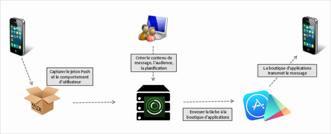

# Création d’un message push {#create-a-push-message}

Envoyez depuis l’interface utilisateur de Mobile Services des messages push vers des segments Analytics afin de tirer parti de vos données Analytics lors de vos interactions avec les utilisateurs.

>[!IMPORTANT]
>
>Avant de créer un message push, voir [Conditions préalables requises pour activer la messagerie push](/help/using/c-manage-app-settings/c-mob-confg-app/configure-push-messaging/prerequisites-push-messaging.md).

Les messages push s’affichent pour les utilisateurs qui ont choisi de recevoir des notifications lorsqu’ils n’utilisent pas activement votre application. Ces notifications avertissent les utilisateurs des nouvelles mises à jour, offres et rappels. Grâce à ces notifications, vous pouvez créer, tester, gérer et générer des rapports sur les messages push dans un processus à la fois simple et rationnel.

Les messages push sont envoyés côté serveur par les boutiques d’applications plutôt que depuis Adobe Mobile Services :

Pour créer un message push :

1. Cliquez sur ***your_app_name*** > **[!UICONTROL Messagerie]** > **[!UICONTROL Gérer les messages]** > **[!UICONTROL Créer un message]** > **[!UICONTROL Créer push]**.
1. Configurez les options d’audience.

   Pour plus d’informations, voir [Audience : Définition et configuration des segments d’audience pour les messages push](/help/using/in-app-messaging/t-create-push-message/c-audience-push-message.md).
