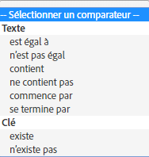

# Audience : message in-app{#audience-in-app-message}

Vous pouvez configurer les options d’audience pour les messages in-app, y compris les options d’affichage, de déclenchement et de caractéristiques.

1. Dans votre application, cliquez sur **[!UICONTROL Messagerie]** &gt; **[!UICONTROL Gestion des messages]** &gt; **[!UICONTROL Créer un message]** &gt; **[!UICONTROL Créer message in-app]**.
1. Sur la page Audience, saisissez les informations dans les champs suivants :

   * **[!UICONTROL Affichage]**

      Sélectionnez l’option qui déclenchera l’affichage d’un message :

      * **[!UICONTROL Toujours]**

         Avec cette option, le message s’affichera à chaque déclenchement.

      * **[!UICONTROL Une fois]**

         Avec cette option, le message s’affichera au premier déclenchement seulement.

      * **[!UICONTROL Jusqu’au clic]**

         Avec cette option, le message s’affichera à chaque déclenchement, jusqu’à ce que l’utilisateur clique dessus. Ce déclenchement survient uniquement en mode plein écran et pour les messages d’alerte. La plupart des messages doivent rediriger ou utiliser une ressource d’Internet et ne s’afficheront pas hors ligne. Afin de toujours afficher le message, quelle que soit la connectivité au réseau, sélectionnez la case à cocher **[!UICONTROL Afficher hors ligne]**.
   * **[!UICONTROL Déclencheur]**

      Sélectionnez une option dans la liste déroulante, puis une condition. Vous pouvez par exemple sélectionner **[!UICONTROL Lancé]** dans la première liste déroulante et **[!UICONTROL Existe]** dans la seconde. Vous pouvez également spécifier des données contextuelles personnalisées qui doivent figurer dans l’événement de déclenchement pour afficher le message.

      >[!IMPORTANT]
      >
      >Si vous sélectionnez plusieurs déclencheurs, ils doivent tous survenir sur le même accès pour que le message s’affiche.

   * **[!UICONTROL Caractéristiques]**
Vous pouvez déterminer qui doit voir le message in-app lors de son déclenchement, ainsi que filtrer (segmenter) l’audience selon les données spécifiées des accès. Par exemple, vous pouvez définir une règle selon laquelle les points ciblés contiennent Denver. Ce filtre vous permet d’afficher le message aux clients inclus dans l’un de vos points ciblés contenant Denver dans le nom, au moment du déclenchement.

## Informations supplémentaires sur les caractéristiques et les déclencheurs {#section_48C39EFB8CAA4F62B994FCC91DF588E6}

>[!IMPORTANT]
>
>Les déclencheurs et les caractéristiques utilisent des données qui sont transférées dans Analytics à partir de votre application. Ces valeurs sont transférées en tant que données contextuelles, variables mappées et mesures. Une variable est une valeur basée sur du texte alors qu’une mesure est une valeur numérique.

Pour afficher le mappage de ces paires de valeurs de clés dans l’interface utilisateur de Mobile Services, ainsi que pour valider la valeur de votre déclencheur, cliquez sur **[!UICONTROL Gérer les paramètres de l’application]** &gt; **[!UICONTROL Gérer les variables et les mesures]** &gt;, ce qui affiche les onglets suivants :

* **[!UICONTROL Variables et mesures standard]**
* **[!UICONTROL Variables personnalisées]**
* **[!UICONTROL Mesures personnalisées]**

Une fois le mappage validé, sélectionnez le comparateur approprié ou un opérateur logique afin de configurer votre audience pour le message.

### Sélection des mesures et des variables {#example_AB126F03BD1C4094B791E230B3DB1189}

Les scénarios suivants vous permettent de déterminer si vous devez sélectionner une mesure ou une variable comme déclencheur :

### Mesures

Une mesure est un nombre, il peut s’agir par exemple d’un nombre dʼachats.

1. Cliquez sur **[!UICONTROL Gérer les messages]** &gt; **[!UICONTROL Créer un message]**.
1. Procédez comme suit dans la section **[!UICONTROL Déclencheur]** de l’onglet **[!UICONTROL Audience]** :

   1. Sélectionnez un événement standard tel que **[!UICONTROL Lancé]** et sélectionnez **[!UICONTROL Existe]**.
   1. Sélectionnez un second déclencheur qui est un point de données personnalisé mappé à une mesure.
   1. Sous **[!UICONTROL Nombre]**, sélectionnez une option de comparateur.

### Variables

Une variable est une chaîne de texte, c’est un identifiant unique. On peut citer par exemple des pays, des aéroports, etc.

1. Cliquez sur **[!UICONTROL Gérer les messages]** &gt; **[!UICONTROL Créer un message]**.
1. Procédez comme suit dans la section **[!UICONTROL Déclencheur]** de l’onglet **[!UICONTROL Audience]** :

   1. Sélectionnez un événement standard tel que **[!UICONTROL Lancé]** et sélectionnez **[!UICONTROL Existe]**.
   1. Sélectionnez un second déclencheur qui est un point de données personnalisé mappé à une variable.
   1. Sous **[!UICONTROL Texte]**, sélectionnez une option de comparateur.

Pour obtenir des informations supplémentaires sur les données contextuelles, les variables et les mesures, consultez [Gérer votre application](/help/using/manage-apps/manage-apps.md).
