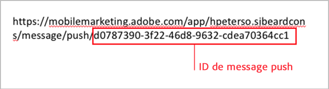
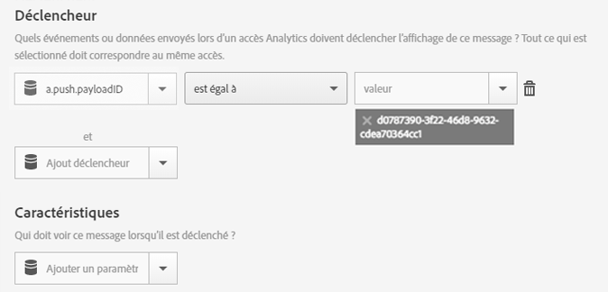

# Déclenchement d’un message in-app lorsque l’application est ouverte à partir d’un message push{#trigger-an-in-app-message-when-the-app-is-opened-from-a-push-message}

{#eol}

Vous pouvez définir l’ID de message push envoyé lorsqu’un utilisateur ouvre l’application à partir d’un message push en tant que déclencheur de message in-app.

1. Obtenez l’ID du message push qui sera envoyé à l’utilisateur.

   L’identifiant du message push est accessible dans l’URL lors du workflow de création du message.

   Voici un exemple :

   

1. Sauvegardez et activez le message in-app avec le déclencheur suivant :

   `"a.push.payloadID" =`

   >[!TIP]
   >
   >L’ID de message push est l’ID que vous avez identifié à l’étape 1.

   Ce déclencheur doit être ajouté manuellement car il ne se trouve pas dans la liste déroulante **[!UICONTROL Déclencheur]**.

   

1. Sauvegardez et envoyez le message push dont l’ID push correspond à celui que vous avez identifié à l’étape 1.
1. Cliquez sur le message push pour ouvrir l’application et vérifier que le message in-app s’affiche bien à l’ouverture.

   Pendant le test, prenez note des informations suivantes :

   * Une fois le message in-app enregistré, la mise à jour du fichier de configuration hébergé avec le nouveau message prend environ 45 secondes.
   * L’application recherche les mises à jour du fichier de configuration (le nouveau message in-app) en cas de **new** launch, vous devez donc vous assurer que l’application déclenche un nouveau lancement lorsque l’utilisateur clique sur le message push.
   Cela signifie généralement que vous devez vous assurer que le délai d’expiration de la session s’est produit. Le délai d’expiration par défaut est de 5 minutes.
