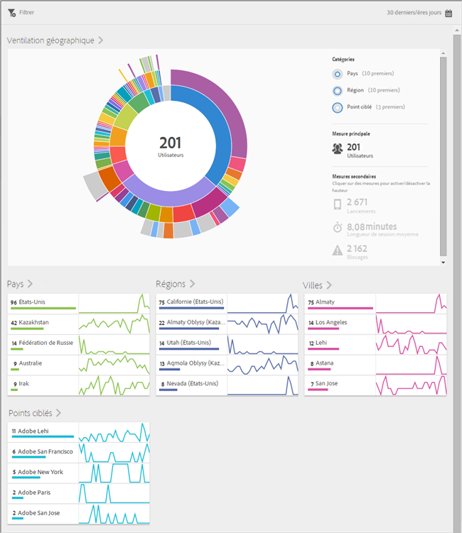
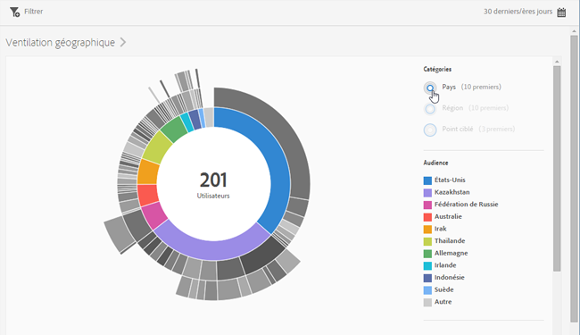
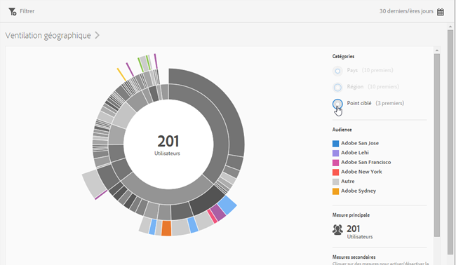
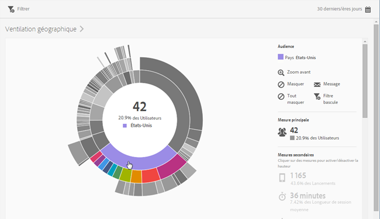
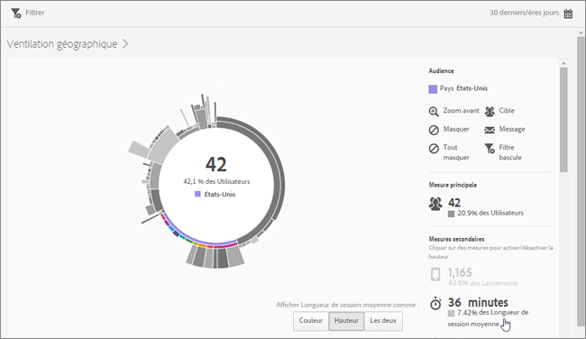
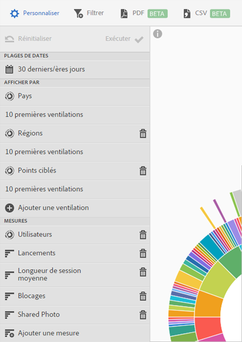

# Aperçu (emplacement){#overview-location}

Le rapport **[!UICONTROL Aperçu de l’emplacement]** vous permet de visualiser les pays, régions et points ciblés (POI) dans lesquels votre application est utilisée.

Ce rapport présente une visualisation radiale de vos données existantes, et vous permet de découvrir les segments d’audience (collections de visiteurs) pour le ciblage. La création et la gestion d’audiences sont semblables à la création et à l’utilisation de segments, excepté que vous pouvez rendre les audiences disponibles dans Experience Cloud.

Informations supplémentaires sur ce rapport :

## Navigation et utilisation {#section_4A88C3849B5847BF8CF433CCFD99FDC3}

Cette visualisation fournit, par exemple, le rapport de base avec des ventilations. La visualisation utilise la hauteur pour montrer la mesure sélectionnée et les différences de performances entre les mesures. Chaque anneau représente un segment d&#39;audience dans la catégorie de l&#39;anneau. Vous pouvez agir sur une audience, par exemple appliquer un filtre bascule, masquer une mesure et afficher des mesures.

>[!TIP]
>
>Outre ces informations, vous pouvez afficher un tutoriel interne au produit qui décrit le mode d’interaction avec le graphique radial. Pour lancer le tutoriel, cliquez sur **[!UICONTROL Ventilation géographique]** dans la barre de titre du rapport, puis cliquez sur l’icône **[!UICONTROL i]**.

Ce graphique radial est interactif. Vous pouvez modifier la période en cliquant sur l’icône **[!UICONTROL Calendrier]** dans la partie supérieure droite. Placez le pointeur de la souris sur une partie du graphique pour afficher plus d’informations. Par exemple, dans l’illustration suivante, vous pouvez voir le nombre total et le pourcentage d’utilisateurs qui utilisent votre application aux États-Unis.

Sur l’illustration, les boutons **[!UICONTROL Catégories]** situés dans le coin supérieur droit vous permettent de permuter l’affichage des informations entre les dix premiers pays et régions et les trois premiers **[!UICONTROL Points ciblés]**.

Voici la visualisation lorsque vous sélectionnez **[!UICONTROL Pays]** :

Voici la visualisation lorsque vous sélectionnez **[!UICONTROL Points ciblés]** :

Vous pouvez cliquer sur une tranche de l’anneau pour sélectionner l’audience sur laquelle vous pouvez effectuer des actions, telles que zoomer, masquer des audiences, créer un message in-app ou un filtre bascule.

Vous pouvez cliquer sur une mesure secondaire sur le côté droit pour l’ajouter à la visualisation et l’afficher en utilisant la couleur, la taille, ou les deux.

## Ajout de ventilations et de mesures {#section_15833511E82648869E7B1EFC24EF7B82}

Vous pouvez ajouter des ventilations et des mesures secondaires qui modifient la hauteur de chaque audience par rapport aux autres audiences du graphique.

>[!TIP]
>
>Plus vous ajoutez d’anneaux, plus le traitement prend du temps.

Pour ajouter des ventilations et des mesures secondaires, cliquez sur **[!UICONTROL Ventilation géographique]** dans la barre de titres du rapport, puis cliquez sur **[!UICONTROL Personnaliser]** pour ouvrir le rail de droite.

Lorsque vous cliquez sur **[!UICONTROL Ajouter une ventilation]** ou **[!UICONTROL Ajouter une mesure]**, un nouvel élément s’affiche avec le même nom que l’élément précédent dans la liste correspondante. Cliquez sur la ventilation ou la mesure nouvellement créée pour accéder à une liste déroulante à partir de laquelle sélectionner un nouvel élément.

## Création d’un filtre d’attractivité {#section_365999D49FC744ECBF9273132497E06C}

Cliquez sur une tranche de l’anneau pour sélectionner l’audience pour laquelle vous souhaitez créer un filtre d’attractivité, puis cliquez sur **[!UICONTROL Filtre bascule]**. Ce filtre d’attractivité permet d’appliquer les filtres actuels et d’exécuter un nouveau rapport selon les filtres.

## Partage de rapports {#section_F8AF2AA73D4C4C008976D45847F82D0B}

Une fois un rapport créé, vos paramètres sont utilisés pour créer une URL personnalisée que vous pouvez copier et partager.

## Informations supplémentaires

Pour plus d’informations sur l’emplacement, voir le contenu suivant :

* [Carte](/help/using/location/c-map-points.md)
* [Gestion des points ciblés](/help/using/location/t-manage-points.md)