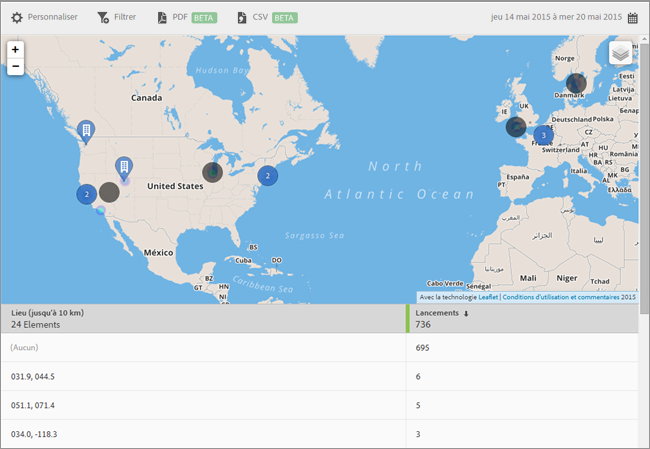

# Carte {#map}

Vous pouvez afficher une carte interactive indiquant vos points ciblés et d’autres marqueurs de données.

Prenez note des informations importantes suivantes :

* Vous pouvez augmenter ou diminuer la taille de la carte.

   Cette fonction est utile, par exemple, si deux points ciblés sont proches les uns des autres. L’agrandissement de la carte vous permet de la voir plus en détail.
* Vos points ciblés s’affichent en bleu.

   D’autres marqueurs de données, tels que Lancements, s’affichent en noir. Cliquez sur un marqueur pour voir plus d’informations.

Cliquez sur  pour sélectionner les options suivantes :

* **[!UICONTROL Carte]**

   Afficher une carte simple.

* **[!UICONTROL Satellite]**
Afficher la carte en mode satellite.

* **[!UICONTROL Marqueurs de données]**

   Spécifier l’affichage des marqueurs de données en noir.

* **[!UICONTROL Carte thermique]**

   Choisissez d’afficher ou non les marqueurs de carte thermique. Plus la couleur est intense, plus la condition (Lancements, par exemple) est remplie fréquemment.

* **[!UICONTROL Points ciblés]**

   Choisissez si vous souhaitez afficher vos points ciblés.

Vous pouvez configurer les options suivantes pour ce rapport :

* **[!UICONTROL Période]**

   Cliquez sur l’icône **[!UICONTROL Calendrier]** pour sélectionner une période personnalisée ou prédéfinie dans la liste déroulante.

* **[!UICONTROL Personnaliser]**

   Personnalisez vos rapports en modifiant les options **[!UICONTROL Afficher par]**, en ajoutant des mesures et des filtres, en ajoutant des séries (mesures) supplémentaires, etc. Pour en savoir plus, voir [Personnalisation des rapports](/help/using/usage/reports-customize/t-reports-customize.md).

* **[!UICONTROL Filtrer]**

   Cliquez sur **[!UICONTROL Filtrer]** pour créer un filtre couvrant différents rapports, afin de visualiser le comportement d’un segment par rapport à l’ensemble des rapports mobiles. Un filtre d’attractivité vous permet de définir un filtre qui est appliqué à tous les rapports autres que de cheminement. Pour plus d’informations, voir [Ajout d’un filtre bascule](/help/using/usage/reports-customize/t-sticky-filter.md).

* **[!UICONTROL Télécharger]**

   Cliquez sur **[!UICONTROL PDF]** ou **[!UICONTROL CSV]** pour télécharger ou ouvrir les documents et les partager avec des utilisateurs qui n’ont pas accès à Mobile Services, ou pour utiliser le fichier dans des présentations.
