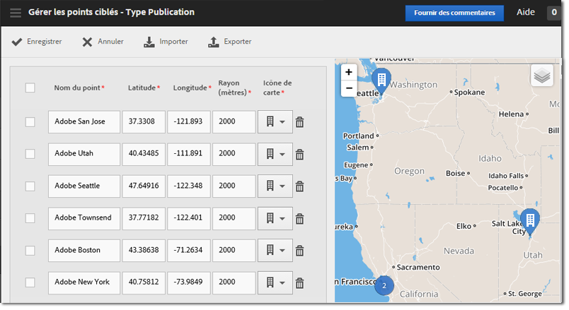

# Gestion des points ciblés{#manage-points-of-interest}

Vous pouvez créer et gérer des points ciblés, qui vous permettent de définir des emplacements géographiques que vous utiliserez aux fins de corrélation, de ciblage des messages in-app, etc. Lorsqu’un accès est envoyé dans un point d’accès, ce dernier est associé à l’accès.

Avant d’utiliser la fonction Emplacement, vérifiez les conditions suivantes :

* Vous devez posséder les applications mobiles Analytics ou Analytics Premium.
* Vous devez activer les **[!UICONTROL rapports sur les emplacements]** pour l’application.
* Si vous utilisez une version du SDK pour iOS ou Android antérieure à la version 4.2, après avoir ajouté de nouveaux **[!UICONTROL points ciblés]**, vous devez télécharger un nouveau fichier de configuration et le fournir à vos développeurs d’applications.

   Si vous utilisez la version 4.2 ou ultérieure du SDK iOS ou du SDK Android, vous n’avez pas besoin de soumettre une mise à jour de l’application à la boutique pour pouvoir mettre à jour vos **[!UICONTROL points ciblés]**. Sur la page Gestion des points ciblés, lorsque vous cliquez sur **[!UICONTROL Enregistrer]**, les modifications sont incluses dans la liste **[!UICONTROL Points ciblés]** et le fichier de configuration de l’application active est mis à jour. L’enregistrement met aussi à jour la liste des points dans votre application sur les appareils des utilisateurs, tant que l’application utilise le SDK et la configuration mis à jour avec une URL des points ciblés à distance.

Sur l’appareil de l’utilisateur, pour qu’un accès soit assigné à un **[!UICONTROL point ciblé]**, la géolocalisation doit être activée pour l’application.

Pour utiliser la fonction Emplacement, procédez comme suit :

1. Cliquez sur le nom de l’application pour accéder à sa page Gérer les paramètres de l’application.
1. Cliquez sur **[!UICONTROL Emplacement]** &gt; **[!UICONTROL Gérer les points ciblés]**.

   

1. Saisissez les informations dans chacun des champs suivants :

   * **[!UICONTROL Nom du point]**

      Saisissez le nom du **[!UICONTROL point ciblé.]**

      Il peut par exemple s’agir d’un nom de ville ou de région. Vous pouvez également créer un **[!UICONTROL point ciblé]** à la périphérie de lieux spécifiques tels que des stades ou des entreprises.

   * **[!UICONTROL Latitude]**

      Saisissez la latitude du **[!UICONTROL point ciblé]**. Ces informations peuvent provenir d’autres sources, y compris Internet.

   * **[!UICONTROL Longitude]**

      Saisissez la longitude du **[!UICONTROL point ciblé]**. Ces informations peuvent provenir d’autres sources, y compris Internet.

   * **[!UICONTROL Rayon (mètres)]**

      Saisissez le rayon (en mètres) autour du **[!UICONTROL point ciblé]** que vous souhaitez inclure. Si vous créez par exemple un Point ciblé pour Denver (Colorado), vous pouvez spécifier un rayon assez large pour inclure la ville de Denver et les régions avoisinantes, mais exclure Colorado Springs.

   * **[!UICONTROL Icône de carte]**

      Sélectionnez une icône qui s’affichera dans les rapports [Aperçu](/help/using/location/c-location-overview.md) et [Carte](/help/using/location/c-map-points.md).

1. Ajoutez des points ciblés supplémentaires, le cas échéant.

   Nous vous recommandons de ne pas ajouter plus de 5 000 points ciblés. Si vous ajoutez plus de 5 000 points ciblés, vous pourrez enregistrer ces points, mais vous recevrez un message d’avertissement vous informant que les règles de bonnes pratiques dictent la définition de moins de 5 000 points.

1. Cliquez sur **[!UICONTROL Enregistrer]**.

Pour supprimer un ou plusieurs points ciblés, cochez les cases applicables, puis cliquez sur **[!UICONTROL Supprimer sélection]**.

Cliquez sur **[!UICONTROL Importer]** ou sur **[!UICONTROL Exporter]** pour travailler sur les données à l’aide d’un fichier `.csv` plutôt que par le biais de l’interface utilisateur de Adobe Mobile
