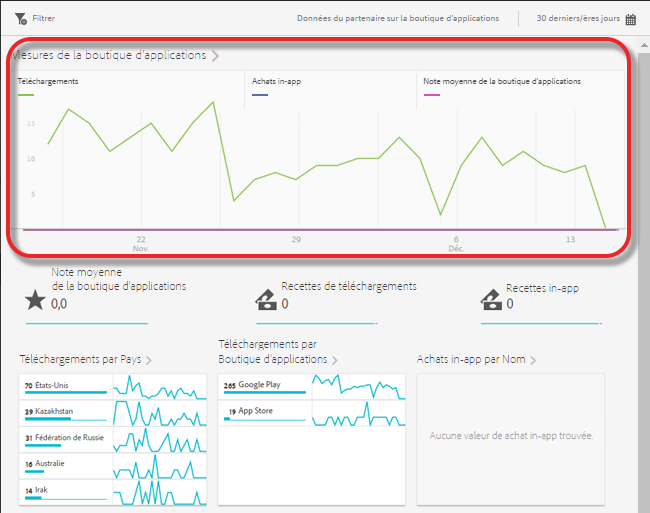
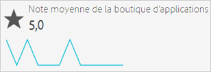
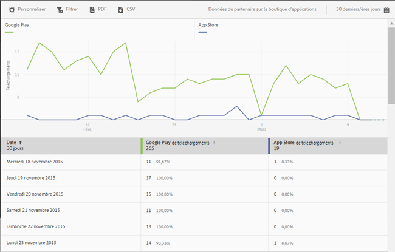
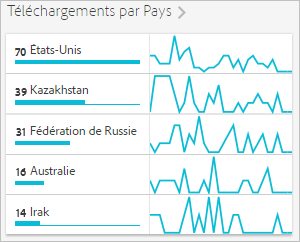
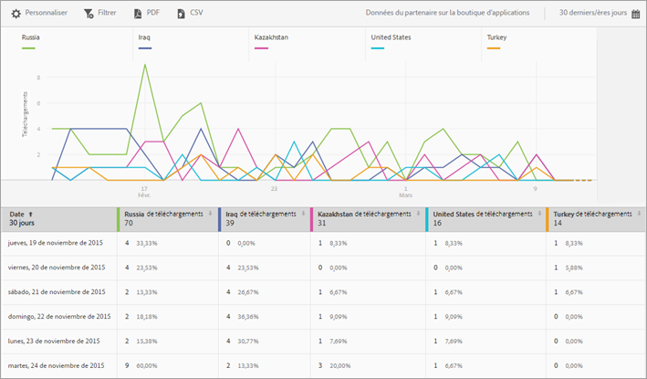
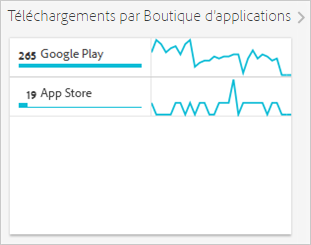

# Rapport Aperçu de la boutique d’applications {#app-store-overview-report}

Le rapport **[!UICONTROL Aperçu de la boutique d’applications]** vous donne un aperçu des mesures de la boutique d’applications, y compris le nombre de téléchargements, les achats in-app, la note moyenne de la boutique d’applications, les recettes de téléchargements, les recettes in-app, les téléchargements par pays, les téléchargements par boutique d’applications et les achats in-app par nom.

>[!TIP]
>
>Dans l’interface utilisateur de Mobile Services, l’élément de menu de la **[!UICONTROL boutique d’applications]** et le rapport **[!UICONTROL Aperçu]** associé s’affichent dans le menu de navigation gauche après la configuration de l’intégration.

Le rapport **[!UICONTROL Aperçu]** comprend un graphique dans le temps qui présente des informations sur le nombre de téléchargements de la boutique d’applications, les achats in-app effectués à l’aide de votre application et la note moyenne de votre application.

Vous pouvez cliquer sur une mesure pour masquer ou afficher sa ligne correspondante. Pour afficher les données d’une journée précise, survolez le jour en question.

>[!IMPORTANT]
>
>Les mesures relatives aux boutiques d’applications, telles que les téléchargements, le classement, les recettes, la classification, etc. dans Adobe Analytics nécessitent une intégration à Data Connector avec un fournisseur approprié. `appFigures` propose actuellement une intégration qui nécessite l’achat du produit et/ou du service approprié à partir de `appFigures`**pour que** vous puissiez activer l’intégration. Pour plus d’informations sur les intégrations à Data Connector, voir [Adobe Exchange](https://www.adobeexchange.com/experiencecloud.html).

>[!TIP]
>
>En plus de modifier la plage de dates du rapport en cliquant sur l’icône de calendrier dans le coin supérieur droit, vous pouvez personnaliser les rapports détaillés, ajouter des filtres et des séries (mesures), ajouter des filtres bascules et télécharger le rapport aux formats PDF ou CSV. Pour en savoir plus, voir [Personnalisation des rapports](/help/using/usage/reports-customize/reports-customize.md).

## Note moyenne de la boutique d’applications {#section_60D0D21824AE4450BC3E34D7ACA12A7A}

Ce rapport présente la note moyenne donnée par les utilisateurs à votre application à l’aide de la fonction de la boutique d’applications.

Vous pouvez cliquer n’importe où sur le widget **[!UICONTROL Note moyenne de la boutique d’applications]** pour afficher un graphique et un diagramme avec la note moyenne par date. Pour afficher les données d’une journée précise, survolez le jour en question.

## Recettes de téléchargements {#section_34F05998E8444544A1B507C1B852C4EE}

Ce rapport présente le revenu généré par le téléchargement de votre application.

## Recettes in-app  {#section_58792ED9C4B54B7D836E30CF09E8E204}

Ce rapport présente le revenu généré par les achats in-app réalisés avec votre application.

## Téléchargements par pays  {#section_10373CD28CA94BA5859DFDEED7D548C6}

Ce rapport présente le nombre de téléchargements de votre application, par pays.

Pour afficher un graphique et un tableau exposant le nombre de téléchargements par pays et par date, cliquez sur **[!UICONTROL Téléchargements par pays]**. Vous pouvez passer le pointeur de la souris sur une date pour afficher les données de cette journée.

## Téléchargements par boutique d’applications  {#section_F1CD1A3F0105469D879E4F280CE32484}

Ce rapport présente le nombre de téléchargements de votre application, par boutique d’applications.

Pour afficher un graphique et un tableau exposant le nombre de téléchargements par pays et par date, cliquez sur **[!UICONTROL Téléchargements par boutique d’applications]**. Vous pouvez passer le pointeur de la souris sur une date pour afficher les données de cette journée.

## Achats in-app par nom  {#section_D747A64F9F6449E0A02EF31D56C92F83}

Ce rapport présente les achats in-app par nom.
