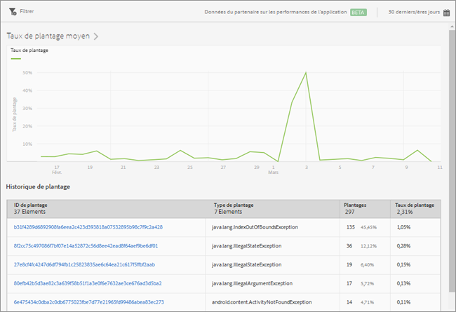

# Rapport Blocages {#crashes}

Le rapport **[!UICONTROL Blocages]** présente un aperçu des blocages de votre application. Il répertorie le nombre de blocages et le taux de plantage, et vous pouvez vous connecter à l’interface utilisateur Apteligent.

>[!IMPORTANT]
>
>Afin d’afficher le rapport **[!UICONTROL Blocages]** dans le panneau de navigation gauche, vous devez d’abord intégrer votre application à l’interface Apteligent.

Le graphique **[!UICONTROL Taux de plantage moyen]** affiche le taux de blocage par date. Vous pouvez passer le pointeur de la souris sur une date pour afficher le taux de plantage de cette journée.

Le graphique **[!UICONTROL Historique de plantage]** présente des informations sur chaque plantage d’application, y compris l’ID et le type de plantage, ainsi que le nombre et la date des plantages. Pour vous connecter à Apteligent et afficher plus d’informations sur le blocage, cliquez sur le lien situé dans la colonne **[!UICONTROL ID de plantage].**

Vous pouvez configurer les options suivantes pour ce rapport :

* **[!UICONTROL Période]**

   Cliquez sur l’icône **[!UICONTROL Calendrier]** pour sélectionner une période personnalisée ou prédéfinie dans la liste déroulante.

* **[!UICONTROL Filtrer]**

   Cliquez sur **[!UICONTROL Filtrer]** pour créer un filtre couvrant différents rapports, afin de visualiser le comportement d’un segment par rapport à l’ensemble des rapports mobiles. Un filtre d’attractivité vous permet de définir un filtre qui est appliqué à tous les rapports autres que de cheminement.

   Pour plus d’informations, voir [Ajout d’un filtre bascule](/help/using/usage/reports-customize/t-sticky-filter.md).