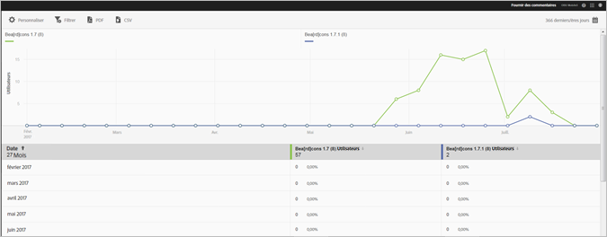

# Rapport Versions {#versions}

Le rapport Versions est un compte-rendu temporel qui affiche des informations sur les différentes versions de votre application exécutées sur les appareils des utilisateurs.

Voici un exemple de rapport Versions :

