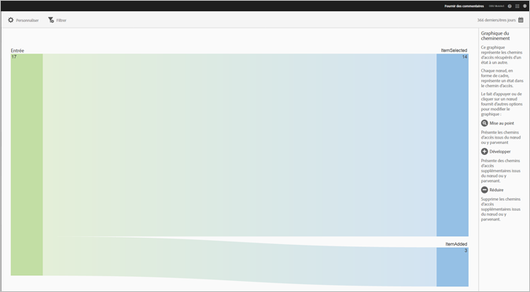
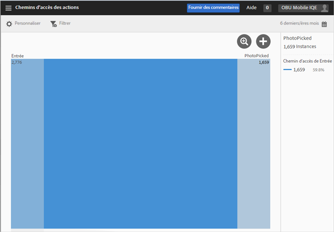
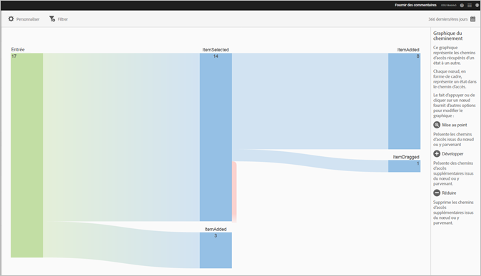
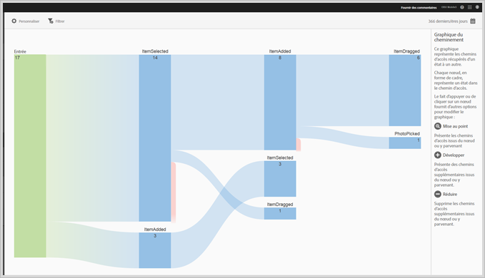
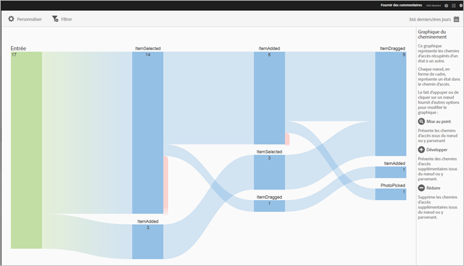

# Rapport Chemins d’accès des actions{#action-paths}

Le rapport Chemins d’accès des actions est basé sur l’analyse des chemins d’accès et affiche un graphique des chemins représentant les voies empruntées par un état de l’application pour acquérir un autre état.

Les rapports **[!UICONTROL Chemins d’accès des vues]** et **[!UICONTROL Chemin d’accès des actions]** sont des rapports de cheminement. Le rapport **[!UICONTROL Chemins d’accès des vues]** vous permet de visualiser la manière dont les utilisateurs naviguent d’un écran à l’autre au sein de votre application. Le rapport **[!UICONTROL Chemins d’accès des actions]** montre la séquence des actions (événements tels que des clics, sélections, redimensionnements, etc.) accomplies par les utilisateurs dans votre application.

>[!TIP]
>
>Vous pouvez utiliser un rapport Entonnoir pour combiner la navigation et les actions dans un rapport. Pour plus d’informations, reportez-vous à la section [Entonnoir](/help/using/usage/reports-funnel.md).

Chaque nœud a la forme d’une boîte et représente un état dans les chemins d’accès des utilisateurs par le biais d’une application. Par exemple, dans l’image ci-dessus, le nœud supérieur représente le nombre d’utilisateurs qui ont lancé l’application et sélectionné une photo dans la galerie.

Pour afficher les options de modification du graphique, cliquez sur un nœud, puis sur **[!UICONTROL Mise au point]** ou **[!UICONTROL Développer]**. Si, par exemple, vous cliquez sur l’état **[!UICONTROL PhotoPicked]** dans le nœud supérieur, les icônes **[!UICONTROL Mise au point]** et **[!UICONTROL Développer]** s’affichent.

Pour agrandir l’affichage, cliquez sur l’icône **[!UICONTROL +]**. Cette option affiche les chemins supplémentaires qui entrent dans le nœud ou en sortent. Dans l’image ci-dessous, l’état 1 lance l’application, l’état 2 sélectionne une photo (l’élément que vous avez développé) et l’état 3 inclut les différents chemins empruntés par les utilisateurs :

* Sélection d’un élément
* Ajout d’un élément
* Glissement d’un élément
* Mise à l’échelle d’un élément

Le développement d’un état est similaire à un entonnoir.

Cliquez sur l’icône  pour isoler le nœud et afficher les chemins d’accès entrants et sortants du nœud sélectionné. Dans l’image ci-dessous, les chemins suivants ont été suivis **avant** que les utilisateurs ne sélectionnent une photo :

* Rotation d’un élément
* Mise à l’échelle d’un élément
* Glissement d’un élément
* Suppression d’un élément

Parmi les utilisateurs qui ont sélectionné une photo, les chemins suivants ont été suivis **après** la sélection de la photo :

* Sélection d’un élément
* Ajout d’un élément
* Glissement d’un élément
* Mise à l’échelle d’un élément

Vous pouvez cibler ou développer plusieurs nœuds afin d’obtenir une vue détaillée des chemins empruntés par les utilisateurs dans votre application. Par exemple :

Vous pouvez configurer les options suivantes pour ce rapport :

* **[!UICONTROL Période]**

   Cliquez sur l’icône **[!UICONTROL Calendrier]** pour sélectionner une période personnalisée ou prédéfinie dans la liste déroulante.

* **[!UICONTROL Personnaliser]**

   Personnalisez vos rapports en modifiant les options **[!UICONTROL Afficher par]**, en ajoutant des mesures et des filtres, en ajoutant des séries (mesures) supplémentaires, etc. Pour en savoir plus, voir [Personnalisation des rapports](/help/using/usage/reports-customize/reports-customize.md).

* **[!UICONTROL Filtrer]**

   Cliquez sur **[!UICONTROL Filtrer]** pour créer un filtre couvrant différents rapports, afin de visualiser le comportement d’un segment par rapport à l’ensemble des rapports mobiles. Un filtre d’attractivité vous permet de définir un filtre qui est appliqué à tous les rapports autres que de cheminement. Pour plus d’informations, voir [Ajout d’un filtre bascule](/help/using/usage/reports-customize/t-sticky-filter.md).

* **[!UICONTROL Télécharger]**

   Cliquez sur **[!UICONTROL PDF]** ou **[!UICONTROL CSV]** pour télécharger ou ouvrir les documents et les partager avec des utilisateurs qui n’ont pas accès à Mobile Services, ou pour utiliser le fichier dans des présentations.
