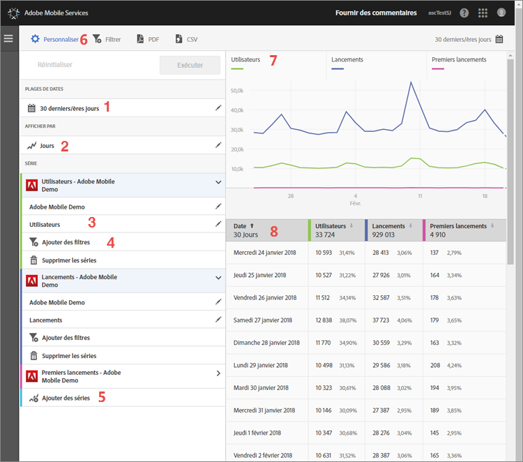

# Personnalisation des rapports{#customize-reports}

Ces informations vous aident à comprendre et à personnaliser les rapports intégrés.

Vous pouvez personnaliser vos rapports en modifiant la plage de dates, les options **[!UICONTROL Afficher par]** (afficher les données graphiques et tabulaires par périodes ou par dimensions), ajouter des mesures et des filtres, ajouter des séries (mesures) supplémentaires, etc.

Pour afficher le rail Personnaliser, cliquez sur le nom de l’application pour accéder à sa page Aperçu, puis cliquez sur **[!UICONTROL Personnaliser]**.

L’exemple suivant montre le rapport Utilisateurs et sessions avec le rail **[!UICONTROL Personnaliser]** ouvert. Cet exemple affiche les données relatives aux 30 derniers jours, classées par jour, avec quatre séries actives :

* **[!UICONTROL Utilisateurs]**
* **[!UICONTROL Lancements]**
* **[!UICONTROL Premiers lancements]**
* **[!UICONTROL Téléchargements de la boutique d’applications]**

Les informations suivantes décrivent chaque portion du rapport et le rail **[!UICONTROL Personnaliser]** :

| Nombre | Description |
|--- |--- |
| 1 | Dans **[!UICONTROL Plages de dates]**, la liste déroulante vous permet de sélectionner différentes plages de dates pour votre rapport. Toutes les données contenues dans le graphique (9) et le tableau correspondant (10) respectent la plage de dates sélectionnée. |
| 2 | Dans **[!UICONTROL Afficher par]**, la liste déroulante vous permet de sélectionner un affichage temporel ou dimensionnel de votre rapport.  Par exemple, sur l’illustration, vous pouvez voir que l’option Jours est sélectionnée. Si vous observez les dates indiquées sous le graphique (7) et les lignes du tableau (8), vous constatez que les données sont classées par date dans un rapport temporel. Jusqu’à six mesures peuvent être consignées dans les rapports temporels en ajoutant à ceux-ci des séries supplémentaires.  Si vous sélectionnez une dimension de cycle de vie, vous pouvez vue les 50 premières valeurs dans une liste classée, les 5 premières valeurs de tendances par jour ou par semaine ou une ventilation des 5 ou 10 premières valeurs. |
| 3 | **[!UICONTROL Les séries]** représentent des mesures individuelles, comme Utilisateurs, Lancements, Premiers lancements et Téléchargements de boutique d’applications dans l’exemple ci-dessus. Chaque série est identifiée par un code de couleur avec les données contenues dans le graphique (7) et le tableau (8).  Vous pouvez ajouter des séries (mesures) supplémentaires, et même différentes applications dans différentes suites de rapports aux fins de comparaison des données.  Pour plus d’informations, voir [Ajout de séries (mesures) aux rapports](/help/using/usage/reports-customize/t-reports-series.md). |
| 4 | **[!UICONTROL Ajouter un filtre]** vous permet de personnaliser les rapports intégrés en ajoutant des filtres (segments) supplémentaires.  Pour plus d’informations, voir [Ajout de filtres aux rapports](/help/using/usage/reports-customize/t-reports-customize.md). |
| 5 | **[!UICONTROL Ajouter des séries]** vous permet de personnaliser les rapports intégrés par l’ajout de séries (mesures) supplémentaires ou d’applications dans différentes suites de rapports aux fins de comparaison des données.  Pour plus d’informations, voir [Ajout de séries (mesures) aux rapports](/help/using/usage/reports-customize/t-reports-series.md). |
| 6 | **[!UICONTROL Filtre bascule]** vous permet de créer un filtre couvrant différents rapports. Par exemple, vous pouvez déterminer les performances d’un segment spécifique dans tous les rapports mobiles. Un filtre d’attractivité vous permet de définir un filtre qui est appliqué à tous les rapports autres que de cheminement. Pour plus d’informations, voir [Ajout d’un filtre bascule](/help/using/usage/reports-customize/t-sticky-filter.md). |
| 7 | Le **[!UICONTROL graphique de données]** affiche les informations sous forme de graphique approprié, sur la base des mesures sélectionnées. Les types de graphiques incluent les graphiques en courbes, les graphiques à barres, les graphiques en anneau, etc. |
| 8 | Le **[!UICONTROL tableau de données]** offre une vue tabulaire des données. Vous pouvez cliquer sur un en-tête de colonne pour trier les données par ordre croissant ou décroissant. |

