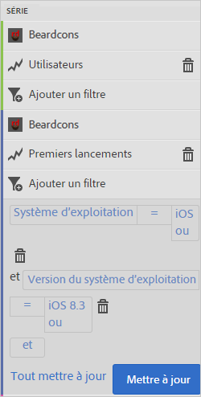

# Add filters to reports{#add-filters-to-reports}

Ces informations vous aident à personnaliser les rapports intégrés par l’ajout de filtres (segments) supplémentaires.

>[!IMPORTANT]
>
>Les mesures d'applications mobiles sont également disponibles dans les rapports et analyses marketing, dans les analyses ad hoc, dans l'entrepôt de données et dans d'autres interfaces de création de rapports Analytics. Si un type de rapport ou une ventilation n’est pas disponible dans Adobe Mobile, il ou elle peut être généré(e) à l’aide d’une autre interface de création de rapports.

Dans cet exemple, nous allons personnaliser le rapport **[!UICONTROL Utilisateurs et sessions], mais ces instructions peuvent s’appliquer à n’importe quel autre rapport.**

1. Ouvrez votre application et cliquez sur **Utilisation** &gt; **[!UICONTROL Utilisateurs et sessions]**.

   

   Ce rapport donne une vue complète des utilisateurs de l’application au fil du temps. Les mesures pour les versions iOS et Android de cette application sont toutefois collectées dans la même suite de rapports. Les utilisateurs peuvent être segmentés d’après le système d’exploitation mobile en ajoutant un filtre personnalisé à la mesure Utilisateurs.

1. Click **[!UICONTROL Customize]**.

   

1. Under **[!UICONTROL Users]**, click **[!UICONTROL Add Filter]** and click **[!UICONTROL Add Rule]**.

1. Select **[!UICONTROL Operating Systems]**, and from the drop-down list, and select **[!UICONTROL iOS]**.

   

   Pour ajouter Android comme filtre, vous devez répéter cette étape.

1. Click **[!UICONTROL And]**, select **[!UICONTROL Operating Systems]** from the drop-down list, and select **[!UICONTROL Android]**.

   Vos filtres doivent dès lors ressembler à l’exemple suivant :

   

1. Cliquez sur **[!UICONTROL Mettre à jour]**.
1. To regenerate the report, click **[!UICONTROL Run]**.

   Ce rapport montre maintenant les utilisateurs ventilés par système d’exploitation. Le titre du rapport a été modifié pour correspondre aux filtres appliqués à ce dernier.

   

   Vous pouvez personnaliser davantage ce rapport. Sous ios 8.3, vous pouvez ajouter la mesure Premiers lancements avec un filtre de version de système d'exploitation ios 8.3 afin de voir combien de clients ios 8.3 ont mis à niveau leurs applications et ont lancé un premier lancement.
1. Under **[!UICONTROL First Launches]**, click **[!UICONTROL Add Filter]**, click **[!UICONTROL Add Rule]**, select **[!UICONTROL Operating Systems]** from the drop-down list, and select **[!UICONTROL iOS]**.
1. Click **[!UICONTROL And]**, select **[!UICONTROL Operating System Versions]** from the drop-down list, and select **[!UICONTROL iOS 8.3]**.

   Vos filtres doivent dès lors ressembler à l’exemple suivant :

   

1. Click **[!UICONTROL Update]** and **[!UICONTROL Run]**.

   Ce rapport montre à présent les utilisateurs possédant iOS 8.3 et qui ont lancé l’application pour la première fois.

   

   Prenez quelques instants pour tester les différentes options du menu de personnalisation et veillez à marquer vos favoris d’un signet. Les URL de rapport dans Adobe Mobile sont fonctionnelles et peuvent être envoyées par courriel ou ajoutées à vos favoris.
