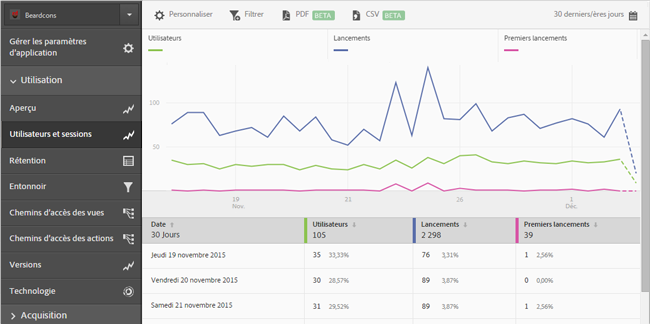

# Ajout de filtres aux rapports {#add-filters-to-reports}

Ces informations vous aident à personnaliser les rapports intégrés par l’ajout de filtres (segments) supplémentaires.

>[!IMPORTANT]
>
>Les mesures d’application mobile sont également disponibles dans les rapports et analyses marketing, Analyses ad hoc, l’entrepôt de données et les autres interfaces de création de rapports Analytics. Si un type de rapport ou une ventilation n’est pas disponible dans Adobe Mobile, il ou elle peut être généré(e) à l’aide d’une autre interface de création de rapports.

Dans cet exemple, nous allons personnaliser le rapport **[!UICONTROL Utilisateurs et sessions]**, mais ces instructions peuvent s’appliquer à n’importe quel autre rapport.

1. Ouvrez votre application et cliquez sur **[!UICONTROL Utilisation]** > **[!UICONTROL Utilisateurs et sessions]**.

   

   Ce rapport fournit une vue complète des utilisateurs de notre application au fil du temps. Cependant, les mesures pour les versions iOS et Android de cette application sont collectées dans la même suite de rapports. Nous pouvons segmenter les utilisateurs par système d’exploitation mobile en ajoutant un filtre personnalisé à la mesure Utilisateurs.

1. Cliquez sur **[!UICONTROL Personnaliser]**.

   

1. Sous **[!UICONTROL Utilisateurs]**, cliquez sur **[!UICONTROL Ajouter un filtre]**, puis sur **[!UICONTROL Ajouter une règle]**.

1. Sélectionnez **[!UICONTROL Systèmes d’exploitation]**, puis choisissez **[!UICONTROL iOS]** dans la liste déroulante.

   

   Pour ajouter Android en tant que filtre, vous devez répéter cette étape.

1. Cliquez sur **[!UICONTROL Et]**, sélectionnez **[!UICONTROL Systèmes d’exploitation]** dans la liste déroulante, puis choisissez **[!UICONTROL Android]**.

   Vos filtres doivent dès lors ressembler à l’exemple suivant :

   

1. Cliquez sur **[!UICONTROL Mettre à jour]**.
1. Pour générer à nouveau le rapport, cliquez sur **[!UICONTROL Exécuter]**.

   Ce rapport présente désormais les utilisateurs classés par système d’exploitation. Le titre du rapport a été modifié pour correspondre aux filtres appliqués au rapport.

   

   Le rapport peut être davantage personnalisé. Depuis iOS 8.3, vous pouvez ajouter la mesure Premiers lancements à l’aide d’un filtre de version du système d’exploitation iOS 8.3 pour déterminer le nombre de clients iOS 8.3 qui ont mis à niveau leurs applications et effectué un premier lancement.
1. Sous **[!UICONTROL Premiers lancements]**, cliquez sur **[!UICONTROL Ajouter un filtre]**, puis sur **[!UICONTROL Ajouter une règle]**. Sélectionnez **[!UICONTROL Systèmes d’exploitation]** dans la liste déroulante, puis choisissez **[!UICONTROL iOS]**.
1. Cliquez sur **[!UICONTROL Et]**, sélectionnez **[!UICONTROL Versions du système d’exploitation]** dans la liste déroulante, puis choisissez **[!UICONTROL iOS 8.3]**.

   Vos filtres doivent dès lors ressembler à l’exemple suivant :

   

1. Cliquez sur **[!UICONTROL Mettre à jour]** et **[!UICONTROL Exécuter]**.

   Ce rapport présente désormais les utilisateurs d’iOS 8.3 qui ont lancé l’application pour la première fois.

   

   Prenez le temps de tester les différentes options du menu de personnalisation des rapports et n’oubliez pas marquer vos favoris dans un signet. Dans Adobe Mobile, les URL de rapport sont fonctionnelles et peuvent être envoyées par courrier électronique ou ajoutées à vos favoris.
