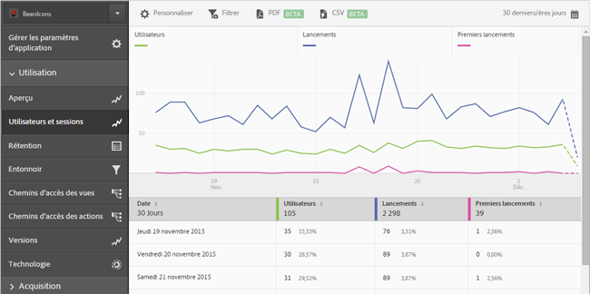
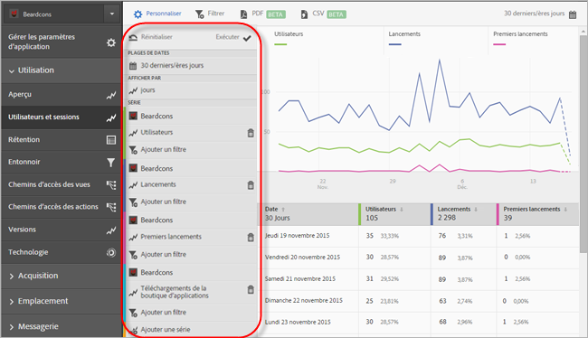
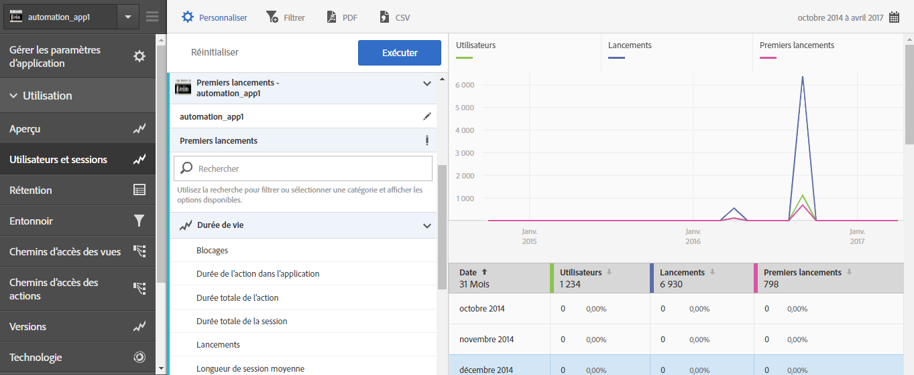
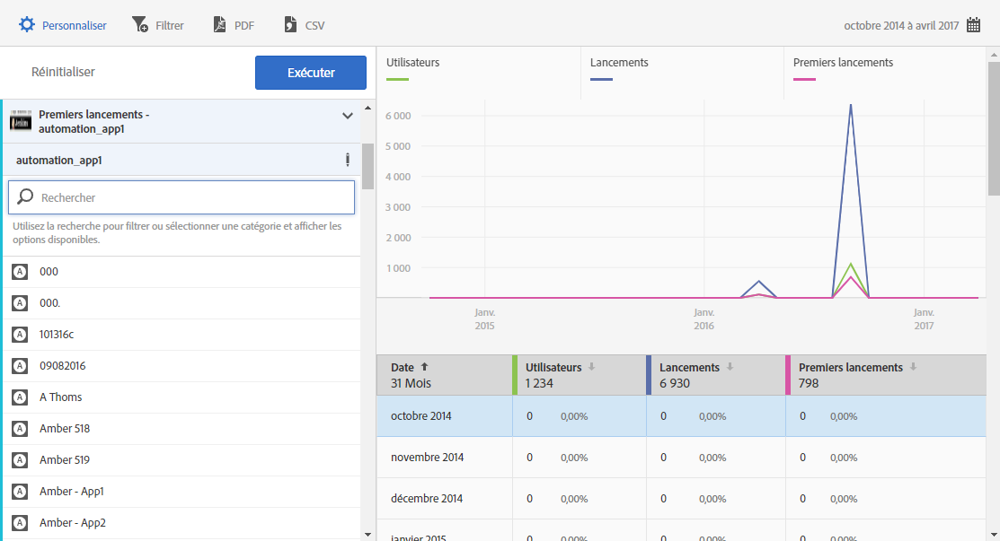

# Add series (metrics) to reports{#add-series-metrics-to-reports}

Ces informations vous aident à personnaliser les rapports intégrés par l’ajout de séries (mesures) supplémentaires ou d’applications dans différentes suites de rapports aux fins de comparaison des données.

>[!IMPORTANT]
>
>Les mesures d’applications mobiles sont également disponibles dans les rapports et analyses marketing, les analyses ad hoc, l’entrepôt de données et d’autres interfaces de création de rapports Analytics. Si un type de rapport ou une ventilation n’est pas disponible dans Adobe Mobile, il ou elle peut être généré(e) à l’aide d’une autre interface de création de rapports.

In this example, we will customize the **[!UICONTROL Users &amp; Sessions]** report, but the instructions can apply to any report.

1. Ouvrez votre application et cliquez sur **Utilisation** &gt; **[!UICONTROL Utilisateurs et sessions]**.

   

   Ce rapport donne une vue complète des utilisateurs de l’application au fil du temps. Toutefois, nous souhaitons ajouter une série à ce rapport afin de rendre compte des blocages de l’application.

1. Click **[!UICONTROL Customize]**.

   

1. Scroll down and click **[!UICONTROL Add Series]**.

   Le nom de la série est renseigné avec le même nom que la dernière série de votre liste. Sur l’illustration précédente, la dernière série correspond à **[!UICONTROL Téléchargements de boutique d’applications]**. Une nouvelle série est donc ajoutée et intitulée **[!UICONTROL Téléchargements de boutique d’applications]**.

1. Procédez de l’une des manières suivantes :

   * Pour ajouter une nouvelle série (mesure), cliquez sur le nom de la série que vous venez de créer et sélectionnez une nouvelle mesure de cycle de vie dans la liste déroulante.

      

   * To add a new app in a different report suite so that you can compare data across apps, click the app name in the newly created series, and select the desired app.

      

1. (Conditionnel) Ajoutez des filtres à la nouvelle série.

   Pour plus d’informations, voir [Ajout de filtres aux rapports](/help/using/usage/reports-customize/t-reports-customize.md).
1. Click **[!UICONTROL Update]** and **[!UICONTROL Run]**.
